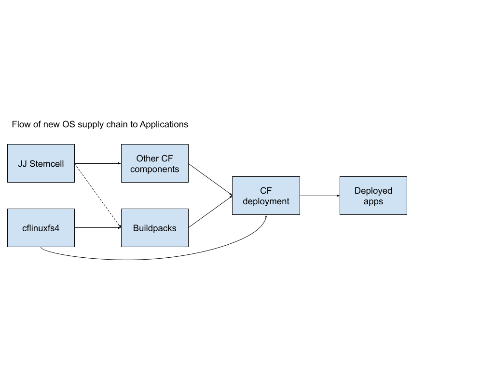

# Meta
[meta]: #meta
- Name: Move to Jammy Jellyfish (22.04) as the next CF Linux Operating System after Bionic.
- Start Date: 2022-01-22
- Author(s): @dsboulder @rkoster
- Status: Accepted
- RFC Pull Request: https://github.com/cloudfoundry/community/pull/191

## Summary

Since bionic is expiring in April of 2023, the CF community needs to switch to a new ubuntu version by then. 
Changing operating systems is fairly expensive and we should perform a coordinated move to Jammy Jellyfish Ubuntu 22.04 in order to maximize our runway.  

## Problem

The CF ecosystem has undergone a few expensive operation system transitions in the last 8 years. This proposal covers an aggressive plan to skip Ubuntu Focal, and instead execute a rapid move to the upcoming 22.04 release (codename Jammy) by the end of 2022. There are many moving parts in upgrading from Ubuntu 18.04 (codename Bionic) and this document covers what it would take to move them all to Ubuntu 22.04 before community 18.04 support ends in April 2023.

## Proposal

Execute a coordinated cross-component move to Jammy Jellyfish, starting in March or April of 2022. The move affects many components and groups, here's the approximate supply chain propagation:

The tasks break down below:

### Produce new stemcells for all IaaSes
*The Foundational Infrastructure Working Group* owns the responsibility for making new stemcells. We expect to be able to consume GA-quality JJ packages from canonical sometime in the month of April, 2022. We might consider doing some early experimentation with 21.10 (impish) or 20.04 (focal) in order to fix some of the expected upcoming breaking changes with JJ, mainly to mitigate timeline risk.

@rkoster owns this operation and can provide any details needed on the BOSH side. Target start time: March 2022

### Produce new cflinuxfs4 rootfs for containers
The production of cflinuxfs4 belongs to the *App Runtime Interfaces Working Group*. It's not clear yet if cflinuxfs4 can run workloads on the bionic kernel, so there may be a dependency on a JJ stemcell to truly validate the new stack.

@meyer owns this operation and can provide details needed on the buildpacks/rootfs side.
Target start time: March 2022

### Create new buildpack versions that are compatible with cflinuxfs4
The creation of a new set of cflinuxfs4-compatible buildpacks, which are hopefully very similar to the existing buildpacks, belongs to the *App Runtime Interfaces Working Group*. This could be an opportunity to switch to some implementation of Cloud Native Buildpacks, but we run the risk of exceeding the bionic timeline by extending the scope.

@meyer owns this operation and can provide details needed on the buildpacks/rootfs side.
Target start time: April 2022

### Ensure all CF components are compatible with new stemcells, fix them as needed
Many CF components should run unmodified on the new Operating System, but there are always some that need work. Some job control scripts typically end up executing OS-specific operations, any kernel performance tweaks need to be reassessed (gorouter!), and low-level jobs like garden typically need modification to be compatible.

This work should be driven out by the CF-deployment conversion work, with *relevant working groups* fixing incompatibility issues when discovered.
Target start time: June 2022 (using early stemcell builds)

### Create a final cf-deployment distribution based on 22.04
There is no owner identified for this work, but final validation would fall into the App Deployments Working Group (with other WGs fixing release incompatibility issues)
Target verification time: August 2022

### Fix application incompatibilities
Because a parallel set of buildpack will exist for cflinuxfs4, applications can move over at their leisure and fix incompatibilities along the way.
Target finishing time: April 2023, when Bionic community support ends!

### Ensure all applications have moved over
The final step is for operators to find outlying applications that haven't yet made the switch. The CF stack auditor plugin will assist with that, like last time. We are also likely going to make it easier to continue to run cflinuxfs3 stacks past 2023, either in an insecure or extended-support way, for operators that haven't finished getting all applications to move over.
Target finishing time: April 2023, when Bionic community support ends!
