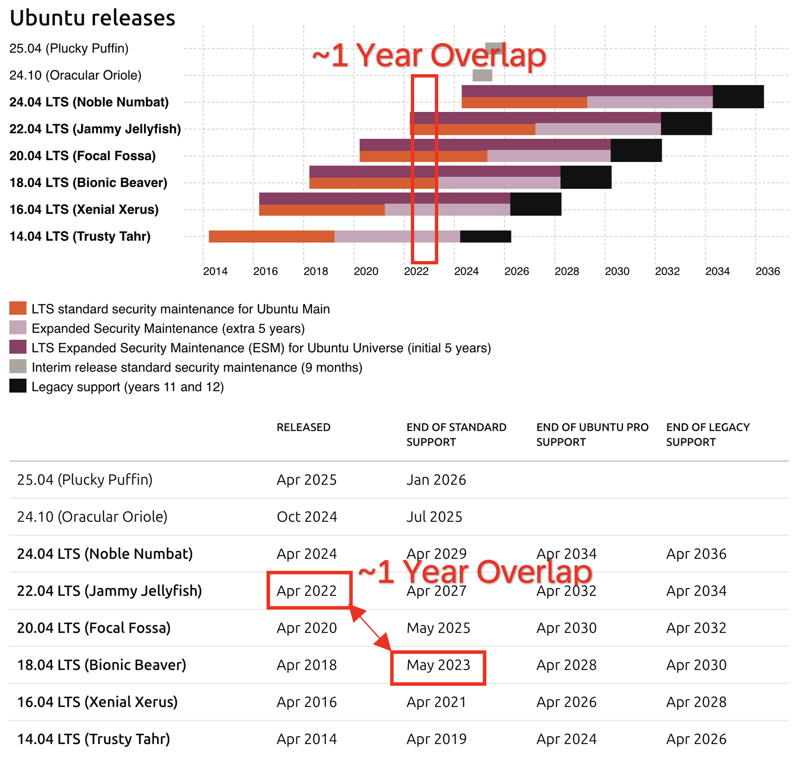

# Meta

- Name: Enhance handling of stacks in CF to improve stack removal/migration experience
- Start Date: 2025-06-24
- Author(s): @FloThinksPi
- Status: Draft
- RFC Pull Request: [community#1220](https://github.com/cloudfoundry/community/pull/1220)

## Summary

With the deprecation of the CFLinuxfs3 stack it became obvious that
removing unsupported stacks from an existing and heavily used CF
Foundation comes with massive problems. Ultimately a stack cannot be
removed without all depending apps being migrated to a new stack,
otherwise downtimes of applications that rely on the removed stack will
occur. This RFC proposes improvements in CF to shift this unavailability
towards lifecycle operations and not actual app downtime - making it a
more pleasant experience for CF users and operators alike. It also opens up possibilities for CF Users to not rely on the CF Foundations stacks but rather use their own stacks to gain indipendence and release the dependency on the CF Community\'s stack release cadence deliberately.

## Problem

In the current CF implementation, apps run on so-called Stacks which
provide the base operating system.

Stacks are based on ubuntu and thus bound to ubuntu's [LTS release
cadence and Support](https://ubuntu.com/about/release-cycle). With
Canonical\'s stop of standard security maintenance for ubuntu
18.04(Bionic Beaver) as a consequence also the CFLinuxFS3 stack could
not be maintained anymore and was deprecated. A successor CFLinuxFS4 was
offered based on ubuntu 22.04(Jammy Jellyfish).

Stacks are used for the staging of an application meaning buildpacks run
on the stack to produce the droplet. This in return means that:

- The buildpack is stack specific meaning it can/will break on an
  incompatible stack change like a major version bump

- The droplet the buildpack produces is also stack specific meaning it
  CAN just be instantiated to become an app instance when combining the droplet
  with the same stack it was built with at execution time


Pictured in above diagram is how the stack is brought into a CF
Foundation and used in a CF Foundation. The following problems occur
when trying to remove/deprecate a stack towards users of a CF
Foundation.

Due to [RFC-39](https://github.com/cloudfoundry/community/blob/main/toc/rfc/rfc-0039-noble-based-cflinuxfs5.md), these struggles with the stack become more frequent for CF Foundation operators and CF users as a intermediate stack(CFLinuxFS5) is build now, 2 years after CFLinuxFS4 rather than 4 years later.

### Usage

The management entry of the stack in the stacks table of the CF API
cannot be removed as long as apps exist which use it as the apps table
has a foreign key relationship to the stacks table. The stack thus is
still visible and still usable to all users of a CF Foundation even if
being insecure, deprecated and SHOULD not be adopted anymore.\
It is a cumbersome process for the users to migrate their workload to a
new stack. Оne has to acknowledge that and give users of Cloud Foundry
time to adapt their workload accordingly without a hard deadline when
their apps will stop working.

### Delivery

By regulations one MAY be forced to stop shipping insecure parts of
CloudFoundry for formal/regulatory reasons. That means removing it/not
deploying it with CF-Deployment at all. In this case, the stack is not
put onto the local filesystem of the Diego cell and every app instance
(Long Running Process(LRP)/Task) start will fail because the runtime did not find the
preloaded stack in its local filesystem. One thus is not able to stop
shipping/delivering the outdated, insecure stack anymore without causing
downtimes to all apps still using it.

### Adoption Timelines

Currently a stack is only shipped ever 4 years skipping one LTS version
of ubuntu entirely. This creates a situation where the old stack e.g.
CFLinuxFS3 is flagged as unsecure at roughly the same time the new stack
CFLinuxFS4 is available. This forces users to adopt it in a very small
timeframe if they still want to receive security updates for their
existing workload. In the last migration from CFLinuxFS3 to CFLinuxFS4
it turned out also the buildpacks need time to adopt -- then the
customers to the new buildpacks for which the time there was far too
short.

## Motivation

1. Enable a productized shipment of CF to come without a deprecated
    stack that still is used by apps on the Foundations

2. Enable operators to remove/disable a stack to prevent/limit new
    adoption

3. Without the stack shipped or remove/disable by operators, keep all
    apps running without downtime.

4. Give users and buildpacks more time to adopt, ideally in the range
    of multiple years.

## Proposal

### Improve logical stack management in CF API (cloud_controller_ng)

In the CF API currently only a global stack table exists, that either
makes the stack usable(present) or not(missing). Using a stack means
that a call to diego bbs includes that stack as e.g. rootfs
`precached:<stackname>`. No check is in place if the diego cells have
that stack available, so this table is just used to check what a user
requests as stack when doing cf capi calls or pushing a cf manifest.
Also against available system buildpacks if the stack+buildpack
combination is supported. It's not used to check what's actually
available on diego though.

In this proposal we extend the global stack management and table by
following workflows inside the CF API.

- Mark a stack as deprecated -> staging and start process logs a
  prominent warning. This brings better awareness than release notes.

- Mark a stack as locked -> prevent using the stack for new apps
  (existing apps CAN still use the stack and CAN deploy updates). Likely
  already prevents blue-green deploy scenarios where a rolling update is
  programmed client side by creating new CF Applications. However all
  apps SHOULD continue to run.

- Mark a stack as disabled -> prevent using the stack for any app
  staging (existing apps continue to run but you can't update them
  anymore)

This requires the stack table to be extended by additional information
regarding a stacks state as well as the endpoints to manage/list stacks
as well. Additionally, the CLI and client libraries would need adoption
to be able to present the newly added information to a CF user when
calling "cf stacks".

Following Datetimes MAY be saved per stack so this information CAN be
used in consequent log lines, errors and deprecation notices and for the
logic to influence stack usage:

- deprecate_at -> Timestamp after which the deprecation notice will be
  printed

- lock_at -> Timestamp after which staging new apps with a that stack
  fail

- disable_at -> Timestamp after which restaging existing apps with a that
  stack fail

- remove_at -> Timestamp after which the stack is removed from the CF
  API. This is a purely informational timestamp just in place to be able to use it in deprecation notices and error messages for better communication towards CF users.

Consequently, this information needs to be used inside the CF API at app
creation time and staging time to check if a stack CAN be used based on
the current server time. To be able to be used to create an app object
the stack MUST be not locked or disabled. To be able to stage an app a
stack MUST not be disabled. The respective endpoints/controllers in the
CF API need to be extended with a corresponding check and present
meaningful error messages in case the conditions to create an app or
stage an app are not meet. Error messages SHOULD refer to the date times
and include since when a stack is deprecated, when it got locked or
disabled to enrich the response to the CF user.

To allow a deprecation notice to be printed when a stack is marked as
deprecated, the CF API MAY add an additional
[emitprogressaction](https://github.com/cloudfoundry/bbs/blob/main/docs/053-actions.md#emitprogressaction)
in the LRP [setup
definition](https://github.com/cloudfoundry/bbs/blob/main/docs/031-defining-lrps.md#setup-optional)
printing a deprecation notice. This is already available in the [CF API
Codebase](https://github.com/cloudfoundry/cloud_controller_ng/blob/384b017c2e7cf02a492ccffdb6985348abdbf8bb/spec/diego/action_builder_spec.rb#L109).

It MAY add a log line with color support to underline the importance of
the deprecation. It also MAY add the time since when a stack is
deprecated, when it is going to be locked and also when it is going to
be disabled. Also restages of apps with a locked stack SHOULD produce
the deprecation warning.

#### Positive

- It allows cf admins to phase out a stack via multiple small steps and
  gives both customer and admins a paved road forward to move from one
  stack to another.

- Better awareness of the deprecation and removal of a stack by
  printing a deprecation notices and timelines in the app logs

- Likely a manageable change as just in the app creation/staging
  workflows a check is required and the stack table and endpoints CAN be
  extended in a compatible way since all fields are only additions.

#### Negative

-

### Bring your own Stack

Currenlty diego bbs only accepts as rootfs:

`precached:cflinuxfs4` as a stack on the local filesystem

`docker://{URL:PORT}/[Image Namespace]:[Reference]` A container
image from a remote. Without URL defaulting to docker hub. Current
method of passing a container image to CF see [the CF
Docs](https://docs.cloudfoundry.org/devguide/deploy-apps/push-docker.html).

Since container images and stacks are technically identical, we MAY offer to support container images as stacks.
This would allow CF Users to use their own stacks, similar to how they can use their own buildpacks today.

##### CF API Changes

First of all the CF API SHOULD add a new feature flag similar to the `diego_docker` feature flag that allows to enable the use of lifecycle docker container images. This flag SHOULD be called `diego_custom_stacks` and be disabled by default in the CF API.

In the CF API we extend the endpoints of apps and cf
manifest to allow a stack not only to be a precached one with a fixed
name e.g. `cflinuxfs4` but also be a valid container image reference e.g. `docker://docker.io/cloudfoundry/cflinuxfs4:1.268.0`. See
<https://docs.cloudfoundry.org/devguide/deploy-apps/manifest-attributes.html#stack>

The CF API CAN check if it's a system
provided one or a remote one by checking if the stack is an exact match
in the stacks table(it already does this to check validity of the
manifest/request) and if it's not an exact match try to evaluate it as
remote container image reference. If it does not match the container url schema produce a error message.

The apps lifecycle object would not only be enabled to have a hardcoded stack name like:

```json
{
  "lifecycle": {
    "type": "buildpack",
    "data": {
      "buildpacks": ["java_buildpack"],
      "stack": "cflinuxfs4"
    }
  },
}
```

but rather also allow a stack to be a container image reference:

```json
{
  "lifecycle": {
    "type": "buildpack",
    "data": {
      "buildpacks": ["java_buildpack"],
      "stack": "docker://docker.io/cloudfoundry/cflinuxfs4:1.268.0"
    },
    "credentials": {
      "example.org": {
        "username": "user",
        "password": "****"
      },
    }
  }
}
```

Similar to the [CNB Lifecycle](https://v3-apidocs.cloudfoundry.org/version/3.196.0/index.html#cloud-native-buildpacks-lifecycle-experimental) adding a credentials sections SHOULD be possible in case the stack resides on a private registry and authentication is required to pull the container image. For `Cloud Native Buildpacks` this is already supported as buildpacks are container images. However opposed to the CNB lifecycle, the credential section SHOULD only implement the `username` and `password` fields as the `token` field is not supported by the Diego BBS API. Diego BBS currently needs always a user [when supplying a password](https://github.com/cloudfoundry/bbs/blob/main/docs/031-defining-lrps.md#imagepassword-optional) to pull a container image in its `rootfs` field.

For pulling the stack the first credentials SHALL be passed to the Diego BBS API that matches the URL/Hostname of the stack image URI. The CF API SHOULD then fill the fields [ImageUsername](https://github.com/cloudfoundry/bbs/blob/main/docs/031-defining-lrps.md#imageusername-optional) and [ImagePassword](https://github.com/cloudfoundry/bbs/blob/main/docs/031-defining-lrps.md#imagepassword-optional) when creating `Tasks` or `LRPs` in the Diego BBS API.

Also for CNBs this currently CAN already be used since the credentials are present in the lifecycles data section.

```json
{
  "type": "cnb",
  "data": {
        "buildpacks": [
            "docker://example.org/java-buildpack:latest"
            "docker://second-example.org/logging-buildpack:latest"
        ],
        "stack": "docker://docker.io/cloudfoundry/cflinuxfs4:1.268.0",
        "credentials": {
            "example.org": {
                "username": "user",
                "password": "****"
            },
            "second-example.org": {
                "token": "****"
            },
        }
  }
}
```

In case a `token` is provided in a credential, the CF API SHOULD ignore credentials which supply a `token` as Diego BBS does not support this field and thus the CF API would not be able to pass it to Diego BBS. Only credentials with a `username` and `password` SHOULD be considdered for the stack. Credentials with the `token` field SHOULD be only used for buildpacks.

Furthermore, in case the stack is a remote container image reference also at least
one system buildpack without a pinned stack MUST exist or a custom
buildpack MUST be provided see
<https://docs.cloudfoundry.org/devguide/deploy-apps/manifest-attributes.html#buildpacks>.

Otherwise the request will be denied by the CF API with the message that there is no buildpack
with that name that fits the stack. This is already the current
behaviour since when you try to force a app to stage with a buildpack
that is assigned a specific stack e.g. `CFLinuxFS4` to be staged with
`CFLinuxFS3` as a stack instead this is prevented by the CF API already:

```
For application \'test: Buildpack \"python_buildpack\" for stack
\"cflinuxfs3\" MUST be an existing admin buildpack or a valid git URI\
FAILED
```

The same would apply if the stack would be a remote container reference
and no own buildpack was provided and none of the system buildpacks can
be used.

##### Diego BBS API

If all the URI evaluation succeeds and boundary conditions like a custom buildpack, feature-flag etc. pass,
the CF API creates the LRP/Task in diego bbs in the [rootfs field](https://github.com/cloudfoundry/bbs/blob/main/docs/031-defining-lrps.md#rootfs-required) of the LRP setup definition

Optionally also passing the credentials in the [ImageUsername](https://github.com/cloudfoundry/bbs/blob/main/docs/031-defining-lrps.md#imageusername-optional) and [ImagePassword](https://github.com/cloudfoundry/bbs/blob/main/docs/031-defining-lrps.md#imagepassword-optional) fields.

```json
# Either
"rootfs": "precached:cflinuxfs4"
# or 
"rootfs": "docker://docker.io/cloudfoundry/cflinuxfs4:1.268.0"
# or 
"rootfs": "docker://myprivateregistry.example.com/cloudfoundry/cflinuxfs4:1.268.0",
"imageusername": "user",
"imagepassword": "123"
```

As the logic what to run in the staging process [resides in the CF API](https://github.com/cloudfoundry/cloud_controller_ng/blob/384b017c2e7cf02a492ccffdb6985348abdbf8bb/lib/cloud_controller/diego/buildpack/staging_action_builder.rb) no code change SHOULD be required in diego bbs to support this.
The same [diego actions](https://github.com/cloudfoundry/bbs/blob/main/docs/053-actions.md#available-actions) SHOULD be used as today when using `prechached` stacks as when using remote container images as stacks.

As they `rootfs` and `action` system is quite flexible in diego no code change in diego MAY be actually required to support this.

##### Providing a stack as remote container image

The CF Community also already uploads the stack and publishes it in
container registries e.g. in docker hub
<https://hub.docker.com/r/cloudfoundry/cflinuxfs4> and
<https://hub.docker.com/r/cloudfoundry/cflinuxfs3>

A comprehensive strategy SHOULD be introduced in which the stack images are distributed on multiple registries for redundancy and vendor independence. Proposing following registries wich offer free public container image hosting:

- Docker Hub
- RedHat`s Quay.io
- GitHub Container Registry

##### CF Tasks

The same stack shall be used also for tasks in respective calls to the
Diego API. When talking to diego BBS the same properties `rootfs`, `imageusername` and `imagepassword` exist in a BBS [Task](https://github.com/cloudfoundry/bbs/blob/main/docs/021-defining-tasks.md#rootfs-required)

##### CF Sidecars

###### User Provided Sidecars

User provided [sidecars](https://docs.cloudfoundry.org/devguide/sidecars.html) executed within the applications container are started in the original app container and thus use the proper stack the user wants beeing it a platform proivided stack or a remote container image.

###### Sidecars provided by CF

Cloud Foundry currently injects binaries like [diego-ssh](https://github.com/cloudfoundry/diego-ssh) automatically into an application container and starts them
as sidecar. Since these sidecars currently work already in arbitrary
containers of lifecycle docker, they are statically linked and thus
self-contained and will also function with any stack version alike as
they do not depend at all on OS functionality.

Other process that are started per app container like the envoy-proxy are started in their own container with a system defined stack by [the diego-release config](https://github.com/cloudfoundry/diego-release/blob/develop/jobs/rep/spec#L52-L56).

With the introduction of custom stacks, these sidecars part beeing it customer provided or CF provided sidecars SHOULD behave and function the same as they do today.

##### Compatibility Documentation

With CF having the scope of running arbitrary stacks and already arbitary container images that contain
unknown software e.g. glibc versions that interact with the host\`s
linux kernel, Cloud Foundry SHOULD start documenting, also for the already existing
docker lifecycle, what kernel versions MUST be supported by the
container and stack. And that the container MUST be able to run with that. On every
stemcell major update a deprication notice for the stack SHOULD be
propagated that informs of a major linux kernel update.

While the linux kernel has outstanding compatibility it SHOULD at least
formally defined to not expect support of the CF community if a
containers software/library is designed to interface against an ancient
old kernel version. Newer kernels might remove certain functionality,
have a braking Application Binary Interface change over a long-time span
and thus break older software when running in a containerized
environment. The [kernel
docs](https://www.kernel.org/doc/Documentation/ABI/README) `ABI ...
backward compatibility for them will be guaranteed for at least 2
years`. Also libraries like glibc drop support for certain kernel
versions e.g. with [glibc
2.24](https://sourceware.org/legacy-ml/libc-alpha/2016-08/msg00212.html)
they bumped the min kernel version from 2.6.32 to 3.2. It is not
guaranteed thus that any arbitrary old stemcell or container image will be functional in CF.

Additionally software compiled to interface against a newer kernel version MAY experience missing functionality, imagine a GLIBC compiled against a newer kernel version that uses a syscall that is not available in the older kernel version. This would lead to a runtime error when the software is executed in a container with an older kernel version provided by a stemcell.

Thus a minimum and maximum(current one in the stemcell) kernel version SHOULD be defined, documented and communicated by CloudFoundry. As a CF User i then know which what kernel versions i can build my software against and be able to run the compiled result in a CF Foundation.

Since most applications are using buildpacks that compile everything in the staging process this is not a problem for most CF Users. However, when using lifecycle docker or custom stacks this should be at least properly documented as constraints as it recieves more relevance when executing precompiled binaries in CF directly.

##### Wrap Up

We would enable CF Users to deliberately use a stack which was removed
as system stack and take over full responsibility and self-support if
they cannot follow the support cadence of CF. Similar how a customers on
e.g. AWS CAN decide to deliberately upload an old/own VM Image ISO on their own
risk and with self-support. The service itself remains in a usable
condition at any time.

We would allow CF Operators to programatically change the stack of all applications to a remote one, restage the applications and thus be able to remove the system stack from the CF Foundation as no usage of the stack exists anymore. This would allow to remove a stack without downtime of applications and without the need to keep the stack in the CF Foundation forever.

#### Positive

- When we would prevent staging with a deprecated/locked/removed stack
  we still CAN offer the user a way forward in his full responsibility
  to be unblocked and to own the whole applications stack end-to-end to
  take their own decisions.

- Likely not a high effort to implement on diego level as the container
  images currently are handled the same and stacks are also container
  images saved as tar file. Also, just minor adoptions to the CF API
  logic CAN be expected as its merely accepting container image references
  in the stack and passing it through towards Diego bbs.

#### Negative

- Since the issue with container images - the app cannot be started when
  registry is unavailable - still exists, it is also applied to custom
  stacks. There exist ideas how to cache container images inside CF for
  better reliability and this would also benefit custom stacks, however
  currently this is not implemented or put into an RFC yet but likely
  then needs to be adressed if custom stacks find acceptance to provide the same
  high availability qualities as with system stacks.

### Provide a stack with every ubuntu LTS

CFLinuxFS3 was based on Ubuntu 18.04 LTS (Bionic Beaver)

CFLinuxFS4 is based on Ubuntu 22.04 LTS (Jammy Jellyfish)



The overlap both versions have is one year. Which initially seems quite
fine to adopt to -- but only for a user of Ubuntu. It also takes us time
to consume a new ubuntu LTS and produce a Stack from it. And it also
takes us time to adopt our buildpacks to the new stack.

It was 10th November 2022 when we had a first version of CFLinuxFS4
ready to test <https://github.com/cloudfoundry/cf-deployment/pull/1008>

It was 20th April 2023 when we had adopted all necessary components
like e.g buildpacks so that we could set CFLinuxFS4 as new default.\
<https://github.com/cloudfoundry/cf-deployment/pull/1070>\
\
Just at that time it made really sense for a customer to test his app
against new stack and buildpacks. CFLinuxFS3 was officially removed
17th of May 2023.
<https://github.com/cloudfoundry/cf-deployment/pull/1078>

Which essentially boiled down the 1 Year ubuntu LTS overlap to a tiny
adoption window of 4 Weeks when not offering CFLinuxFS4 in an
experimental state to CF Users of a Foundation or keeping CFLinuxFS3 in
the system for longer with a custom Ops file in CF-Deployment.

Instead of using just every second Ubuntu LTS for a stack we could use
every Ubuntu LTS and build a stack every 2 Years. The migration window
should increase (using the same numbers as from the experience with
CFLinuxFS4 and taking so long to release a stack) from 4 Weeks to
roughly 2 Years!

Currently the CF Community already committed to a CFLinuxFS5 stack based
on Ubuntu 24.04(Noble Numbat) with
[RFC-39](https://github.com/cloudfoundry/community/blob/main/toc/rfc/rfc-0039-noble-based-cflinuxfs5.md).
This proposal extends this
[RFC-39](https://github.com/cloudfoundry/community/blob/main/toc/rfc/rfc-0039-noble-based-cflinuxfs5.md)
by not only having the single CFLinuxFS5 stack build but rather
committing to a regular release cycle from now on in line with ubuntu
LTS releases.

#### Positive

- CF Users and Buildpack providers have \~2 Years to move from old to
  new stack before the old stack receives no security updates and must
  be removed

#### Negative

- Double the maintenance effort/cost in a 4 Year window regarding stacks
  and cf community buildpacks

## Future Improvements

In this section we describe future work that is not part of this RFC but CAN extend the current proposals in the future.

### Enable org scoped stack management in CF (cloud_controller_ng)

In the CF API currently, only a global stack management exists as
described above.
In addition to that we'd like to create the ability for CF Admins to
decide per organization to set or remove the statuses "deprecate",
"locked", "disabled" on an organization individual basis.

Introducing two new endpoints:

`GET /v3/organizations/[GUID]/stacks`

`UPDATE /v3/organizations/[GUID]/stacks`

This allows CF admins to react on CF user request/complains/tickets on
an individual level rather than re-enabling a deprecated, locked or
disabled stack for a whole CF Foundation and all users.\
It supplies the tool required by CF admins to support individual users
properly without making commitments to all CF users regarding
support/enablement of a certain stack.

It also creates the opportunity to offer certain system stacks to just a
subset of CF Users as a side motivation. With this mechanism extended
support for a certain stack CAN be provides to individual users.

#### Positive

- Enables admins to react on CF user complains/issues/incidents when
  locking or disabling a certain stack globally

- Enable CF foundation admins to offer certain stacks for certain CF
  users exclusively and not globally for all.

#### Negative

- Likely higher implementation effort since every check against the
  stacks table would need to join a "stacks-visibility-table" in various
  places.

- Needs additional endpoint on org level to list/manage the
  "stacks-visibility-table" to control which stacks are available to
  certain orgs
