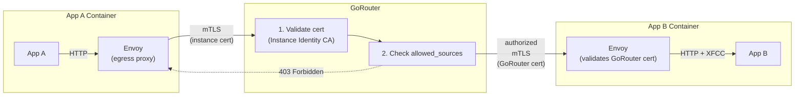

# Meta
[meta]: #meta
- Name: App-to-App mTLS via GoRouter
- Start Date: 2026-02-16
- Author(s): @rkoster, @beyhan, @maxmoehl
- Status: Draft
- RFC Pull Request: [community#1438](https://github.com/cloudfoundry/community/pull/1438)


## Summary

Enable authenticated and authorized app-to-app communication via GoRouter using mutual TLS (mTLS). Applications connect to a shared internal domain (e.g., `apps.mtls.internal`), resolvable only from within CF, where GoRouter requires client certificates, validates caller identity, and enforces per-route access control before forwarding requests.

This follows the same default-deny model as container-to-container network policies: all traffic is blocked unless explicitly allowed.


## Problem

Cloud Foundry applications can communicate via external routes (through GoRouter) or container-to-container networking (direct). Neither option provides authenticated app-to-app communication with platform-enforced authorization:

- **External routes**: Traffic leaves the VPC to reach the load balancer, adding latency and cost. GoRouter's client certificate settings are global, so enabling strict mTLS breaks external clients.
- **C2C networking**: Requires `network.write` permission (often unavailable to developers), lacks load balancing and observability, and has no identity forwarding.

**The gap**: There is no way for applications to communicate securely through GoRouter where:
- Only CF applications can connect (mTLS with instance identity)
- Traffic stays internal (no load balancer round-trip)
- The platform enforces which apps can call which routes
- Standard GoRouter features work (load balancing, retries, observability)

Authentication alone is insufficient. Without authorization enforcement, any authenticated app could access any route on the mTLS domain, defeating the purpose of platform-enforced security.


## Proposal

### Architecture Overview



The solution has two core components that must ship together:

- **Phase 1a (mTLS Infrastructure)**: GoRouter requires and validates client certificates for the mTLS domain, forwarding caller identity via the XFCC header.
- **Phase 1b (Authorization Enforcement)**: GoRouter enforces per-route access control. Routes are blocked by default unless `allowed_sources` explicitly permits the caller.

An optional enhancement simplifies client adoption:

- **Phase 2 (Egress HTTP Proxy)**: Sidecar proxy automatically injects instance identity certificates, so apps don't need TLS configuration.

### Phase 1a: mTLS Infrastructure

GoRouter gains the ability to require client certificates for specific domains while leaving other domains unaffected.

**How it works:**
1. Operator configures an internal domain (e.g., `apps.mtls.internal`) with mTLS requirements
2. BOSH DNS resolves `*.apps.mtls.internal` to GoRouter instances
3. Applications map routes to this domain like any shared domain
4. When a client connects, GoRouter:
   - Requires a client certificate
   - Validates it against the Instance Identity CA
   - Sets the XFCC header with the certificate details
   - Proceeds to authorization check (Phase 1b)

**Security settings** for the mTLS domain use the strictest configuration:
- `client_cert_validation: require`: clients must present a certificate
- `only_trust_client_ca_certs: true`: only Instance Identity CA is trusted
- `forwarded_client_cert: sanitize_set`: XFCC header cannot be spoofed

### Phase 1b: Authorization Enforcement

GoRouter enforces access control at the routing layer using a default-deny model, matching the design of container-to-container network policies.

**How it works:**
1. Route owner specifies `allowed_sources` in the route configuration
2. When a request arrives on an mTLS domain, GoRouter:
   - Extracts the caller's identity from the client certificate (app GUID, space GUID, org GUID)
   - Checks if the identity matches any `allowed_sources` rule
   - Returns `403 Forbidden` if not authorized (default-deny)
   - Forwards the request with XFCC header if authorized

**Route configuration examples:**

Platform-enforced authorization with explicit allowlist:
```yaml
applications:
- name: backend-api
  routes:
  - route: backend.apps.mtls.internal
    options:
      allowed_sources:
        apps: ["frontend-app-guid"]
        spaces: ["trusted-space-guid"]
```

App-delegated authorization (any authenticated app allowed):
```yaml
applications:
- name: autoscaler-api
  routes:
  - route: autoscaler.apps.mtls.internal
    options:
      allowed_sources:
        any: true
```

When `any: true` is set, GoRouter allows any request with a valid instance identity certificate. The app receives the XFCC header and performs its own authorization checks. This is useful when authorization depends on dynamic information (e.g., service bindings) that cannot be determined at route creation time.

**Validation rules:**
- `any: true` is mutually exclusive with `apps`, `spaces`, and `orgs`
- If `any` is not set, at least one of `apps`, `spaces`, or `orgs` must be specified (default-deny)

This builds on the route options framework from [RFC-0027: Generic Per-Route Features](rfc-0027-generic-per-route-features.md). Phase 1b depends on RFC-0027 being implemented first.

### Implementation References

| Component | Reference |
|-----------|-----------|
| GoRouter TLS config | [`routing-release/.../config.go`](https://github.com/cloudfoundry/routing-release/blob/develop/src/code.cloudfoundry.org/gorouter/config/config.go) |
| GoRouter BOSH spec | [`routing-release/jobs/gorouter/spec`](https://github.com/cloudfoundry/routing-release/blob/develop/jobs/gorouter/spec) |
| RFC-0027 route options | [`toc/rfc/rfc-0027-generic-per-route-features.md`](rfc-0027-generic-per-route-features.md) |
| Cloud Controller routes | [`cloud_controller_ng/.../route.rb`](https://github.com/cloudfoundry/cloud_controller_ng/blob/main/app/models/runtime/route.rb) |


## Security Model

Two layers of mTLS enforcement ensure only authorized traffic reaches applications:

| Layer | Validates | Trusts |
|-------|-----------|--------|
| Client → GoRouter | App's instance identity cert | Instance Identity CA |
| GoRouter → Backend | GoRouter's backend cert | GoRouter Backend CA |

This ensures:
- Only CF application instances can connect to mTLS routes
- Only GoRouter can connect to application backends
- Applications cannot bypass GoRouter


## Release Criteria

**Phase 1a and Phase 1b are co-requisites and must be released together.**

Deploying Phase 1a without Phase 1b would leave all mTLS routes accessible to any authenticated app, violating the default-deny security model. This RFC is not production-ready without both phases.

Phase 1b depends on [RFC-0027: Generic Per-Route Features](rfc-0027-generic-per-route-features.md) being implemented first.

This aligns with the container-to-container networking model where network policies enforce default-deny before traffic is allowed between apps.


## Optional Enhancements

### Phase 2: Egress HTTP Proxy

To simplify client adoption, add an HTTP proxy to the application sidecar that automatically handles mTLS.

**How it works:**
1. Diego configures an egress proxy (Envoy) listening on `127.0.0.1:8888`
2. The proxy is configured to intercept requests to `*.apps.mtls.internal`
3. For matching requests, the proxy:
   - Upgrades the connection to TLS
   - Presents the application's instance identity certificate
   - Forwards the request to GoRouter

**Application usage:**
```bash
# Client app sets HTTP_PROXY for the internal domain
export HTTP_PROXY=http://127.0.0.1:8888
export NO_PROXY=external-api.example.com

# Plain HTTP request, proxy handles mTLS automatically
curl http://myservice.apps.mtls.internal/api
```

This eliminates the need for applications to load certificates and configure TLS clients.

**Implementation references:**
- Diego Envoy proxy: [`diego-release/.../envoy-builder`](https://github.com/cloudfoundry/diego-release/tree/develop/src/code.cloudfoundry.org/envoy-builder)
- Instance identity certs: [`diego-release/docs/050-app-instance-identity.md`](https://github.com/cloudfoundry/diego-release/blob/develop/docs/050-app-instance-identity.md)


## Key Repositories

| Repository | Changes |
|------------|---------|
| [routing-release](https://github.com/cloudfoundry/routing-release) | Phase 1a: `mtls_domains` config; Phase 1b: `allowed_sources` enforcement |
| [capi-release](https://github.com/cloudfoundry/capi-release) | Phase 1b: `allowed_sources` route option validation |
| [diego-release](https://github.com/cloudfoundry/diego-release) | Phase 2: Egress proxy configuration |
| [cf-deployment](https://github.com/cloudfoundry/cf-deployment) | Ops-file for enabling mTLS app routing |


## References

- [RFC-0027: Generic Per-Route Features](rfc-0027-generic-per-route-features.md)
- [Container-to-Container Networking](https://docs.cloudfoundry.org/concepts/understand-cf-networking.html)
- [Diego Instance Identity Documentation](https://github.com/cloudfoundry/diego-release/blob/develop/docs/050-app-instance-identity.md)
- [GoRouter Client Certificate Configuration](https://github.com/cloudfoundry/routing-release/blob/develop/jobs/gorouter/spec)
