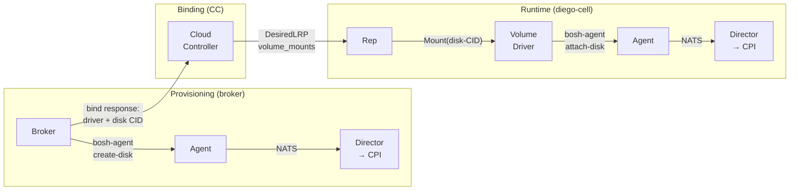
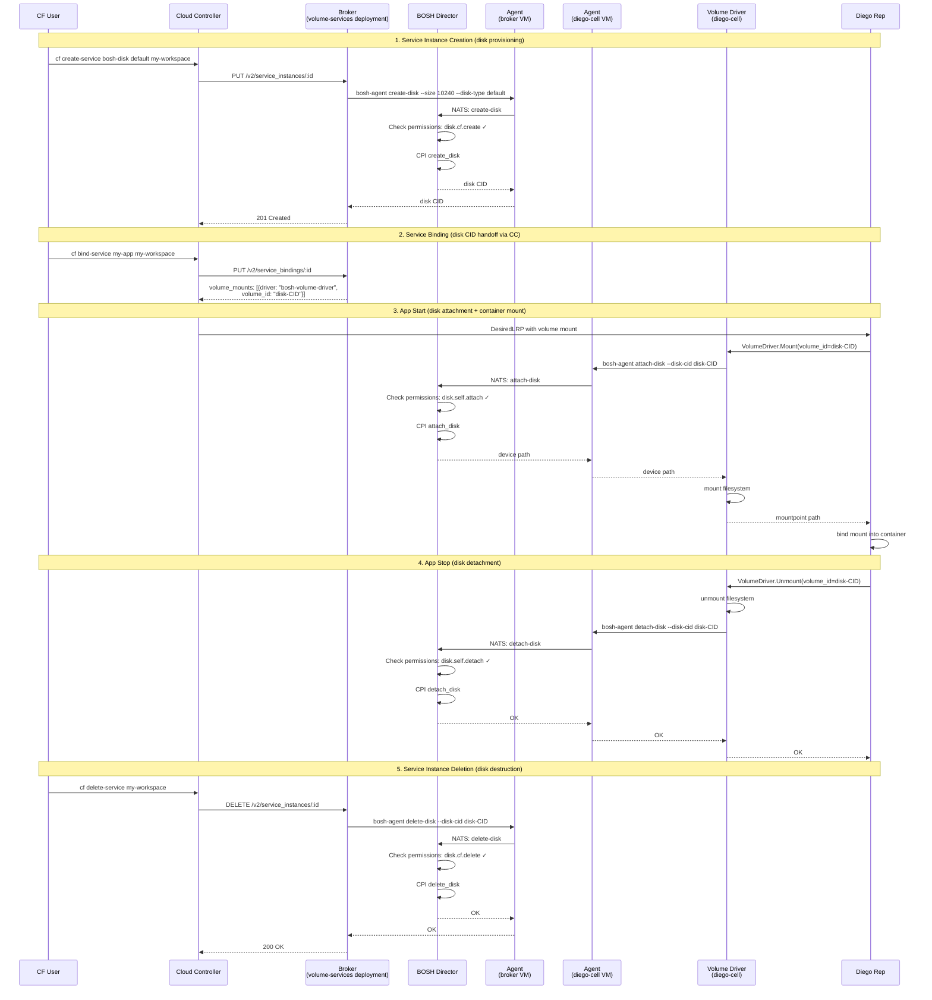

# Meta
[meta]: #meta
- Name: BOSH-Provided Dynamic Disks via Volume Services
- Start Date: 2026-03-13
- Author(s): @rkoster
- Status: Draft
- RFC Pull Request: [community#](https://github.com/cloudfoundry/community/pull/)


## Summary

Enable Diego containers to use IaaS-managed persistent disks through a **secure-by-default** architecture that leverages BOSH's existing per-instance identity:

- **No credential distribution** — The volume driver calls the local BOSH Agent binary, which relays requests to the Director over its existing mTLS NATS connection. No UAA tokens, no API credentials on cells.
- **Per-instance blast radius** — Each Agent has a unique certificate. A compromised cell can only perform operations on itself (`disk.self.attach`), not on other cells. No lateral movement.
- **Manifest-driven permissions** — Operators declare capabilities in the deployment manifest. The Director enforces them at runtime. No external credential management.

The architecture has four layers:

1. **BOSH Director** — `permissions` model controlling disk lifecycle operations per instance group
2. **BOSH Agent** — subcommands relaying disk requests to the Director
3. **Volume driver** — Docker Volume Plugin v1.12, collocated on Diego cells
4. **Diego changes** — evacuation sequencing for exclusive-access volumes, instance-indexed volume IDs

This enables Cloud Foundry to run **stateful single-container workloads** — agentic coding sessions, cloud-based developer environments, AI agent processes — with dedicated IaaS block storage, while maintaining the security posture operators expect.


## Problem

A new class of workload is emerging: **single-container processes that need dedicated persistent storage**.

- **Agentic coding sessions** — AI agents operating within workspaces containing source code, build artifacts, and tool state
- **Cloud-based developer environments** — persistent scratch space tied to a single container
- **Batch jobs** — checkpoint intermediate state across restarts

These workloads need storage that survives container restarts but is tied to a single container — not a shared service. Diego's volume services already support persistent storage via drivers (`nfsv3driver`, `smbdriver`), but these use shared network filesystems. What's missing is a driver backed by **dedicated IaaS block storage**.

### The integration challenge

Integrating IaaS disk operations with Diego raises security questions:

- **Who holds IaaS credentials?** Diego cells shouldn't have direct access to cloud provider APIs.
- **How are operations authorized?** Which cells can attach which disks?
- **What's the blast radius of compromise?** If one cell is compromised, what can an attacker do?

This RFC proposes an architecture that answers these questions by building on BOSH's existing per-instance identity infrastructure — no new credentials, no credential distribution, and a blast radius limited to a single VM.


## Proposal

### Overview

The proposal has four layers:

1. **BOSH Director** — `permissions` model on instance groups controlling disk lifecycle operations, enforced at runtime
2. **BOSH Agent** — subcommands that relay disk requests to the Director over NATS (Agent is a relay, not an enforcement point)
3. **Volume driver for Diego** — Docker Volume Plugin v1.12 job on Diego cells; disk CIDs flow through CC service bindings (same as NFS/SMB)
4. **Diego changes** — Volman queries driver capabilities; Rep uses stop-first evacuation and instance-indexed volume IDs for `private`-scope volumes


### Layer 1: BOSH Director — Dynamic Disk Management

#### Permissions

Instance groups gain an optional `permissions` list controlling which disk operations they may request:

| Permission | Scope |
|---|---|
| `disk.create` | Create disks in own deployment |
| `disk.delete` | Delete disks in own deployment |
| `disk.list` | List disks in own deployment (by CID prefix) |
| `disk.self.attach` | Attach disks to the requesting VM only |
| `disk.self.detach` | Detach disks from the requesting VM only |
| `disk.attach` | Attach disks to any VM in own deployment (implies `disk.self.attach`) |
| `disk.detach` | Detach disks from any VM in own deployment (implies `disk.self.detach`) |
| `disk.<deployment>.create` | Create disks in named deployment (cross-deployment) |
| `disk.*.create` | Create disks in any deployment |

No deployment qualifier = scoped to own deployment. Broader permissions imply narrower ones (`disk.attach` implies `disk.self.attach`). The `permissions` list is extensible — future RFCs may add permissions for other resource types.

#### Deployment manifest

```yaml
name: cf

instance_groups:
  # Diego cells: attach/detach to self only (tightest scope)
  - name: diego-cell
    permissions:
      - disk.self.attach   # attach disks to THIS cell only
      - disk.self.detach   # detach disks from THIS cell only
    jobs:
      - name: bosh-volume-driver   # Docker Volume Plugin v1.12
        release: bosh-volume-services
      - name: rep
        release: diego
      # ...

  # Broker: create/delete only
  - name: volume-services-broker
    permissions:
      - disk.create       # provision IaaS disks
      - disk.delete       # deprovision IaaS disks
    jobs:
      - name: bosh-volume-broker   # Open Service Broker API
        release: bosh-volume-services
      # ...
```

Cross-deployment example — broker in a separate deployment managing disks for `cf`:

```yaml
name: volume-services

instance_groups:
  - name: broker
    permissions:
      - disk.cf.create    # create disks in the "cf" deployment
      - disk.cf.delete    # delete disks in the "cf" deployment
    jobs:
      - name: bosh-volume-broker
        release: bosh-volume-services
```

#### How it works

1. **Deploy time**: Director validates all `permissions` entries. Unknown permissions cause deploy errors.
2. **Runtime**: When a disk operation arrives over NATS, the Director identifies the Agent by its client certificate, resolves the instance group and deployment, and checks the `permissions` list. Unauthorized requests are rejected.
3. **Tracking**: Dynamic disks are marked `dynamic` in the Director DB, associated with a target deployment (which may differ from the creating deployment in cross-deployment cases). `bosh disks` surfaces them.
4. **Lifecycle**: When a deployment is deleted, associated dynamic disks are orphaned and follow existing orphan disk cleanup.

#### VM-level locking

Dynamic disk operations do **not** acquire deployment locks. Instead, the Director uses a fine-grained **VM lock** (`lock:vm:<vm_cid>`) around CPI `attach_disk` and `detach_disk` calls:

- Dynamic disk attach/detach and deploy-time attach/detach both acquire the VM lock
- Operations on **different VMs** proceed in parallel — no blocking
- Operations on the **same VM** are serialized — only one CPI attach/detach at a time
- Short lock timeout (60s) — dynamic disk ops fail fast if the VM is busy

This allows dynamic disk operations to proceed while a `bosh deploy` is running, as long as they target different VMs. If a deploy and a dynamic disk op target the same VM simultaneously, the VM lock serializes the CPI calls.


### Layer 2: BOSH Agent — Disk Primitives

The Agent is extended with subcommands that relay disk requests to the Director over NATS. The Agent does not enforce permissions — the Director is the sole enforcement point (see Layer 1). Each subcommand reads the Agent's existing NATS credentials and client certificate, sends a request, and outputs the result as JSON to stdout or exits non-zero with an error on stderr.

| Subcommand | Arguments | Description |
|---|---|---|
| `create-disk` | `--size <MiB>` `--disk-type <name>` | Create a disk via the CPI. Returns disk CID. |
| `delete-disk` | `--disk-cid <CID>` | Delete a disk via the CPI. |
| `attach-disk` | `--disk-cid <CID>` `[--agent-id <UUID>]` | Attach a disk. Without `--agent-id`: attach to self (requires `disk.self.attach`). With `--agent-id`: attach to target VM (requires `disk.attach`). Returns device path. |
| `detach-disk` | `--disk-cid <CID>` `[--agent-id <UUID>]` | Detach a disk. Without `--agent-id`: detach from self (requires `disk.self.detach`). With `--agent-id`: detach from target VM (requires `disk.detach`). |
| `list-disks` | `--prefix <string>` | List dynamic disks matching the CID prefix. Returns array of `{cid, size, created_at}`. For disk set support (see Future Work). |

The `--disk-type` argument references a disk type defined in the cloud config (e.g., `default`, `fast`, `large`). The Director resolves this to cloud properties at runtime, ensuring consistency with operator-defined disk configurations.

The `--agent-id` argument specifies the target VM by its Agent UUID (from the Agent's client certificate). Agent IDs are globally unique across all deployments. When omitted, the operation targets the calling Agent's own VM.

Collocated BOSH jobs invoke the Agent at a well-known path:

```bash
/var/vcap/bosh/bin/bosh-agent create-disk --size 10240 --disk-type default
```


### Layer 3: BOSH Volume Driver for Diego

A BOSH job (`bosh-volume-driver`) implements the [Docker Volume Plugin v1.12](https://docs.docker.com/engine/extend/plugins_volume/) protocol — the same protocol used by `nfsv3driver` and `smbdriver`. It is collocated on Diego cells and listens on a Unix socket.

| Endpoint | Behavior |
|---|---|
| `/VolumeDriver.Create` | Stores pre-created disk CID (from service binding opts) in local state |
| `/VolumeDriver.Mount` | Calls `bosh-agent attach-disk`, mounts filesystem, returns mountpoint |
| `/VolumeDriver.Unmount` | Unmounts filesystem, calls `bosh-agent detach-disk` |
| `/VolumeDriver.Remove` | Removes disk CID from local state (broker handles deletion) |
| `/VolumeDriver.Get/List/Path` | Returns volume info from local state |
| `/VolumeDriver.Capabilities` | Returns `{"Capabilities": {"Scope": "private"}}` (see Layer 4) |
| `/Plugin.Activate` | Returns `{"Implements": ["VolumeDriver"]}` |

#### Plugin discovery

Volman discovers drivers through spec files in `/var/vcap/data/voldrivers` (default). The job places a spec file at startup:

```json
{
  "Name": "bosh-volume-driver",
  "Addr": "unix:///var/vcap/data/bosh-volume-driver/driver.sock",
  "InstanceIndexedVolumeIds": true
}
```

Volman syncs every 30 seconds and calls `/Plugin.Activate` to verify the driver. Diego changes for `private`-scope volumes and `InstanceIndexedVolumeIds` are specified in Layer 4.

#### Disk CID flow through Cloud Foundry

Disk CIDs flow from the broker to the volume driver through **Cloud Controller service bindings** — the same mechanism used by NFS and SMB volume services:



**How it works:**
1. User runs `cf create-service bosh-disk default my-workspace`. Broker calls `bosh-agent create-disk --disk-type default`, records the disk CID.
2. User runs `cf bind-service my-app my-workspace`. Broker returns volume mount config (driver name + disk CID) in the bind response.
3. Diego places the container. Rep passes volume mount to volman → `VolumeDriver.Mount` → `bosh-agent attach-disk` → mount filesystem into container.
4. Container stops. Rep calls `VolumeDriver.Unmount` → unmount → `bosh-agent detach-disk`.
5. User deletes service instance. Broker calls `bosh-agent delete-disk`.

This is identical to NFS/SMB volume services. The only difference is the backing storage: IaaS block devices instead of network filesystem shares.


### Layer 4: Diego Changes

IaaS block devices (EBS, GCP Persistent Disk, Azure Disk) can only attach to one VM at a time. This constraint requires two changes to Diego's behavior.

#### Querying driver capabilities

Diego's volman must query the driver's capabilities to determine scope. The volume driver returns:

```json
{"Capabilities": {"Scope": "private"}}
```

The `Scope` field values:
- `local` — volume is local to a single host (current default)
- `global` — volume is global across hosts (shared storage)
- `private` — volume is private to a single container (one mount at a time)

The `private` scope signals that the volume uses exclusive-access storage. Diego uses this signal to enable stop-first evacuation (Change 1 below).

> **Why `private`?** The Docker Volume Plugin spec defines `local` and `global` scopes. Adding `private` follows this naming pattern: `local` = host-scoped, `global` = cluster-scoped, `private` = container-scoped (exclusive access). Alternative names like `exclusive` or `single-mount` were considered but don't fit the existing scheme.

#### Change 1: Evacuation sequencing for private-scope volumes

**Current behavior:** During cell evacuation, the Rep requests an auction for replacement instances immediately while existing containers are still running. The old container is stopped only after the new container is placed elsewhere.

**Problem:** For block devices, the new container cannot attach the disk until the old container releases it. The mount operation fails because the disk is still attached to the evacuating cell.

**New behavior:** For LRPs with `private`-scope volumes, the Rep changes the evacuation sequence:

1. **Stop first** — Stop the existing container and unmount all `private`-scope volumes (triggers `VolumeDriver.Unmount` → `detach-disk`)
2. **Then auction** — Request placement of the replacement instance

This ensures the disk is detached before the new container attempts to attach it.

**Components affected:**
- **Rep** (`evacuation_controller.go`) — Check volume scope before evacuation; use stop-first sequence for `private` scope
- **Volman** (`docker_driver_plugin.go`) — Call `Capabilities()` endpoint on driver discovery; cache and expose scope to Rep

#### Change 2: Instance-indexed volume IDs

**Current behavior:** When a driver declares `UniqueVolumeIds: true` in its spec file, volman appends the **container GUID** as a suffix to the volume ID. The container GUID is a UUID that changes on every restart.

**Problem:** For persistent block storage, a restarted container must receive the same disk. Using container GUID as suffix means the driver sees a different volume ID after restart and cannot map it back to the original disk.

**New behavior:** A new driver spec flag `InstanceIndexedVolumeIds` tells volman to use the **instance index** (0, 1, 2, ...) as the suffix instead. The instance index is stable across restarts — instance 0 always receives suffix `_0`, instance 1 receives `_1`, etc.

The driver receives:
- `<volume-id>_0` for instance 0
- `<volume-id>_1` for instance 1
- etc.

This enables the driver to maintain a stable mapping: volume ID + instance index → disk CID.

**`UniqueVolumeIds` vs `InstanceIndexedVolumeIds`:**

These flags are **mutually exclusive** — they represent alternative strategies for volume ID suffixing:

| Spec Flag | Suffix | Stability | Use Case |
|-----------|--------|-----------|----------|
| Neither | None | N/A | Shared volume, same for all instances |
| `UniqueVolumeIds: true` | Container GUID | Changes on restart | Per-container state (e.g., caches) |
| `InstanceIndexedVolumeIds: true` | Instance Index | Stable across restarts | Persistent per-instance storage |

**Components affected:**
- **Volman** — New `InstanceIndexedVolumeIds` spec field; use `ActualLRPKey.Index` as suffix when set
- **Rep** — Already passes instance index to volman in `NewRunRequestFromDesiredLRP`; no changes needed

#### Driver spec file

The volume driver spec file for the BOSH volume driver:

```json
{
  "Name": "bosh-volume-driver",
  "Addr": "unix:///var/vcap/data/bosh-volume-driver/driver.sock",
  "InstanceIndexedVolumeIds": true
}
```

- `InstanceIndexedVolumeIds: true` — use instance index as volume ID suffix (stable across restarts)
- `Scope: "private"` — discovered dynamically via the `Capabilities()` endpoint, not declared in the spec file


### Security Model

This RFC's security model builds on BOSH's existing per-instance identity infrastructure.

#### Secure by default — no credential distribution

The volume driver calls the local BOSH Agent binary. The Agent relays requests to the Director over its existing mTLS NATS connection. No UAA tokens, no Director API credentials, no cloud provider credentials on Diego cells. There's nothing to leak.

#### Per-instance blast radius

Each BOSH Agent has a unique mTLS client certificate tied to that specific VM instance. When a request arrives, the Director identifies the *exact VM* making the request — not just the instance group, but the specific instance.

If an attacker compromises a Diego cell, they can only perform operations that specific cell is permitted to perform. With `disk.self.attach` / `disk.self.detach` permissions, a compromised cell can only attach disks to itself — not to other cells. No lateral movement is possible.

#### Manifest-driven permissions

Operators declare permissions in the deployment manifest:

```yaml
instance_groups:
  - name: diego-cell
    permissions:
      - disk.self.attach
      - disk.self.detach
```

The Director enforces these at runtime. No external credential management, no UAA client configuration, no scope-to-instance-group mapping to maintain. The manifest is the single source of truth.

#### IaaS-enforced disk isolation

IaaS block devices can only be attached to one VM at a time. This is enforced by the cloud provider, providing an additional layer of isolation beyond CF's authorization model.


### Scope and Deliverables

This RFC specifies **interface contracts and deployment model** only. Implied deliverables:

1. **BOSH Director** — `permissions` manifest property, deploy-time validation, runtime enforcement, NATS handlers for dynamic disk ops, dynamic disk tracking, orphan management
2. **BOSH Agent** — `create-disk`, `delete-disk`, `attach-disk`, `detach-disk` subcommands
3. **Volume driver job** — Docker Volume Plugin v1.12, collocated on Diego cells (`bosh-volume-services` release)
4. **Volume broker job** — Open Service Broker API for disk lifecycle, same release
5. **Diego** — Volman calls `Capabilities()` endpoint and caches scope; Rep uses stop-first evacuation for `private`-scope volumes; new `InstanceIndexedVolumeIds` spec flag for stable per-instance volume IDs


## Future Work

### Kubernetes / CSI integration

The Agent disk primitives (Layer 2) are not Diego-specific. The same interface could back a [CSI driver](https://kubernetes-csi.github.io/docs/) for Kubernetes-based CF deployments.

CSI separates storage operations into two components:

- **Controller Plugin** (centralized) — handles `ControllerPublishVolume` (attach to a target node) and `ControllerUnpublishVolume`. Would use `disk.attach` and `disk.detach` permissions with `--agent-id` to target specific nodes.
- **Node Plugin** (per-node DaemonSet) — handles `NodeStageVolume` / `NodePublishVolume` (mount). Would use `disk.self.attach` and `disk.self.detach` permissions (or no attach permissions if the controller handles all attach/detach).

This RFC's permission model supports both patterns — Diego's local-only model (`disk.self.attach`) and K8s's centralized controller model (`disk.attach` + `--agent-id`). CSI driver implementation is out of scope for this RFC.

### Disk sets — per-instance persistent storage

This RFC specifies single-disk primitives. A natural extension is **disk sets** — a service instance that manages a collection of disks, one per app instance, analogous to Kubernetes StatefulSet `volumeClaimTemplates`.

#### Problem

Diego's `DesiredLRP` defines `volume_mounts` once for all instances — every instance receives identical mount configuration. This works for shared filesystems (NFS, SMB) but not for IaaS block devices, which can only attach to one VM at a time. To run multiple app instances with per-instance persistent storage, each instance needs its own disk with stable identity (instance 0 always gets disk 0, even after restart).

#### Concept

A **disk set** is a broker-managed collection of disks:

1. **Provision**: `cf create-service bosh-disk-set default my-workspace` — broker creates a disk set record (no disks yet)
2. **Bind**: `cf bind-service my-app my-workspace` — broker returns `volume_id = <disk-set-id>` (a namespace, not a single CID)
3. **Mount (per instance)**: Diego places instance N, volman calls the driver with an encoded volume ID containing the instance index (via `InstanceIndexedVolumeIds`). Driver resolves: "disk set X, index N → disk CID" (creates on first use). Driver calls `bosh-agent attach-disk`.
4. **Scale up**: New instances trigger new disk creation
5. **Scale down**: Disks are detached but **retained** (like K8s StatefulSet)
6. **Deprovision**: Broker deletes all disks in the set

#### Leveraging Layer 4's instance-indexed volumes

Layer 4 of this RFC specifies the `InstanceIndexedVolumeIds` driver spec flag, which tells volman to use the **instance index** as the volume ID suffix instead of container GUID. This behavior is exactly what disk sets need:

- Instance 0 receives volume ID `<disk-set-id>_0`
- Instance 1 receives volume ID `<disk-set-id>_1`
- etc.

The driver decodes the suffix, uses it as the instance key, and resolves to the correct disk CID from the broker's disk set. Because the instance index is stable across restarts, instance 0 always receives the same disk.

Disk sets also require `Scope: "private"` to enable stop-first evacuation — each disk can only be attached to one VM at a time.

#### BOSH-side support

A `list-disks` Agent subcommand enables the broker and driver to discover existing disks in a set:

| Subcommand | Arguments | Description |
|---|---|---|
| `list-disks` | `--prefix <string>` | List disk CIDs matching the prefix. Returns array of `{cid, size, created_at}`. |

This allows the broker to enumerate disks in a set without maintaining a separate database, and supports garbage collection of orphaned disks.

#### Scope

With the Diego changes in Layer 4 (`InstanceIndexedVolumeIds` and `Scope: "private"`), disk sets require only broker-side logic to manage the disk set state and map instance indices to disk CIDs. This RFC establishes the foundation; a follow-up RFC can specify the disk set broker behavior in detail.


## Appendix: Alternative Architectures

This appendix explores an alternative approach — exposing disk operations via a Director HTTP API — and analyzes what would be required to integrate it with Diego volume services. This analysis informed the design choices in this RFC.

### A. Director HTTP API approach

An alternative architecture adds REST endpoints directly to the BOSH Director:

```
POST   /dynamic_disks/provide      # create + attach disk to instance
POST   /dynamic_disks/:name/detach # detach disk from instance  
DELETE /dynamic_disks/:name        # delete disk
```

Clients authenticate via UAA OAuth tokens with scopes like `bosh.dynamic_disks.update` and `bosh.dynamic_disks.delete`.

This approach has been prototyped in [community PR #1401](https://github.com/cloudfoundry/community/pull/1401) and [bosh PR #2652](https://github.com/cloudfoundry/bosh/pull/2652).

### B. Credential provisioning for Director API access

To call the Director HTTP API, clients need UAA credentials with the appropriate scopes. Two provisioning paths exist:

**Option 1: Define UAA clients in Director deployment manifest**

```yaml
# director.yml (bosh create-env)
uaa:
  clients:
    dynamic-disk-client:
      secret: ((dynamic_disk_client_secret))
      authorities: bosh.dynamic_disks.update,bosh.dynamic_disks.delete
      authorized-grant-types: client_credentials
```

The operator must then extract the generated secret and distribute it to components that need Director API access.

**Option 2: Create UAA clients out-of-band with `uaac`**

```bash
uaac target https://DIRECTOR_IP:8443 --ca-cert /path/to/ca.pem
uaac token client get uaa_admin -s UAA_ADMIN_SECRET
uaac client add dynamic-disk-client \
  --authorities bosh.dynamic_disks.update,bosh.dynamic_disks.delete \
  --authorized_grant_types client_credentials \
  --secret GENERATED_SECRET
```

Either approach requires manual credential management outside the standard BOSH deployment workflow.

### C. Diego volume services integration challenges

To integrate the Director HTTP API with Diego volume services, two components need Director API access:

| Component | Location | Credential distribution |
|---|---|---|
| Service broker | Broker VM(s) | Inject via BOSH job properties. One or few instances. Manageable. |
| Volume driver | Every Diego cell | Inject via BOSH job properties. N instances (potentially hundreds). Each cell becomes an attack surface. |

The volume driver runs on every Diego cell because Diego's volman expects drivers to be local processes listening on Unix sockets. When a container is placed on a cell, the Rep calls the local volume driver to mount the volume.

**Per-cell credential distribution creates operational and security concerns:**

1. **Credential sprawl** — UAA client credentials stored on every Diego cell
2. **Network exposure** — Every cell needs HTTPS access to the Director (typically cells only have outbound access to blob stores and NATS)
3. **Attack surface** — Compromising any cell yields Director API credentials capable of attaching/detaching disks across the deployment

### D. Centralized alternatives

Could the volume driver be centralized to avoid per-cell credentials?

**Option 1: Centralized volume driver proxy**

A single process holds Director credentials and proxies volume operations for all cells. Diego's volman supports remote drivers via TCP/HTTPS (not just Unix sockets), so this is technically feasible without modifying volman's discovery mechanism.

Concerns:
- **Single point of failure** — All volume mount/unmount operations depend on this proxy
- **Per-cell identity still required** — The proxy must authenticate which cell is making the request to enforce `disk.self.attach` semantics (only attach to the requesting cell). This requires building authentication infrastructure between cells and proxy.
- **Additional operational complexity** — New component to deploy, configure, scale, and monitor
- **Latency** — Extra network hop for every mount/unmount operation

**Option 2: Controller watching Diego BBS**

A controller watches Diego's BBS for DesiredLRP volume mount requests and calls the Director API centrally.

Problems:
- Must track which cell each container lands on (BBS ActualLRP state)
- Race conditions between container placement and disk attachment
- Must coordinate with Rep's mount lifecycle (Rep expects volume driver to return mountpoint synchronously)
- Deep integration with Diego internals rather than using the standard volume plugin interface

The Agent relay approach (this RFC) avoids these concerns by using BOSH's existing per-instance mTLS identity — each Agent has a unique certificate, so the Director can identify exactly which VM is making the request without building additional authentication infrastructure.

### E. Comparison summary

| Aspect | Agent subcommands (this RFC) | Director HTTP API |
|---|---|---|
| **Credential model** | No new credentials. Agent uses existing NATS mTLS. | UAA OAuth credentials required. |
| **Cell requirements** | No changes. Agent already present. | Director API credentials + network access on every cell. |
| **Permission granularity** | Per-instance-group, declared in manifest. | Per-UAA-client. All clients with scope have equal access. |
| **Diego integration** | Standard volume driver plugin. Minimal Diego changes (Layer 4). | Custom integration required. |
| **Broker integration** | Calls local Agent binary. | Calls Director HTTP API (straightforward). |

Both approaches share the same Director dependency for disk operations and the same failure mode: mounted disks survive Director downtime, but new operations require the Director to be available.

### F. End-to-end sequence diagram

The following diagram illustrates the complete lifecycle in a cross-deployment scenario, where the broker runs in a separate deployment (`volume-services`) with `disk.cf.create` and `disk.cf.delete` permissions, and the Diego cells run in the `cf` deployment with `disk.self.attach` and `disk.self.detach` permissions:




## Appendix: Docker Volume Plugin vs Kubernetes CSI

Diego's volman uses the **Docker Volume Plugin** protocol, not Kubernetes CSI. This appendix compares the two to clarify why this RFC extends the `Scope` field rather than using CSI-style access modes.

### Protocol comparison

| Aspect | Docker Volume Plugin | Kubernetes CSI |
|---|---|---|
| **Transport** | HTTP REST over Unix socket | gRPC |
| **Discovery** | Spec files in `/run/docker/plugins` or custom path | Node registration via kubelet |
| **Lifecycle endpoints** | `Create`, `Remove`, `Mount`, `Unmount`, `Get`, `List`, `Path` | `CreateVolume`, `DeleteVolume`, `NodeStageVolume`, `NodePublishVolume`, `NodeUnpublishVolume`, etc. |
| **Capabilities endpoint** | `Capabilities` — returns `{"Scope": "local\|global"}` | `GetCapabilities` — returns detailed access modes and capabilities |
| **Access modes** | None built-in (only `Scope`) | Rich: `SINGLE_NODE_WRITER`, `SINGLE_NODE_READER_ONLY`, `MULTI_NODE_READER_ONLY`, `MULTI_NODE_SINGLE_WRITER`, `MULTI_NODE_MULTI_WRITER`, `SINGLE_NODE_SINGLE_WRITER` (RWOP) |

### Why extend `Scope` instead of adding access modes?

CSI's `SINGLE_NODE_SINGLE_WRITER` (ReadWriteOncePod, RWOP) access mode is semantically what we need — a volume that can only be mounted by one workload at a time. However:

1. **Diego uses Docker Volume Plugin, not CSI.** The CSI protocol is not available in Diego's architecture.
2. **The Docker spec is extensible.** The `Scope` field is a plain string with no validation. The spec explicitly states "More capabilities may be added in the future."
3. **Adding a new scope value is minimal change.** Drivers already implement `Capabilities()`; returning `"private"` instead of `"local"` requires no protocol changes.
4. **`private` fits the naming scheme.** `local` = host-scoped, `global` = cluster-scoped, `private` = container-scoped (exclusive).

### Diego's current gap

Diego's volman (`voldocker/docker_driver_plugin.go`) currently **does not call the `Capabilities()` endpoint**. The `Scope` field has no effect on Diego's behavior today. Layer 4 of this RFC addresses this by having volman query capabilities and act on the result.

### CSI reference: RWOP

Kubernetes 1.22 introduced `ReadWriteOncePod` (RWOP) access mode via CSI's `SINGLE_NODE_SINGLE_WRITER` capability. This provides the same semantics we achieve with `Scope: "private"`:

- Volume can only be mounted by a single pod at a time
- Scheduler considers this constraint when placing pods
- If a pod is evicted, the volume is unmounted before a new pod can claim it

The Diego changes in Layer 4 (stop-first evacuation for private-scope volumes) mirror this Kubernetes behavior.
