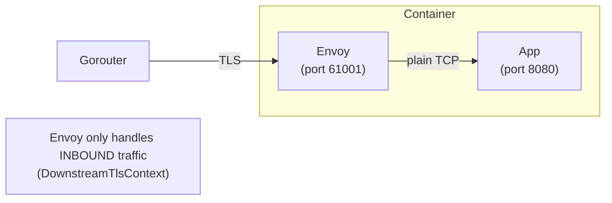
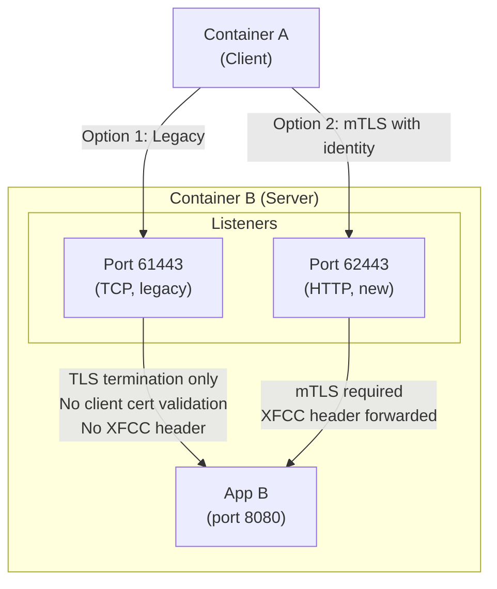
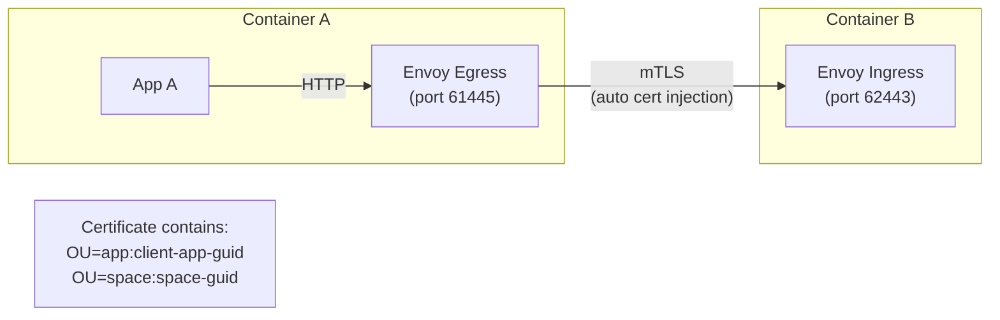
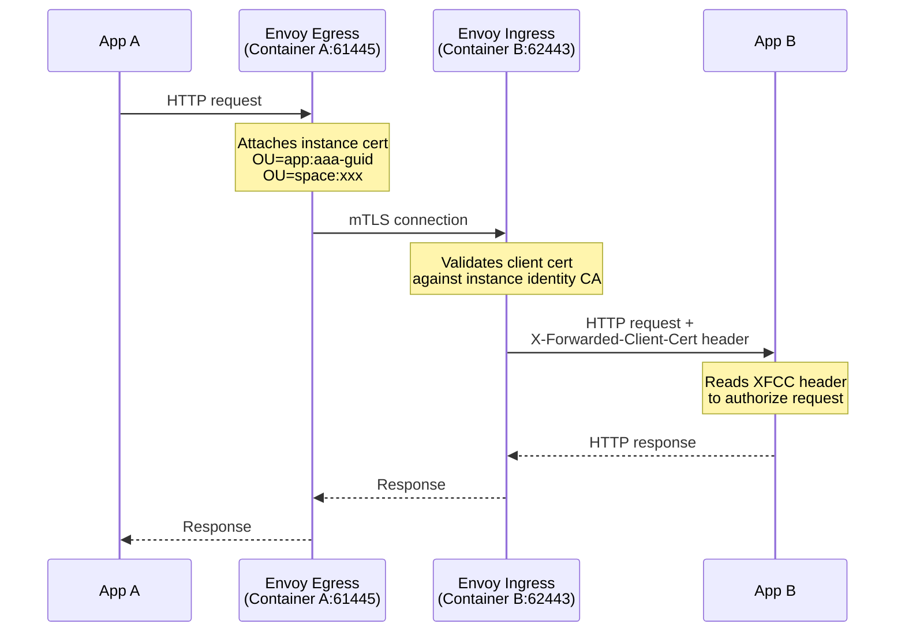

# Meta
[meta]: #meta
- Name: Full mTLS for Diego Container-to-Container Traffic
- Start Date: 2026-02-13
- Author(s): @rkoster
- Status: Draft
- RFC Pull Request: (fill in with PR link after you submit it)


## Summary

This RFC proposes implementing full mutual TLS (mTLS) for container-to-container (C2C) traffic in Diego, enabling applications to both authenticate themselves and verify the identity of connecting applications.

The approach introduces a **new HTTP-based listener on port 62443** that runs alongside the existing TCP-based C2C port (61443), providing a dual opt-in model for both operators and application authors. This enables zero-trust networking where all app-to-app traffic can be authenticated and authorization decisions can be made based on app/space/org identity.


## Problem

Cloud Foundry's Diego runtime currently runs Envoy as a per-container sidecar for handling **inbound traffic only**. While this provides TLS termination and route integrity, several limitations prevent true zero-trust app-to-app communication:

### No Client-Side (Egress) Proxy

Envoy is not configured as an egress proxy. Applications cannot automatically inject their instance identity certificate when making outbound connections. The current workaround requires applications to manually use `CF_INSTANCE_CERT` and `CF_INSTANCE_KEY` environment variables to present their identity.

### No Identity Extraction on Server Side

Even when mTLS is enabled, the receiving application has no way to know who connected. Envoy does not forward client certificate information via headers (no XFCC header configuration).

### C2C Port (61443) is TCP-Based

The C2C listener (port 61443) is a TCP proxy, not an HTTP proxy. This means:
- No HTTP connection manager
- No XFCC header support
- No mTLS client certificate validation
- No HTTP/2 support

### Existing mTLS Only Affects Route Integrity

The existing BOSH property `containers.proxy.require_and_verify_client_certificates` only affects route integrity ports (Gorouter → App), not C2C traffic.

### Current Architecture



### Current Certificate Setup

Diego generates two separate certificates per container:

| Certificate | SAN Contents | Purpose | mTLS Support | HTTP/2 |
|------------|--------------|---------|--------------|--------|
| Instance Identity | Container IP address | Route integrity (Gorouter → App) | Yes (optional) | Yes |
| C2C Certificate | Internal route hostnames (e.g., `app.apps.internal`) | Container-to-container TLS | No | No |

Both certificates include app identity in the `OrganizationalUnit` field with claims like `app:some-app-guid`, `space:some-space-guid`, and `organization:some-org-guid`.


## Proposal

### Design Principles

1. **Backwards compatibility**: Keep port 61443 unchanged for existing applications
2. **Dual opt-in**: Both operator and application author must opt-in
3. **New port for new behavior**: Port 62443 for HTTP-based mTLS with XFCC header support

### Port Allocation

| Port | Type | Purpose | mTLS | XFCC | Status |
|------|------|---------|------|------|--------|
| 61001+ | HTTP | Route integrity | Optional | No | Existing |
| 61443 | TCP | Legacy C2C TLS | No | No | Existing (unchanged) |
| **62443** | **HTTP** | **C2C mTLS with identity** | **Required** | **Yes** | **New** |
| 61445 | HTTP | Egress proxy (client-side) | N/A | N/A | New |

### Implementation Phases

The implementation is divided into three phases to allow gradual adoption and testing.

---

### Phase 1: Server-Side - New HTTP-based C2C mTLS Port (62443)

Add a new Envoy listener on port 62443 that provides HTTP-based C2C with mTLS and XFCC header forwarding.



#### Changes Required

**New Port Constant**: Add `C2CMTLSPort = 62443` alongside the existing `C2CTLSPort = 61443`.

**New HTTP-based Listener**: Create a new Envoy listener with:
- HTTP connection manager (not TCP proxy)
- `DownstreamTlsContext` with `RequireClientCertificate: true`
- Validation context trusting the instance identity CA
- XFCC header forwarding configured via `ForwardClientCertDetails: SANITIZE_SET`
- Subject, URI, and DNS fields included in the XFCC header

**BOSH Properties**:

```yaml
containers.proxy.enable_c2c_mtls_listener:
  description: "Enable the HTTP-based C2C mTLS listener on port 62443. This listener 
    requires client certificates and forwards caller identity via the X-Forwarded-Client-Cert header."
  default: false

containers.proxy.c2c_mtls_port:
  description: "Port for the HTTP-based C2C mTLS listener with XFCC support"
  default: 62443
```

**Port Reservation**: Add validation to prevent applications from using port 62443, similar to the existing reservation for port 61443.

#### Result

When an operator enables `containers.proxy.enable_c2c_mtls_listener`:
- Port 62443 becomes available on all containers
- Clients connecting to 62443 MUST present a valid instance identity certificate
- The receiving app gets an `X-Forwarded-Client-Cert` header with caller identity:

```
X-Forwarded-Client-Cert: Hash=abc123;Subject="CN=instance-guid,OU=app:client-app-guid,OU=space:space-guid"
```

---

### Phase 2: Client-Side Egress Proxy (Port 61445)

Enable Envoy to act as an HTTP proxy for outbound connections, automatically injecting the instance identity certificate.



#### Changes Required

**Egress Proxy Port**: Reserve port 61445 for the egress proxy.

**Egress Listener**: Create a new Envoy listener that acts as an HTTP CONNECT proxy, bound to `127.0.0.1:61445` (localhost only).

**UpstreamTlsContext**: Configure the egress proxy to automatically attach the instance identity certificate to outbound connections using `UpstreamTlsContext` with the `id-cert-and-key` SDS secret.

**Environment Variable** (optional): Inject a CF-specific environment variable to allow applications to opt-in:

```
CF_INSTANCE_MTLS_PROXY=http://127.0.0.1:61445
```

Using a CF-specific variable rather than `HTTP_PROXY` allows applications to opt-in explicitly without affecting all outbound traffic.

**BOSH Properties**:

```yaml
containers.proxy.enable_egress_proxy:
  description: "Enable Envoy egress proxy for outbound mTLS on port 61445"
  default: false

containers.proxy.egress_proxy_port:
  description: "Port for the egress HTTP proxy"
  default: 61445
```

#### Considerations

- **SNI Handling**: Envoy needs to extract the target hostname for proper TLS handshake
- **NO_PROXY**: Applications should configure `NO_PROXY` for traffic that should not go through the proxy
- **Non-HTTP Traffic**: TCP-based protocols will not work through HTTP CONNECT
- **Performance**: Additional hop adds latency
- **Memory**: Additional memory allocation may be needed for the egress proxy

---

### Phase 3: Full Integration

With both phases implemented, the complete mTLS flow enables zero-trust app-to-app communication:



#### Opt-in Model

| Actor | How to Opt-in |
|-------|---------------|
| **Operator** | Set `containers.proxy.enable_c2c_mtls_listener: true` and `containers.proxy.enable_egress_proxy: true` |
| **Server App** | Listen for connections and read `X-Forwarded-Client-Cert` header |
| **Client App** | Connect to port 62443 (directly or via egress proxy at 61445) |

#### App-Level Authorization

Applications can parse the XFCC header to make authorization decisions based on the caller's app GUID, space GUID, or organization GUID embedded in the certificate's OrganizationalUnit field.

---

### Benefits

| Aspect | Benefit |
|--------|---------|
| **Backwards compatible** | Port 61443 unchanged, existing apps continue to work |
| **Operator opt-in** | New BOSH properties to enable 62443 and 61445 listeners |
| **App author opt-in** | Must explicitly connect to 62443 to use mTLS with identity |
| **Clear semantics** | 62443 = "secure C2C with identity verification" |
| **Gradual migration** | Apps can migrate one at a time |
| **No breaking changes** | All existing functionality preserved |

### What Full mTLS Enables

1. **Automatic identity injection**: Apps don't need to handle certificates manually
2. **Identity verification**: Server apps can verify and extract caller identity
3. **Zero-trust networking**: All app-to-app traffic is authenticated
4. **Policy enforcement**: Authorization decisions based on app/space/org identity

---

## Key Repositories

The following repositories require modifications to implement this proposal:

| Repository | Purpose |
|------------|---------|
| [cloudfoundry/executor](https://github.com/cloudfoundry/executor) | Envoy config generation, certificate generation, environment variable injection |
| [cloudfoundry/bbs](https://github.com/cloudfoundry/bbs) | CertificateProperties model |
| [cloudfoundry/diego-release](https://github.com/cloudfoundry/diego-release) | BOSH property definitions |
| [cloudfoundry-incubator/routing-info](https://github.com/cloudfoundry-incubator/routing-info) | InternalRoutes structure |

## References

- [Envoy XFCC Header Documentation](https://www.envoyproxy.io/docs/envoy/latest/configuration/http/http_conn_man/headers#x-forwarded-client-cert)
- [Envoy Dynamic Forward Proxy](https://www.envoyproxy.io/docs/envoy/latest/configuration/http/http_filters/dynamic_forward_proxy_filter)
- [Diego Envoy Proxy Configuration](https://github.com/cloudfoundry/diego-release/blob/develop/docs/060-envoy-proxy-configuration.md)
