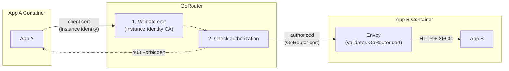
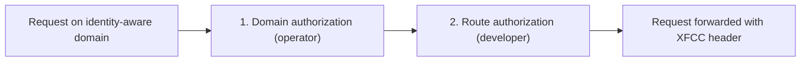

# Meta
[meta]: #meta
- Name: Identity-Aware Routing for GoRouter
- Start Date: 2026-02-16
- Author(s): @rkoster, @beyhan, @maxmoehl
- Status: Draft
- RFC Pull Request: [community#1438](https://github.com/cloudfoundry/community/pull/1438)


## Summary

Enable identity-aware routing on GoRouter through per-domain mutual TLS (mTLS). Operators configure domains that require client certificates via `router.domains` in BOSH, specify how to handle the XFCC header, and optionally enable platform-enforced access control through Cloud Controller.

This RFC introduces two tiers:

- **mTLS domain** (Part 1): A domain configured in `router.domains` where GoRouter requires and validates a client certificate during the TLS handshake. Any valid certificate signed by the configured CA is accepted. GoRouter sets the XFCC header for backend applications. This establishes mutual authentication between client and router for that domain.
- **Identity-aware domain** (Part 2): An mTLS domain that also has Cloud Foundry identity enforcement enabled (`--enforce-access-rules`). GoRouter extracts CF app identity from the certificate and enforces route-level access rules. This follows the same default-deny model as container-to-container network policies: all traffic is blocked unless explicitly allowed.

This infrastructure supports two primary use cases: authenticated CF app-to-app communication (identity-aware domains, e.g., `apps.identity`), and external client certificate validation for partner integrations (mTLS domains without enforcement).


## Problem

Cloud Foundry applications can communicate via external routes (through GoRouter) or container-to-container networking (direct). Neither provides per-domain mutual authentication with platform-enforced authorization:

- **External routes**: Traffic leaves the VPC to reach the load balancer, adding latency and cost. GoRouter's client certificate settings are global — enabling strict mutual TLS for one domain affects all domains.
- **C2C networking**: Requires [`network.write` scope](https://docs.cloudfoundry.org/devguide/deploy-apps/cf-networking.html#grant-permissions), which is not granted to space developers by default—operators must set [`enable_space_developer_self_service: true`](https://github.com/cloudfoundry/cf-networking-release/blob/develop/jobs/policy-server/spec). Also lacks load balancing, observability, and identity forwarding.

This RFC addresses two use cases that require per-domain mutual authentication:

1. **CF app-to-app routing**: Applications need authenticated internal communication where only CF apps can connect (via instance identity), traffic stays internal, the platform enforces which apps can call which routes, and standard GoRouter features work (load balancing, retries, observability). These routes are on identity-aware domains.

2. **External client certificates**: Some platforms need to validate client certificates from external systems (partner integrations, IoT devices) on specific domains without affecting other domains or requiring CF-specific identity handling.

**The gap**: GoRouter has no mechanism for requiring mutual authentication on specific domains while leaving others unaffected, and no way to enforce authorization rules at the route level based on caller identity.

For CF app-to-app routing specifically, authentication alone is insufficient. Without authorization enforcement, any authenticated app could access any route on an identity-aware domain, defeating the purpose of platform-enforced security.


## Proposal

GoRouter gains the ability to require client certificates for specific domains, with configurable identity extraction and authorization enforcement. This is implemented in two parts:

- **Part 1 (Domain-Scoped mTLS)**: GoRouter requires and validates client certificates for domains configured in `router.domains`. The XFCC header is set with certificate details. This alone is sufficient for external client certificate validation — these are **mTLS domains**.
- **Part 2 (CF Identity & Authorization)**: GoRouter extracts CF identity from Diego instance certificates (when using Envoy XFCC format) and enforces authorization rules based on route options. This turns an mTLS domain into an **identity-aware domain** and enables CF app-to-app routing.

### Architecture Overview

| Step | Part | Actor | What happens |
|------|------|-------|--------------|
| 1 | 1 | Operator | Configures an mTLS domain in the `router.domains` BOSH configuration |
| 2 | 1 | DNS | BOSH DNS (or external DNS) resolves the domain to GoRouter instances |
| 3 | 1 | GoRouter | Requires and validates a client certificate, sets the XFCC header |
| 4 | 2 | Operator | Registers the domain in CC with `cf create-shared-domain` (or `cf create-private-domain`); add `--enforce-access-rules` to make it identity-aware (`--scope` is optional) |
| 5 | 2 | Operator | Shares the domain into orgs (`cf share-private-domain`) so developers can create routes |
| 6 | 2 | Developer | Creates access rules per route via the Access Rules API (identity-aware domains only) |
| 7 | 2 | GoRouter | Extracts CF identity from the certificate and enforces access rules (identity-aware domains only) |

Part 1 alone (without Part 2) is sufficient for external client certificate validation: GoRouter validates the cert and sets the XFCC header; backend applications handle authorization themselves based on that header. This is an mTLS domain without identity awareness.

The diagram below shows the most complex use case: CF app-to-app routing with both parts active.



### Part 1: Domain-Scoped mTLS

GoRouter gains the ability to require client certificates for specific domains while leaving other domains unaffected — these are called **mTLS domains**. This infrastructure is generic and can be used for multiple purposes beyond CF app-to-app routing. Operators configure it entirely through the BOSH manifest.

#### GoRouter BOSH Configuration

```yaml
router:
  domains:
    # SNI hostname pattern for this domain configuration. Wildcards supported.
    - name: "*.apps.identity"
      
      # CA certificate(s) for validating client certs (PEM-encoded)
      ca_certs: ((diego_instance_identity_ca.certificate))
      
      # How to handle the X-Forwarded-Client-Cert header:
      #   sanitize_set (default, recommended) - Remove incoming XFCC, set from client cert
      #   forward - Pass through existing XFCC header
      #   always_forward - Always pass through, even if no client cert
      forwarded_client_cert: sanitize_set
      
      # Format of the XFCC header value: raw (default) or envoy
      xfcc_format: envoy
```

The community convention for identity-aware routing is `*.apps.identity`, following the same pattern as `*.apps.internal` for container-to-container networking. Operators can use any domain they control; `*.apps.identity` is the recommended standard.

#### XFCC Header Format

The `xfcc_format` field controls the format of the `X-Forwarded-Client-Cert` header that GoRouter sets on proxied requests:

- **`raw`** (default): The full PEM certificate is base64-encoded and placed in the header. This produces a large header value (approximately 1.5 KB per certificate) that the backend application must decode and parse to extract identity fields.
- **`envoy`**: GoRouter uses the same compact format as [Envoy's XFCC implementation](https://www.envoyproxy.io/docs/envoy/latest/configuration/http/http_conn_man/headers#x-forwarded-client-cert): `Hash=<sha256-fingerprint>;Subject="<distinguished-name>"`. This reduces the header to approximately 300 bytes. When `xfcc_format: envoy` is configured and Part 2 authorization is active, GoRouter parses identity directly from the Subject's `OU` fields (`OU=app:<guid>`, `OU=space:<guid>`, `OU=organization:<guid>`) without decoding the full certificate, which is more efficient.

### Part 2: CF Identity & Authorization

Part 2 adds Cloud Foundry identity and authorization on top of the mTLS infrastructure from Part 1. An mTLS domain becomes an **identity-aware domain** when created with `--enforce-access-rules`. Identity-aware domains enforce route-level access rules using CF app identity extracted from Diego instance certificates. Part 2 is implemented entirely through Cloud Controller API changes — no additional BOSH configuration is required beyond Part 1.

#### Operator Setup

Enforcement is configured at domain creation time using `--enforce-access-rules` and is immutable after that — a domain cannot be converted between enforcing and non-enforcing once registered. This makes the rollout safe by design: the domain enforces access rules before any developer can create a route on it.

```bash
# 1. BOSH: configure router.domains in gorouter.yml (GoRouter infrastructure)

# 2. Register the domain in CC with enforcement enabled from the start
cf create-shared-domain apps.identity --enforce-access-rules --scope org

# 3. Share the domain into orgs (developers can now create routes)
cf share-private-domain my-org apps.identity

# 4. Developers create routes and add access rules before going live
cf map-route my-app apps.identity --hostname my-app
cf add-access-rule my-app apps.identity cf:app:<caller-guid> --hostname my-app
```

To register a domain for Part 1 only (external client certificate validation, no CF identity enforcement), omit the flag: `cf create-shared-domain partner.example.com`.

#### Operator Scope

The operator sets a scope boundary at domain creation time that limits which callers can reach routes on the domain. This boundary is enforced before any route-level access rules are evaluated.

| Field | Type | Description |
|-------|------|-------------|
| `enforce_access_rules` | boolean | When true, GoRouter enforces access rules for routes on this domain. Set at creation time only — immutable after creation. |
| `access_rules_scope` | string | Operator-level boundary: `any`, `org`, or `space`. Set at creation time only — immutable after creation. |

These fields are set via the `POST /v3/domains` CC API endpoint (via `cf create-shared-domain` or `cf create-private-domain`). They are not present on the `PATCH /v3/domains/:guid` endpoint.

| Scope | Effect |
|-------|--------|
| `any` | Any authenticated caller passes domain-level checks |
| `org` | Caller must be from the same org as the destination |
| `space` | Caller must be from the same space as the destination |

For shared routes with apps mapped from multiple spaces, scope is evaluated against the selected backend after load balancing. See [Scope Evaluation and Shared Routes](#scope-evaluation-and-shared-routes) in the Appendix for details and tradeoffs.

#### Layered Authorization

GoRouter extracts CF identity from Diego instance identity certificates and enforces authorization at two layers:



1. **Domain level (operator)**: The `access_rules_scope` boundary, configured at domain creation. Requires Admin role for shared domains, Org Manager for private domains.
2. **Route level (developer)**: Access rules on individual routes, configured via the Access Rules API. Requires Space Developer role in the route's space.

Developers can only **restrict further** within operator boundaries. They cannot expand access beyond operator-defined limits. When a domain has `enforce_access_rules: true`, all requests to routes without access rules are denied by default.

See [Identity Extraction](#identity-extraction) in the Appendix for details on how GoRouter parses identity from certificates.

#### Developer Access Rules

Developers control which callers can reach their routes by creating access rules. Each rule has a human-readable name for auditability and a selector that identifies allowed callers. Only Space Developers in the route's space can manage access rules — unlike C2C policies which require permissions in both source and destination spaces, access rules are destination-controlled.

##### Selector Syntax

| Selector | Description |
|----------|-------------|
| `cf:app:<guid>` | Allow a specific CF application |
| `cf:space:<guid>` | Allow all apps in a CF space |
| `cf:org:<guid>` | Allow all apps in a CF organization |
| `cf:any` | Allow any authenticated CF application (within operator scope) |

The `cf:` prefix is reserved for Cloud Foundry native identities. See [Namespace Reservation](#namespace-reservation) in the Appendix for future extensibility.

##### CLI Commands

```bash
# Add an access rule
cf add-access-rule frontend-app apps.identity cf:app:d76446a1-f429-4444-8797-be2f78b75b08 \
  --hostname backend

# Add an access rule for a route with a path
cf add-access-rule frontend-app apps.identity cf:app:d76446a1-f429-4444-8797-be2f78b75b08 \
  --hostname backend --path /api

# List access rules
cf access-rules apps.identity --hostname backend
cf access-rules apps.identity --hostname backend --path /api

# Remove an access rule
cf remove-access-rule frontend-app apps.identity --hostname backend
cf remove-access-rule frontend-app apps.identity --hostname backend --path /api
```

Selectors always require a GUID rather than a name. This is intentional: the person creating the rule does not need read access to the selector's source app, space, or org. The GUID is a public identity that the calling team shares out of band.

##### Validation Rules

- Access rules can only be created for routes on domains where `enforce_access_rules` is true (i.e., domains created with `--enforce-access-rules`)
- Access rules cannot be created for routes on internal domains (domains created with `--internal`). Traffic to internal domains bypasses GoRouter entirely via container-to-container networking, so GoRouter cannot enforce access rules. Cloud Controller rejects the request with a 422 error.
- `cf:any` cannot be combined with other selectors on the same route. If a route has a `cf:any` rule, no other rules (`cf:app:...`, `cf:space:...`, `cf:org:...`) can be added.
- Duplicate selectors on the same route are rejected with an error
- Rule names must be unique per route
- Selector GUIDs (`cf:app:<guid>`, `cf:space:<guid>`, `cf:org:<guid>`) are not validated against Cloud Controller at creation time. The developer creating the rule does not need visibility into the source app, space, or org. App and space GUIDs function as public identities that teams can share with each other out of band. This intentionally differs from C2C networking, where both sides of a policy must be reachable by the policy creator.

#### Access Rules API

| Method | Path | Description |
|--------|------|-------------|
| `GET` | `/v3/access_rules` | List access rules (with filters) |
| `GET` | `/v3/access_rules/:guid` | Get a single access rule |
| `POST` | `/v3/access_rules` | Create an access rule |
| `PATCH` | `/v3/access_rules/:guid` | Update an access rule (metadata only) |
| `DELETE` | `/v3/access_rules/:guid` | Delete a rule by guid |

Access rules are owned by their route: deleting a route cascades to delete all its access rules. However, deleting the resource referenced by a selector (app, space, or org) does **not** delete the access rule — see [Access Rule Lifecycle](#access-rule-lifecycle) in the Appendix. See [Access Rules API Examples](#access-rules-api-examples) for full request/response examples and [Access Rules API Reference](#access-rules-api-reference) for query parameters, includes, and filtering details.

Part 2 depends on [RFC-0027: Generic Per-Route Features](rfc-0027-generic-per-route-features.md) being implemented first. See [Internal Implementation](#internal-implementation) for how Cloud Controller translates access rules into route options and how GoRouter processes them.


## Release Criteria

### CF App-to-App Routing Use Case

Part 1 and Part 2 are co-requisites and must be released together.

Deploying Part 1 without Part 2 would leave all routes on identity-aware domains accessible to any authenticated app, violating the default-deny security model. Routes must have access rules configured via the Access Rules API to control access.

Part 2 depends on [RFC-0027: Generic Per-Route Features](rfc-0027-generic-per-route-features.md) being implemented first.

### External Client Validation Use Case

Part 1 alone (without `--enforce-access-rules` on the domain) is sufficient. Backend applications handle authorization based on the XFCC header. Note that if a domain is created with `--enforce-access-rules` but no access rules are configured on a route, requests to that route will be denied by default.


## Security Considerations

### SNI and Host Header Validation

GoRouter uses Server Name Indication (SNI) during the TLS handshake to determine whether to require a client certificate. This creates a potential security concern: SNI and the HTTP Host header are independent values controlled by the client.

#### Attack Scenario Without Mitigation

1. Attacker connects to GoRouter with SNI = `regular-app.example.com` (standard domain)
2. TLS handshake completes without requiring a client certificate
3. Attacker sends HTTP request with `Host: secure-api.apps.identity` (mTLS domain)
4. Without validation, the request would be routed to the certificate-protected application

#### Mitigation: SNI-Host Validation

GoRouter validates that the TLS handshake was performed appropriately for the target domain. For requests to mTLS domains, GoRouter verifies that:

1. **Mutual authentication was enforced during the TLS handshake**: The client certificate was required and validated
2. **The SNI domain matches the Host header**: The domain used for TLS configuration matches the HTTP request target

If either check fails, GoRouter rejects the request with HTTP 421 (Misdirected Request) before forwarding to the backend. See [SNI-Host Validation Implementation](#sni-host-validation-implementation) in the Appendix for technical details.

#### Mixed-Mode Environments

GoRouter supports mixed-mode operation where some domains require mutual authentication and others do not. Clients connecting to standard domains are not required to send SNI. The validation rule is:

- If the HTTP Host header points to an mTLS domain, mutual authentication **must** have been enforced during the TLS handshake for that specific domain
- If the HTTP Host header points to a standard domain, no additional validation is required

This preserves backward compatibility with existing deployments while preventing authentication bypass attacks.

#### Behavior Summary

| SNI | Host Header | TLS Handshake | Result |
|-----|-------------|---------------|--------|
| `secure.apps.identity` | `secure.apps.identity` | Client cert validated | ✅ Allowed |
| (empty) | `regular.example.com` | No client cert | ✅ Allowed |
| `regular.example.com` | `secure.apps.identity` | No client cert | ❌ 421 Misdirected |
| (empty) | `secure.apps.identity` | No client cert | ❌ 421 Misdirected |
| `secure-a.apps.identity` | `secure-b.apps.identity` | Client cert for domain A | ❌ 421 Misdirected |


## Appendix

### Access Rules API Examples

#### Create a Single Rule (`POST /v3/access_rules`)

```http
POST /v3/access_rules
```

```json
{
  "name": "frontend-app",
  "selector": "cf:app:d76446a1-f429-4444-8797-be2f78b75b08",
  "metadata": {
    "labels": { "team": "payments" },
    "annotations": { "description": "Allow frontend to call payments API" }
  },
  "relationships": {
    "route": { "data": { "guid": "route-guid" } }
  }
}
```

#### Create Response

```json
{
  "guid": "rule-guid-1",
  "name": "frontend-app",
  "selector": "cf:app:d76446a1-f429-4444-8797-be2f78b75b08",
  "created_at": "2026-03-25T10:00:00Z",
  "updated_at": "2026-03-25T10:00:00Z",
  "metadata": {
    "labels": { "team": "payments" },
    "annotations": { "description": "Allow frontend to call payments API" }
  },
  "relationships": {
    "route": { "data": { "guid": "route-guid" } },
    "app": { "data": { "guid": "d76446a1-f429-4444-8797-be2f78b75b08" } },
    "space": { "data": null },
    "organization": { "data": null }
  },
  "links": {
    "self": { "href": "/v3/access_rules/rule-guid-1" },
    "route": { "href": "/v3/routes/route-guid" }
  }
}
```

#### Update Metadata (`PATCH /v3/access_rules/:guid`)

```http
PATCH /v3/access_rules/rule-guid-1
```

```json
{
  "metadata": {
    "labels": { "team": "payments", "env": "prod" },
    "annotations": { "description": "Updated description" }
  }
}
```

#### List with Includes (for Auditing)

```http
GET /v3/access_rules?include=route,app
```

```json
{
  "pagination": {
    "total_results": 2,
    "total_pages": 1,
    "first": { "href": "/v3/access_rules?page=1&per_page=50" },
    "last": { "href": "/v3/access_rules?page=1&per_page=50" },
    "next": null,
    "previous": null
  },
  "resources": [
    {
      "guid": "rule-guid-1",
      "name": "frontend-app",
      "selector": "cf:app:d76446a1-f429-4444-8797-be2f78b75b08",
      "created_at": "2026-03-25T10:00:00Z",
      "updated_at": "2026-03-25T10:00:00Z",
      "metadata": {
        "labels": { "team": "payments" },
        "annotations": {}
      },
      "relationships": {
        "route": { "data": { "guid": "route-guid" } },
        "app": { "data": { "guid": "d76446a1-f429-4444-8797-be2f78b75b08" } },
        "space": { "data": null },
        "organization": { "data": null }
      },
      "links": {
        "self": { "href": "/v3/access_rules/rule-guid-1" },
        "route": { "href": "/v3/routes/route-guid" }
      }
    },
    {
      "guid": "rule-guid-2",
      "name": "old-job",
      "selector": "cf:app:app-guid-deleted",
      "created_at": "2025-11-01T14:23:00Z",
      "updated_at": "2025-11-01T14:23:00Z",
      "metadata": {
        "labels": {},
        "annotations": {}
      },
      "relationships": {
        "route": { "data": { "guid": "route-guid" } },
        "app": { "data": null },
        "space": { "data": null },
        "organization": { "data": null }
      },
      "links": {
        "self": { "href": "/v3/access_rules/rule-guid-2" },
        "route": { "href": "/v3/routes/route-guid" }
      }
    }
  ],
  "included": {
    "apps": [
      {
        "guid": "d76446a1-f429-4444-8797-be2f78b75b08",
        "name": "frontend-app",
        "relationships": {
          "space": { "data": { "guid": "space-guid" } }
        }
      }
    ],
    "routes": [
      {
        "guid": "route-guid",
        "host": "backend",
        "path": "",
        "url": "backend.apps.identity",
        "relationships": {
          "domain": { "data": { "guid": "domain-guid" } },
          "space": { "data": { "guid": "space-guid" } }
        }
      }
    ]
  }
}
```

In `rule-guid-2`, the `app` relationship is `null` because the referenced app (`app-guid-deleted`) no longer exists. The selector string is preserved so the caller can identify which GUID was referenced. Stale rules are visible at two levels: the `null` relationship on the resource itself, and the absence of the deleted app from the `included.apps` block.

### Scope Evaluation and Shared Routes

GoRouter's route table stores per-endpoint tags from the route-emitter, including `organization_id` and `space_id` for each destination app instance. When `access_rules_scope` is set, GoRouter compares the caller's identity (extracted from the client certificate) against the **selected backend's** tags after load balancing:

| Scope | Check | Effect |
|-------|-------|--------|
| `any` | None | Any authenticated caller passes domain-level checks |
| `org` | `caller.OrgGUID == selected_endpoint.organization_id` | Caller must be from the same org as the selected backend |
| `space` | `caller.SpaceGUID == selected_endpoint.space_id` | Caller must be from the same space as the selected backend |

When a [shared route](https://v3-apidocs.cloudfoundry.org/version/3.215.0/index.html#share-a-route-with-other-spaces-experimental) has apps mapped from multiple spaces, the GoRouter `EndpointPool` for that route contains endpoints from different spaces. Each endpoint carries its own `space_id` and `organization_id` tags, set by the route-emitter based on the app instance it represents — not the route owner.

For example, if route `api.apps.identity` is shared between Space A and Space B, with an app mapped in each:

```
EndpointPool for "api.apps.identity":
  [0] 10.0.1.5:8080  tags: { space_id: "space-a-guid", organization_id: "org-guid" }
  [1] 10.0.2.9:8080  tags: { space_id: "space-b-guid", organization_id: "org-guid" }
```

GoRouter first selects a backend endpoint via load balancing, then evaluates scope against that specific endpoint's tags. For `scope: space`:

- A caller from Space A is allowed if endpoint [0] is selected, denied if endpoint [1] is selected
- A caller from Space B is allowed if endpoint [1] is selected, denied if endpoint [0] is selected
- A caller from Space C (no app mapped to the route) is always denied

#### Tradeoff: Intermittent Failures on Cross-Space Shared Routes

This design prioritizes **strictness over intuitiveness**. When an operator configures `scope: space`, they are expressing the intent that callers should only reach backends in their own space. Post-selection checking honors this intent even when a route spans multiple spaces.

The tradeoff is that callers may see **intermittent 403 errors** if:
1. A route is shared across spaces (e.g., Space A and Space B)
2. A caller from Space A makes requests to the route
3. Load balancing sometimes selects a backend in Space B

This behavior is deterministic per request (the same backend selection produces the same authorization result) and becomes consistent when sticky sessions pin the caller to a specific backend.

**Workaround for intentional cross-space sharing:** Developers who intentionally share a route across spaces and want all participating spaces to access all backends can add the shared org as an additional selector:

```bash
# Allow any app in the shared org to reach this route
cf add-access-rule shared-org-access api.apps.identity \
  cf:org:shared-org-guid --hostname api
```

This bypasses the space-level scope check by granting access at the org level.

### Identity Extraction

GoRouter extracts CF identity from Diego instance identity certificates regardless of `xfcc_format`. With `envoy` format, identity is parsed from pre-extracted Subject fields (`OU=app:<guid>,OU=space:<guid>,OU=organization:<guid>`). With `raw` format, GoRouter decodes the base64 certificate and extracts the same fields. The `envoy` format is more performant but both work identically for authorization.

### Access Rules API Reference

#### List Query Parameters

| Parameter | Description |
|-----------|-------------|
| `names` | Comma-delimited list of rule names to filter by |
| `route_guids` | Comma-delimited list of route guids to filter by |
| `selectors` | Comma-delimited list of selectors to filter by |
| `selector_resource_guids` | Comma-delimited list of GUIDs to filter by. CC performs a text-match against the selector string (e.g., `cf:app:<guid>`, `cf:space:<guid>`, `cf:org:<guid>`). Stale rule detection — identifying rules whose referenced GUID no longer exists — is the caller's responsibility. |
| `include` | Comma-delimited list of related resources to include: `route`, `app`, `space`, `organization` |
| `page` | Page to display (default: 1) |
| `per_page` | Number of results per page (default: 50) |
| `order_by` | Value to sort by (e.g., `created_at`, `-created_at`, `name`, `-name`) |

#### Including Related Resources

Access rules have **read-only** relationships for `app`, `space`, and `organization`. These relationships are:

- **Populated by Cloud Controller** based on the selector type and whether the referenced resource exists
- **Not settable by the user** — the `relationships` block in a `POST` or `PATCH` request only accepts `route`
- **Updated automatically** when CC resolves the selector on each API response (not stored in the database)

| Selector type | Populated relationship | Others |
|---------------|----------------------|--------|
| `cf:app:<guid>` (exists) | `app: { data: { guid: "..." } }` | `space`, `organization` → `null` |
| `cf:app:<guid>` (deleted) | `app: { data: null }` | `space`, `organization` → `null` |
| `cf:space:<guid>` (exists) | `space: { data: { guid: "..." } }` | `app`, `organization` → `null` |
| `cf:org:<guid>` (exists) | `organization: { data: { guid: "..." } }` | `app`, `space` → `null` |
| `cf:any` | All `null` | — |

When a relationship is non-null, the corresponding resource can be sideloaded via the `include` parameter (e.g., `include=app` returns the app object in the `included.apps` block). When the referenced resource no longer exists, the relationship data is `null` even though the selector string is preserved, making stale rules immediately visible without cross-referencing.

The `route` relationship is always present (required at creation time) and can also be sideloaded via `include=route`.

#### Access Rule Lifecycle

Access rules have different cascade behaviors depending on which resource is deleted:

| Deleted resource | Access rule behavior | Rationale |
|-----------------|---------------------|-----------|
| **Route** | Access rule is **deleted** (cascade) | Access rules cannot exist without a route |
| **App/Space/Org** (selector target) | Access rule is **preserved** | Metadata may contain useful context (see below) |

When a selector's target resource is deleted (e.g., the app referenced by `cf:app:<guid>` is deleted), the access rule remains in place but becomes "stale":

- The `selector` string is preserved (e.g., `cf:app:d76446a1-...`)
- The corresponding relationship becomes `null` (e.g., `app: { data: null }`)
- The rule no longer grants access (GoRouter cannot match a non-existent app's identity)

**Why preserve stale rules?** The access rule's metadata (name, labels, annotations) may contain information the Space Developer needs to re-establish the rule:

```json
{
  "name": "frontend-team-access",
  "selector": "cf:app:d76446a1-f429-4444-8797-be2f78b75b08",
  "metadata": {
    "labels": { "team": "frontend" },
    "annotations": { 
      "contact": "frontend-team@example.com",
      "slack": "#frontend-support"
    }
  },
  "relationships": {
    "app": { "data": null }
  }
}
```

When the frontend team deploys a new app with a different GUID, the Space Developer can contact them (using the annotation) to get the new GUID, then update or replace the access rule. Automatic deletion would lose this context.

Space Developers can query for stale rules and clean them up manually when appropriate. See the `selector_resource_guids` query parameter in [List Query Parameters](#list-query-parameters).

### Namespace Reservation

The `cf:` prefix is reserved for Cloud Foundry native identities. Future extensibility may include additional namespaces such as `spiffe:` (SPIFFE identity URIs), `oidc:` (OIDC subject claims), or `x509:` (X.509 certificate subjects).

### Internal Implementation

Cloud Controller stores access rules in a dedicated `route_access_rules` table. When syncing route information to Diego, Cloud Controller flattens these rules into RFC-0027 compliant route options:

```ruby
# Access rules are converted to RFC-0027 compliant route options
route.options = {
  "access_scope": "org",
  "access_rules": "cf:app:guid1,cf:space:guid2"
}
```

This conversion happens transparently — developers interact only with the Access Rules API, not with raw route options. Cloud Controller filters `access_scope` and `access_rules` from the `/v3/routes` API responses; these fields are internal implementation details visible only in the Diego sync path.

#### GoRouter Authorization Behavior

GoRouter determines authorization mode based on route options. It has no knowledge of domain-level settings — Cloud Controller translates `enforce_access_rules: true` into the presence of `access_scope` in route options during Diego sync.

- If route options contain `access_scope` → enforcement is active:
  - Apply scope boundary (`any`, `org`, or `space`)
  - If `access_rules` present → check caller against rules
  - If no `access_rules` → deny all requests (default deny)
- If route options do not contain `access_scope` → forward request without authorization checks

This builds on the route options framework from [RFC-0027: Generic Per-Route Features](rfc-0027-generic-per-route-features.md).

### Router Log Messages

GoRouter emits `[RTR]` log lines to the application's log stream (visible via `cf logs`). The following messages cover authorization scenarios for identity-aware domains, including edge cases where access rules exist but authorization is not enforced.

#### Successful Authorized Request

When a request passes both domain-level and route-level authorization:

```
[RTR] backend.apps.identity - [2026-03-20T10:15:00Z]
  "GET /api/data HTTP/1.1" 200 1234
  x_forwarded_for:"10.0.1.5" x_forwarded_proto:"https"
  caller_app:"frontend-guid" caller_space:"space-guid" caller_org:"org-guid"
  mtls_auth:"allowed" mtls_rule:"route:cf:app:frontend-guid"
```

The `caller_*` fields are extracted from the instance identity certificate. `mtls_auth:"allowed"` confirms authorization passed, and `mtls_rule` identifies which rule matched.

#### Denied — Failed Domain-Level Scope Check

When the caller's identity does not match the operator's `scope` boundary for the selected backend:

```
[RTR] backend.apps.identity - [2026-03-20T10:15:01Z]
  "GET /api/data HTTP/1.1" 403 0
  caller_app:"attacker-guid" caller_space:"other-space-guid" caller_org:"other-org-guid"
  mtls_auth:"denied" mtls_rule:"domain:scope=org"
  mtls_denied_reason:"caller org other-org-guid does not match selected backend org-guid"
```

#### Denied — Failed Route-Level Access Rule Check

When the caller passes domain-level checks but has no matching access rule:

```
[RTR] backend.apps.identity - [2026-03-20T10:15:02Z]
  "GET /api/data HTTP/1.1" 403 0
  caller_app:"unknown-app-guid" caller_space:"same-space-guid" caller_org:"same-org-guid"
  mtls_auth:"denied" mtls_rule:"route:access_rules"
  mtls_denied_reason:"caller app unknown-app-guid not in access_rules"
```

#### Denied — No Access Rules Configured (Default Deny)

When a route on an identity-aware domain has no access rules configured, the default-deny model rejects all requests:

```
[RTR] backend.apps.identity - [2026-03-20T10:15:03Z]
  "GET /api/data HTTP/1.1" 403 0
  caller_app:"frontend-guid" caller_space:"space-guid" caller_org:"org-guid"
  mtls_auth:"denied" mtls_rule:"route:no_access_rules"
  mtls_denied_reason:"route has no access rules configured"
```

#### Denied — Identity Extraction Failed

When the client certificate is valid but does not contain the expected CF identity fields (e.g., a partner certificate on a route with `access_scope` set):

```
[RTR] backend.apps.identity - [2026-03-20T10:15:05Z]
  "GET /api/data HTTP/1.1" 403 0
  mtls_auth:"denied" mtls_rule:"identity_extraction"
  mtls_denied_reason:"certificate does not contain CF identity OU fields"
```

#### Rejected — SNI/Host Mismatch (mTLS Bypass Attempt)

When a client attempts to access an mTLS domain but the TLS handshake was performed for a different domain (or without SNI). This indicates either a misconfigured client or an attempted authentication bypass. See [SNI and Host Header Validation](#sni-and-host-header-validation) for details.

```
[RTR] secure.apps.identity - [2026-03-20T10:15:06Z]
  "GET /api HTTP/1.1" 421 0
  tls_sni:"regular.example.com" host:"secure.apps.identity"
  error:"mTLS enforcement mismatch: TLS handshake did not enforce mTLS for requested domain"
```

#### Summary of `mtls_auth` Values

| Value | HTTP Status | Meaning |
|-------|-------------|---------|
| `allowed` | 2xx/3xx/5xx | Request authorized and forwarded to backend |
| `denied` | 403 | Request rejected by GoRouter (authorization failure) |
| (none) | 421 | Request rejected before authorization (SNI/Host mismatch) |

### Relationship to Container-to-Container Networking

This RFC complements Cloud Foundry's existing [container-to-container (C2C) networking](https://docs.cloudfoundry.org/concepts/understand-cf-networking.html) rather than replacing it. The two mechanisms serve different purposes and operate at different layers.

#### Why Extend GoRouter Instead of C2C Networking

This RFC reuses existing GoRouter infrastructure—TLS termination, request routing, load balancing, access logging, and the route options framework from [RFC-0027](rfc-0027-generic-per-route-features.md). By enforcing authorization at the HTTP layer, applications gain access to caller identity via the XFCC header, enabling fine-grained authorization decisions. GoRouter already handles millions of requests; adding per-domain mTLS builds on proven infrastructure.

C2C networking operates at Layer 4 (TCP/UDP) using IPtables rules enforced on Diego Cells via [VXLAN policy agents](https://github.com/cloudfoundry/silk-release). This architecture has [scaling considerations for large deployments](https://github.com/cloudfoundry/cf-networking-release/blob/develop/docs/09-large-deployments.md): policies are limited by VXLAN's 16-bit marks (~65,535 apps can participate in policies), and each policy requires IPtables rules on every Diego Cell. For HTTP traffic requiring caller identity, load balancing, and observability, GoRouter-based routing is a better fit.

#### When to Use Which

- **C2C networking**: Non-HTTP protocols (databases, message queues, gRPC over TCP), low-latency direct connections, when traffic should bypass GoRouter entirely.
- **Identity-aware routing (this RFC)**: HTTP APIs requiring caller identity in the request, platform-enforced authorization at the route level, when you need GoRouter features (load balancing, retries, observability, access logs).

The two mechanisms can coexist. An application might use C2C networking for database connections while exposing HTTP APIs via identity-aware routing.

#### Authorization Model Differences

C2C network policies and this RFC's access rules have different authorization semantics:

- **C2C**: A user creates a network policy allowing App A → App B. The user must have the [`network.write` scope](https://docs.cloudfoundry.org/devguide/deploy-apps/cf-networking.html#grant-permissions) (or Space Developer role with `enable_space_developer_self_service`) in **both** the source and destination spaces. The policy is directional and names specific source/destination pairs.
- **Access rules (this RFC)**: The operator boundary allows callers within the configured scope. The developer creates access rules on their own route via Cloud Controller — they only need permissions in the destination space. There is no requirement for the caller's space to opt in.

This is intentional. This RFC's model is *destination-controlled*: the route owner decides who may call them, and the operator sets the maximum boundary. This matches how HTTP APIs typically work — the server defines its access policy. C2C's *bilateral* model (both sides must agree) is appropriate for Layer 4 network-level access where neither side is inherently the "server."

Operators who want the bilateral guarantee of C2C should continue using C2C networking for those workloads. The two are complementary.

### Configuration Examples

#### CF App-to-App Routing (Same-Org Boundary)

GoRouter BOSH config:
```yaml
router:
  domains:
    - name: "*.apps.identity"
      ca_certs: ((diego_instance_identity_ca.certificate))
      forwarded_client_cert: sanitize_set
      xfcc_format: envoy
```

Cloud Controller domain registration:
```bash
cf create-shared-domain apps.identity --enforce-access-rules --scope org
```

Application access rule configuration:
```bash
# Allow specific apps to call a route
cf add-access-rule frontend-app apps.identity cf:app:frontend-guid --hostname backend
cf add-access-rule monitoring apps.identity cf:app:monitoring-guid --hostname backend

# List rules
cf access-rules apps.identity --hostname backend
# name            selector
# frontend-app    cf:app:frontend-guid
# monitoring      cf:app:monitoring-guid
```

#### CF App-to-App Routing (Same-Space Boundary)

```bash
cf create-shared-domain apps.identity --enforce-access-rules --scope space
```

With shared routes, callers from any participating space (i.e., any space that has an app mapped to the route) are allowed.

#### CF App-to-App Routing (Any Authenticated Caller)

```bash
cf create-shared-domain apps.identity --enforce-access-rules --scope any
```

Route-level access rules control access:
```bash
# Allow any authenticated app (within operator scope)
cf add-access-rule allow-all apps.identity cf:any --hostname public-api

# Or allow all apps in a specific space
cf add-access-rule trusted-space apps.identity cf:space:trusted-space-guid --hostname internal-api
```

#### External Client Certificate Validation (App-Level Authorization)

GoRouter BOSH config:
```yaml
router:
  domains:
    - name: "*.partner.example.com"
      ca_certs: ((partner_ca.certificate))
      forwarded_client_cert: sanitize_set
      xfcc_format: envoy
```

Cloud Controller domain registration:
```bash
# Do NOT pass --enforce-access-rules — let the app handle authorization
cf create-shared-domain partner.example.com
```

In this configuration, GoRouter validates that the client certificate is signed by the partner CA, then forwards the XFCC header to the backend application. The application parses the XFCC header and performs its own authorization based on the certificate's Subject, SANs, or other fields.

**Important:** If you pass `--enforce-access-rules` on a domain used for external partner certificates, requests will be denied unless the certificate contains CF identity OU fields. For external partner certificates that don't have CF identity, omit `--enforce-access-rules` and let the backend application handle authorization.

### SNI-Host Validation Implementation

This section provides implementation details for the [SNI and Host Header Validation](#sni-and-host-header-validation) security mechanism.

#### Why Track `clientCertRequired`

Checking only that SNI matches the Host header is insufficient. Consider this scenario:

1. A bug or race condition in TLS configuration causes GoRouter to skip client certificate validation
2. The client sends correct SNI for an mTLS domain
3. The TLS handshake completes without actually requiring/verifying a client certificate
4. Without tracking `clientCertRequired`, the HTTP-layer check would pass (SNI matches Host)

By explicitly tracking whether client certificate validation was enforced during the TLS handshake, GoRouter provides defense-in-depth against implementation bugs.

#### Connection State Tracking

GoRouter captures TLS handshake state using Go's [`tls.Config.GetConfigForClient`](https://pkg.go.dev/crypto/tls#Config) callback, which is invoked for each new connection:

```go
// Captured during TLS handshake (GetConfigForClient callback)
type tlsConnectionState struct {
    sni              string  // SNI from ClientHello
    mtlsDomain       string  // mTLS domain that was matched (empty if none)
    clientCertRequired bool  // Whether client cert was required
}
```

The state is stored in a connection-scoped context and retrieved at the HTTP layer.

#### HTTP-Layer Validation

The mTLS authorization handler validates the connection state before processing authorization rules:

```go
func (h *mtlsAuthorization) ServeHTTP(w http.ResponseWriter, r *http.Request, next http.HandlerFunc) {
    hostDomain := extractDomain(r.Host)
    
    if h.config.IsMtlsDomain(hostDomain) {
        connState := getTLSConnectionState(r)
        
        // Verify mTLS was actually enforced for this domain
        if !connState.clientCertRequired || connState.mtlsDomain != hostDomain {
            h.logger.Warn("mtls-enforcement-mismatch",
                slog.String("host", r.Host),
                slog.String("tls_sni", connState.sni),
                slog.String("tls_mtls_domain", connState.mtlsDomain))
            w.WriteHeader(http.StatusMisdirectedRequest) // 421
            return
        }
    }
    // ... proceed with authorization checks
}
```

#### Relevant Source Files

| File | Purpose |
|------|---------|
| [`router/router.go`](https://github.com/cloudfoundry/routing-release/blob/develop/src/code.cloudfoundry.org/gorouter/router/router.go) | TLS configuration and `GetConfigForClient` callback |
| [`handlers/mtls_authorization.go`](https://github.com/cloudfoundry/routing-release/blob/develop/src/code.cloudfoundry.org/gorouter/handlers/mtls_authorization.go) | HTTP-layer SNI/Host validation and authorization |
| [`config/config.go`](https://github.com/cloudfoundry/routing-release/blob/develop/src/code.cloudfoundry.org/gorouter/config/config.go) | `GetMtlsDomainConfig()` and `IsMtlsDomain()` methods |

### References

| Component | Reference |
|-----------|-----------|
| GoRouter TLS config | [`routing-release/.../config.go`](https://github.com/cloudfoundry/routing-release/blob/develop/src/code.cloudfoundry.org/gorouter/config/config.go) |
| GoRouter BOSH spec | [`routing-release/jobs/gorouter/spec`](https://github.com/cloudfoundry/routing-release/blob/develop/jobs/gorouter/spec) |
| RFC-0027 route options | [`toc/rfc/rfc-0027-generic-per-route-features.md`](rfc-0027-generic-per-route-features.md) |
| Cloud Controller routes | [`cloud_controller_ng/.../route.rb`](https://github.com/cloudfoundry/cloud_controller_ng/blob/main/app/models/runtime/route.rb) |
| Container-to-Container Networking | [CF Docs](https://docs.cloudfoundry.org/concepts/understand-cf-networking.html) |
| C2C Policy Server API | [`cf-networking-release/docs/08-policy-server-api.md`](https://github.com/cloudfoundry/cf-networking-release/blob/develop/docs/08-policy-server-api.md) |
| Diego Instance Identity | [`diego-release/docs/050-app-instance-identity.md`](https://github.com/cloudfoundry/diego-release/blob/develop/docs/050-app-instance-identity.md) |
