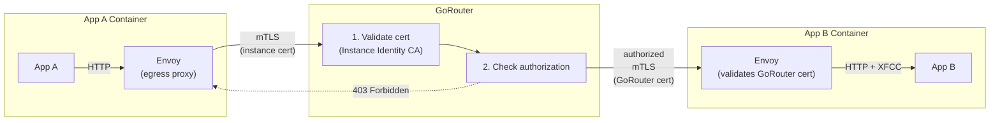
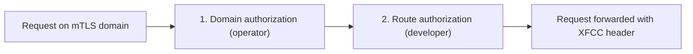

# Meta
[meta]: #meta
- Name: Domain-Scoped mTLS for GoRouter
- Start Date: 2026-02-16
- Author(s): @rkoster, @beyhan, @maxmoehl
- Status: Draft
- RFC Pull Request: [community#1438](https://github.com/cloudfoundry/community/pull/1438)


## Summary

Enable per-domain mutual TLS (mTLS) on GoRouter with optional identity extraction and authorization enforcement. Operators configure domains that require client certificates, specify how to handle the XFCC header, and optionally enable platform-enforced access control.

This infrastructure supports multiple use cases: authenticated CF app-to-app communication via internal domains (e.g., `apps.mtls.internal`), external client certificate validation for partner integrations, and cross-CF federation between installations.

For CF app-to-app routing, this follows the same default-deny model as container-to-container network policies: all traffic is blocked unless explicitly allowed.


## Problem

Cloud Foundry applications can communicate via external routes (through GoRouter) or container-to-container networking (direct). Neither provides per-domain mTLS requirements with platform-enforced authorization:

- **External routes**: Traffic leaves the VPC to reach the load balancer, adding latency and cost. GoRouter's client certificate settings are global—enabling strict mTLS for one domain affects all domains.
- **C2C networking**: Requires [`network.write` scope](https://docs.cloudfoundry.org/devguide/deploy-apps/cf-networking.html#grant-permissions), which is not granted to space developers by default—operators must set [`enable_space_developer_self_service: true`](https://github.com/cloudfoundry/cf-networking-release/blob/develop/jobs/policy-server/spec). Also lacks load balancing, observability, and identity forwarding.

This RFC addresses several use cases that require per-domain mTLS:

1. **CF app-to-app routing**: Applications need authenticated internal communication where only CF apps can connect (via instance identity), traffic stays internal, the platform enforces which apps can call which routes, and standard GoRouter features work (load balancing, retries, observability).

2. **External client certificates**: Some platforms need to validate client certificates from external systems (partner integrations, IoT devices) on specific domains without affecting other domains or requiring CF-specific identity handling.

3. **Cross-CF federation**: Applications on one CF installation need to securely communicate with applications on another CF installation, each with its own CA and GUID namespace.

**The gap**: GoRouter has no mechanism for requiring mTLS on specific domains while leaving others unaffected, and no way to enforce authorization rules at the route level based on caller identity.

For CF app-to-app routing specifically, authentication alone is insufficient. Without authorization enforcement, any authenticated app could access any route on the mTLS domain, defeating the purpose of platform-enforced security.


## Proposal

GoRouter gains the ability to require client certificates for specific domains, with configurable identity extraction and authorization enforcement. This is implemented in phases:

- **Phase 1a (mTLS Domain Infrastructure)**: GoRouter requires and validates client certificates for configured domains. The XFCC header is set with certificate details. This alone enables external client certificate validation.
- **Phase 1b (CF Identity & Authorization)**: Optional, opt-in behavior where GoRouter extracts CF identity from Diego instance certificates and enforces authorization rules. This enables CF app-to-app routing and cross-CF federation.
- **Phase 2 (Egress HTTP Proxy)**: Opt-in enhancement where the sidecar proxy automatically injects instance identity certificates, simplifying client adoption for CF app-to-app routing. Users enable this per-app; it is not required for Phase 1 functionality.

### Architecture Overview

The diagram below shows CF app-to-app routing (the most complex use case). For external client certificate validation, only GoRouter and the backend app are involved—external clients connect directly to GoRouter with their certificates.



### Phase 1a: mTLS Domain Infrastructure

GoRouter gains the ability to require client certificates for specific domains while leaving other domains unaffected. This infrastructure is generic and can be used for multiple purposes beyond CF app-to-app routing.

**How it works:**
1. Operator configures a domain with mTLS requirements in the `mtls_domains` configuration
2. DNS (BOSH DNS or external) resolves the domain to GoRouter instances
3. Applications map routes to this domain like any shared domain
4. When a client connects, GoRouter:
   - Requires a client certificate
   - Validates it against the configured CA
   - Sets the XFCC header with certificate details (format configurable)
   - Optionally extracts identity and enforces authorization (Phase 1b)

**Configuration:**

```yaml
router:
  mtls_domains:
    # Domain pattern requiring mTLS. Wildcards supported.
    - domain: "*.apps.mtls.internal"
      
      # CA certificate(s) for validating client certs (PEM-encoded)
      ca_certs: ((diego_instance_identity_ca.certificate))
      
      # How to handle the X-Forwarded-Client-Cert header:
      #   sanitize_set (default, recommended) - Remove incoming XFCC, set from client cert
      #   forward - Pass through existing XFCC header
      #   always_forward - Always pass through, even if no client cert
      forwarded_client_cert: sanitize_set
      
      xfcc:
        # Format of the XFCC header:
        #   raw (default) - Full base64-encoded certificate (~1.5KB)
        #   envoy - Compact format (~300 bytes):
        #           Hash=<sha256>;Subject="CN=<instance-id>,OU=app:<guid>..."
        format: envoy
        
        # How to extract caller identity from the certificate:
        #   none (default) - No extraction; backend parses XFCC itself
        #   cf_ou - Extract app/space/org GUIDs from Diego instance identity
        #           certificate OU fields (app:<guid>, space:<guid>, organization:<guid>)
        identity_extractor: cf_ou
      
      authorization:
        # How to enforce access control:
        #   none (default) - Any valid certificate accepted
        #   cf_identity - Enforce rules using CF identity hierarchy
        #                 (requires identity_extractor: cf_ou)
        mode: cf_identity
        
        # Operator-level caller restrictions (only for mode: cf_identity).
        # Two approaches (mutually exclusive):
        #
        # 1. Relative boundary (scope) - compares caller identity against
        #    the route destination's tags (organization_id, space_id) which
        #    are set by the route-emitter for each app instance:
        #      any (default) - Any authenticated caller passes domain-level checks
        #      org   - Caller must be in the same org as the route's destination app
        #      space - Caller must be in the same space as the route's destination app
        #
        # 2. Explicit boundary (orgs/spaces) - absolute list of allowed
        #    caller org/space GUIDs. Useful for cross-CF federation where
        #    scope checks are meaningless (remote GUIDs have no local context).
        config:
          # Option 1: Relative boundary (recommended for single-CF)
          scope: org
          
          # Option 2: Explicit boundary (for cross-CF federation)
          # orgs: ["remote-cf-org-guid-1", "remote-cf-org-guid-2"]
          # OR
          # spaces: ["remote-cf-space-guid-1"]
```

**Validation rules:**
- `authorization.config.scope` is mutually exclusive with `authorization.config.orgs` and `authorization.config.spaces`
- `authorization.config.orgs` is mutually exclusive with `authorization.config.spaces`
- If `authorization.config` is omitted, the default is `scope: any` (any authenticated caller passes domain-level checks)
- `authorization.mode: cf_identity` requires `xfcc.identity_extractor: cf_ou`
- Invalid combinations are rejected during BOSH deployment by the GoRouter job templates

**How scope works:**

GoRouter's route table stores per-endpoint tags from the route-emitter, including `organization_id` and `space_id` for each destination app instance. When `scope` is set, GoRouter compares the caller's identity (extracted from the mTLS certificate) against the destination's tags:

| Scope | Check | Effect |
|-------|-------|--------|
| `any` | None | Any authenticated caller passes domain-level checks |
| `org` | `caller.OrgGUID ∈ pool endpoints' organization_id` | Caller must be from the same org as the destination |
| `space` | `caller.SpaceGUID ∈ pool endpoints' space_id` | Caller must be from the same space as the destination |

**Shared routes and endpoint pools:**

When a [shared route](https://v3-apidocs.cloudfoundry.org/version/3.215.0/index.html#share-a-route-with-other-spaces-experimental) has apps mapped from multiple spaces, the GoRouter `EndpointPool` for that route contains endpoints from different spaces. Each endpoint carries its own `space_id` and `organization_id` tags, set by the route-emitter based on the app instance it represents — not the route owner.

For example, if route `api.apps.mtls.internal` is shared between Space A and Space B, with an app mapped in each:

```
EndpointPool for "api.apps.mtls.internal":
  [0] 10.0.1.5:8080  tags: { space_id: "space-a-guid", organization_id: "org-guid" }
  [1] 10.0.2.9:8080  tags: { space_id: "space-b-guid", organization_id: "org-guid" }
```

GoRouter iterates the pool's endpoints when evaluating scope, checking the caller's identity against each endpoint's tags and short-circuiting on the first match. For `scope: space`, if any endpoint's `space_id` matches the caller's space GUID, the request is allowed. A caller from Space A or Space B passes the check; a caller from Space C (with no app mapped to the route) is denied. This naturally enables cross-space access on shared routes between the participating spaces.

### Phase 1b: CF Identity & Authorization

When `xfcc.identity_extractor: cf_ou` and `authorization.mode: cf_identity` are enabled, GoRouter enforces access control at the routing layer using a default-deny model, matching the design of container-to-container network policies.

Authorization is enforced at two layers:

1. **Domain level (operator)**: Configured via `authorization.config` in `mtls_domains`
2. **Route level (developer)**: Configured via `mtls_allowed_*` route options

**Layered authorization:**



Developers can only **restrict further** within operator boundaries. They cannot expand access beyond operator-defined limits.

**Route options** (RFC-0027 compliant flat format):

```yaml
applications:
# Platform-enforced authorization with explicit allowlist
- name: backend-api
  routes:
  - route: backend.apps.mtls.internal
    options:
      # Comma-separated app GUIDs allowed to call this route
      mtls_allowed_apps: "frontend-app-guid,monitoring-app-guid"
      # Comma-separated space GUIDs whose apps can call this route
      mtls_allowed_spaces: "trusted-space-guid"
      # Comma-separated org GUIDs whose apps can call this route
      mtls_allowed_orgs: "partner-org-guid"

# App-delegated authorization: any authenticated app allowed within operator scope
# Useful when authorization depends on dynamic information (e.g., service bindings)
- name: autoscaler-api
  routes:
  - route: autoscaler.apps.mtls.internal
    options:
      # When true, any request passing operator-level authorization is allowed
      # The app receives XFCC header for additional authorization checks
      mtls_allow_any: true
```

**Validation rules:**
- `mtls_allow_any: true` is mutually exclusive with `mtls_allowed_apps`, `mtls_allowed_spaces`, and `mtls_allowed_orgs`
- All `mtls_allowed_*` values are comma-separated strings of GUIDs
- Cloud Controller validates GUID format (not existence, to support federation)

**Warning behavior:**

When a route specifies `mtls_allowed_*` options but the domain has `authorization.mode: none`, the route options are stored by CAPI as inert metadata — CAPI does not track or validate whether the domain enforces them. GoRouter logs a warning per-request to the application's log stream (see [Router Log Messages](#router-log-messages) for the full format):

```
[RTR] backend.partner.example.com - mtls_auth:"not_enforced"
  mtls_denied_reason:"route specifies mtls_allowed_apps but domain authorization.mode=none; rules ignored"
```

The request is forwarded, not denied. This allows developers to set route options before the operator enables enforcement, and provides visible feedback that the rules are not yet active.

This builds on the route options framework from [RFC-0027: Generic Per-Route Features](rfc-0027-generic-per-route-features.md). Phase 1b depends on RFC-0027 being implemented first.

### Phase 2: Egress HTTP Proxy (Opt-in)

To simplify client adoption, add an HTTP proxy to the application sidecar that automatically handles mTLS. Users enable this per-app; applications that configure TLS clients directly do not need it.

**How it works:**
1. Diego configures an egress proxy (Envoy) listening on `127.0.0.1:8888`
2. The proxy is configured to intercept requests to `*.apps.mtls.internal`
3. For matching requests, the proxy:
   - Upgrades the connection to TLS
   - Presents the application's instance identity certificate
   - Forwards the request to GoRouter

**Application usage:**
```bash
# Client app sets HTTP_PROXY for the internal domain
export HTTP_PROXY=http://127.0.0.1:8888
export NO_PROXY=external-api.example.com

# Plain HTTP request, proxy handles mTLS automatically
curl http://myservice.apps.mtls.internal/api
```

This eliminates the need for applications to load certificates and configure TLS clients.

### Extensibility

The `xfcc.identity_extractor` and `authorization.mode` fields are designed to support additional modes in the future without breaking the configuration schema:

| Identity Extractor | Authorization Mode | Use Case |
|-------------------|-------------------|----------|
| `none` | `none` | External client certs, app-level authorization |
| `cf_ou` | `cf_identity` | CF app-to-app with platform-enforced rules |
| `cf_ou` | `cf_identity` | Cross-CF federation (via per-installation domains) |
| `subject_cn` (future) | `cn_allowlist` (future) | Generic CN-based authorization |
| `spiffe` (future) | `spiffe_authz` (future) | SPIFFE identity federation |

Each `authorization.mode` can define its own `authorization.config` schema, allowing future modes to have different policy options without affecting existing configurations.

This allows operators to use `mtls_domains` for external client certificate validation without CF-specific coupling, while preserving the option to add new identity extraction and authorization modes as needs evolve.


## Release Criteria

**For CF app-to-app routing use case:**

Phase 1a and Phase 1b (with `xfcc.identity_extractor: cf_ou` and `authorization.mode: cf_identity`) are co-requisites and must be released together.

Deploying Phase 1a without enabling CF identity authorization would leave all mTLS routes accessible to any authenticated app, violating the default-deny security model. Routes must specify `mtls_allowed_*` options to control access.

Phase 1b depends on [RFC-0027: Generic Per-Route Features](rfc-0027-generic-per-route-features.md) being implemented first.

**For external client validation use case:**

Phase 1a alone (with `authorization.mode: none`) is sufficient. Backend applications handle authorization based on the XFCC header.


## Appendix

### Router Log Messages

GoRouter emits `[RTR]` log lines to the application's log stream (visible via `cf logs`). The following messages cover mTLS authorization scenarios, including edge cases where route options exist but authorization is not enforced.

**Successful authorized request:**

When a request passes both domain-level and route-level authorization:

```
[RTR] backend.apps.mtls.internal - [2026-03-20T10:15:00Z]
  "GET /api/data HTTP/1.1" 200 1234
  x_forwarded_for:"10.0.1.5" x_forwarded_proto:"https"
  caller_app:"frontend-guid" caller_space:"space-guid" caller_org:"org-guid"
  mtls_auth:"allowed" mtls_rule:"route:mtls_allowed_apps"
```

The `caller_*` fields are extracted from the instance identity certificate. `mtls_auth:"allowed"` confirms authorization passed, and `mtls_rule` identifies which rule matched.

**Denied — failed domain-level scope check:**

When the caller's identity does not match the operator's `scope` boundary:

```
[RTR] backend.apps.mtls.internal - [2026-03-20T10:15:01Z]
  "GET /api/data HTTP/1.1" 403 0
  caller_app:"attacker-guid" caller_space:"other-space-guid" caller_org:"other-org-guid"
  mtls_auth:"denied" mtls_rule:"domain:scope=org"
  mtls_denied_reason:"caller org other-org-guid not in endpoint pool"
```

**Denied — failed route-level `mtls_allowed_*` check:**

When the caller passes domain-level checks but is not in the route's `mtls_allowed_*` list:

```
[RTR] backend.apps.mtls.internal - [2026-03-20T10:15:02Z]
  "GET /api/data HTTP/1.1" 403 0
  caller_app:"unknown-app-guid" caller_space:"same-space-guid" caller_org:"same-org-guid"
  mtls_auth:"denied" mtls_rule:"route:mtls_allowed_apps"
  mtls_denied_reason:"caller app unknown-app-guid not in mtls_allowed_apps"
```

**Denied — no route options set (default deny):**

When a route on an mTLS domain has no `mtls_allowed_*` options and no `mtls_allow_any`, the default-deny model rejects all requests:

```
[RTR] backend.apps.mtls.internal - [2026-03-20T10:15:03Z]
  "GET /api/data HTTP/1.1" 403 0
  caller_app:"frontend-guid" caller_space:"space-guid" caller_org:"org-guid"
  mtls_auth:"denied" mtls_rule:"route:no_mtls_allowed_options"
  mtls_denied_reason:"route has no mtls_allowed_* options configured"
```

**Warning — route options set but domain authorization not enabled:**

When a route has `mtls_allowed_*` options but the domain uses `authorization.mode: none` (or the route is on a non-mTLS domain), GoRouter logs a warning on each request. The request is **forwarded** (not denied) because authorization is not active:

```
[RTR] backend.partner.example.com - [2026-03-20T10:15:04Z]
  "GET /api/data HTTP/1.1" 200 1234
  mtls_auth:"not_enforced"
  mtls_denied_reason:"route specifies mtls_allowed_apps but domain authorization.mode=none; rules ignored"
```

This warning is logged per request (not just at startup) so it appears in the application's log stream, making it visible to developers who may have misconfigured their route. CAPI stores the route options as-is — it does not validate whether the domain enforces them. The route options are inert metadata until the operator enables `authorization.mode: cf_identity` on the domain.

**Warning — identity extraction failed:**

When the client certificate is valid but does not contain the expected identity fields:

```
[RTR] backend.apps.mtls.internal - [2026-03-20T10:15:05Z]
  "GET /api/data HTTP/1.1" 403 0
  mtls_auth:"denied" mtls_rule:"identity_extraction"
  mtls_denied_reason:"certificate does not contain CF identity OU fields"
```

**Summary of `mtls_auth` values:**

| Value | HTTP Status | Meaning |
|-------|-------------|---------|
| `allowed` | 2xx/3xx/5xx | Request authorized and forwarded to backend |
| `denied` | 403 | Request rejected by GoRouter |
| `not_enforced` | 2xx/3xx/5xx | Route has mTLS options but domain does not enforce them |

### Relationship to Container-to-Container Networking

This RFC complements Cloud Foundry's existing [container-to-container (C2C) networking](https://docs.cloudfoundry.org/concepts/understand-cf-networking.html) rather than replacing it. The two mechanisms serve different purposes and operate at different layers.

**Why extend GoRouter instead of C2C networking?**

This RFC reuses existing GoRouter infrastructure—TLS termination, request routing, load balancing, access logging, and the route options framework from [RFC-0027](rfc-0027-generic-per-route-features.md). By enforcing authorization at the HTTP layer, applications gain access to caller identity via the XFCC header, enabling fine-grained authorization decisions. GoRouter already handles millions of requests; adding per-domain mTLS builds on proven infrastructure.

C2C networking operates at Layer 4 (TCP/UDP) using IPtables rules enforced on Diego Cells via [VXLAN policy agents](https://github.com/cloudfoundry/silk-release). This architecture has [scaling considerations for large deployments](https://github.com/cloudfoundry/cf-networking-release/blob/develop/docs/09-large-deployments.md): policies are limited by VXLAN's 16-bit marks (~65,535 apps can participate in policies), and each policy requires IPtables rules on every Diego Cell. For HTTP traffic requiring caller identity, load balancing, and observability, GoRouter-based routing is a better fit.

**When to use which:**

- **C2C networking**: Non-HTTP protocols (databases, message queues, gRPC over TCP), low-latency direct connections, when traffic should bypass GoRouter entirely.
- **mTLS app routing (this RFC)**: HTTP APIs requiring caller identity in the request, platform-enforced authorization at the route level, when you need GoRouter features (load balancing, retries, observability, access logs).

The two mechanisms can coexist. An application might use C2C networking for database connections while exposing HTTP APIs via mTLS app routing.

**Authorization model differences:**

C2C network policies and this RFC's `scope` have different authorization semantics:

- **C2C**: A user creates a network policy allowing App A → App B. The user must have the [`network.write` scope](https://docs.cloudfoundry.org/devguide/deploy-apps/cf-networking.html#grant-permissions) (or Space Developer role with `enable_space_developer_self_service`) in **both** the source and destination spaces. The policy is directional and names specific source/destination pairs.
- **`scope: space` (this RFC)**: The operator boundary allows any app in the same space as the destination to call that route. The developer registers `mtls_allowed_*` route options on their own route — they only need permissions in the destination space. There is no requirement for the caller's space to opt in.

This is intentional. This RFC's model is *destination-controlled*: the route owner decides who may call them, and the operator sets the maximum boundary. This matches how HTTP APIs typically work — the server defines its access policy. C2C's *bilateral* model (both sides must agree) is appropriate for Layer 4 network-level access where neither side is inherently the "server."

Operators who want the bilateral guarantee of C2C should continue using C2C networking for those workloads. The two are complementary.

### Configuration Examples

**CF app-to-app routing (same-org boundary):**
```yaml
router:
  mtls_domains:
    - domain: "*.apps.mtls.internal"
      ca_certs: ((diego_instance_identity_ca.certificate))
      forwarded_client_cert: sanitize_set
      xfcc:
        format: envoy
        identity_extractor: cf_ou
      authorization:
        mode: cf_identity
        config:
          # Caller must be from the same org as the route's destination app.
          # No org GUIDs needed — GoRouter checks the caller's certificate
          # against the route-emitter tags on each endpoint.
          scope: org
```

**CF app-to-app routing (same-space boundary):**
```yaml
router:
  mtls_domains:
    - domain: "*.apps.mtls.internal"
      ca_certs: ((diego_instance_identity_ca.certificate))
      forwarded_client_cert: sanitize_set
      xfcc:
        format: envoy
        identity_extractor: cf_ou
      authorization:
        mode: cf_identity
        config:
          # Caller must be from the same space as the route's destination app.
          # With shared routes, callers from any participating space (i.e. any
          # space that has an app mapped to the route) are allowed.
          scope: space
```

**CF app-to-app routing (any authenticated caller):**
```yaml
router:
  mtls_domains:
    - domain: "*.apps.mtls.internal"
      ca_certs: ((diego_instance_identity_ca.certificate))
      forwarded_client_cert: sanitize_set
      xfcc:
        format: envoy
        identity_extractor: cf_ou
      authorization:
        mode: cf_identity
        # No config or scope: any — any authenticated caller passes domain-level checks
        # Route-level mtls_allowed_* options control access
```

**External client certificate validation (app-level authorization):**
```yaml
router:
  mtls_domains:
    - domain: "*.partner.example.com"
      ca_certs: ((partner_ca.certificate))
      forwarded_client_cert: sanitize_set
      xfcc:
        format: envoy
        # identity_extractor: none (default)
      authorization:
        mode: none
        # No config needed for mode: none
```

In this configuration, GoRouter validates that the client certificate is signed by the partner CA, then forwards the XFCC header to the backend application. The application parses the XFCC header and performs its own authorization based on the certificate's Subject, SANs, or other fields.

**Cross-CF federation (apps calling across CF installations):**

When multiple CF installations need to communicate, configure a separate mTLS domain per remote CF installation. This uses explicit `orgs:`/`spaces:` lists rather than `scope:` because org/space GUIDs from a remote CF are meaningless locally — there are no local route-emitter tags to match against. Each remote installation's CA is trusted independently:

```yaml
router:
  mtls_domains:
    # Local CF app-to-app (scope uses route-emitter tags)
    - domain: "*.apps.mtls.internal"
      ca_certs: ((diego_instance_identity_ca.certificate))
      forwarded_client_cert: sanitize_set
      xfcc:
        format: envoy
        identity_extractor: cf_ou
      authorization:
        mode: cf_identity
        config:
          scope: org  # Callers must be in same org as destination

    # Trust apps from CF-East installation
    # Uses explicit orgs: list because remote GUIDs have no local route-emitter tags
    - domain: "*.apps.mtls.cf-east.internal"
      ca_certs: ((cf_east_diego_ca.certificate))
      forwarded_client_cert: sanitize_set
      xfcc:
        format: envoy
        identity_extractor: cf_ou
      authorization:
        mode: cf_identity
        config:
          orgs: ["trusted-east-org-guid"]  # Only this org from CF-East can call

    # Trust apps from CF-West installation
    # No explicit list: any CF-West app can call (route-level mtls_allowed_* applies)
    - domain: "*.apps.mtls.cf-west.internal"
      ca_certs: ((cf_west_diego_ca.certificate))
      forwarded_client_cert: sanitize_set
      xfcc:
        format: envoy
        identity_extractor: cf_ou
      authorization:
        mode: cf_identity
        # No config: any CF-West app can call (route-level mtls_allowed_* applies)
```

Route configuration specifies allowed apps per originating installation:

```yaml
applications:
- name: backend-api
  routes:
  # Local clients
  - route: backend.apps.mtls.internal
    options:
      mtls_allowed_apps: "local-frontend-guid"
  # Clients from CF-East (must be in trusted-east-org-guid due to domain config)
  - route: backend.apps.mtls.cf-east.internal
    options:
      mtls_allowed_apps: "east-frontend-guid"
```

The domain naming convention `*.apps.mtls.<cf-installation>.internal` ensures:
- No conflict with existing app routes (CF identifier is at the parent domain level)
- GUIDs are scoped to their originating installation
- Each installation's CA is trusted independently
- Standard `cf_ou` identity extraction and `cf_identity` authorization work unchanged
- Local domains use `scope:` (matches route-emitter tags); remote domains use explicit `orgs:`/`spaces:` lists

### References

| Component | Reference |
|-----------|-----------|
| GoRouter TLS config | [`routing-release/.../config.go`](https://github.com/cloudfoundry/routing-release/blob/develop/src/code.cloudfoundry.org/gorouter/config/config.go) |
| GoRouter BOSH spec | [`routing-release/jobs/gorouter/spec`](https://github.com/cloudfoundry/routing-release/blob/develop/jobs/gorouter/spec) |
| RFC-0027 route options | [`toc/rfc/rfc-0027-generic-per-route-features.md`](rfc-0027-generic-per-route-features.md) |
| Cloud Controller routes | [`cloud_controller_ng/.../route.rb`](https://github.com/cloudfoundry/cloud_controller_ng/blob/main/app/models/runtime/route.rb) |
| Container-to-Container Networking | [CF Docs](https://docs.cloudfoundry.org/concepts/understand-cf-networking.html) |
| Diego Instance Identity | [`diego-release/docs/050-app-instance-identity.md`](https://github.com/cloudfoundry/diego-release/blob/develop/docs/050-app-instance-identity.md) |
