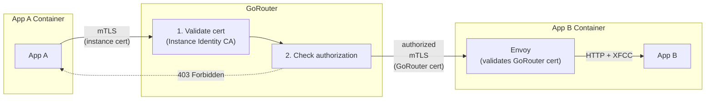
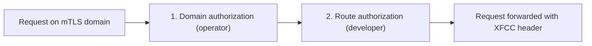

# Meta
[meta]: #meta
- Name: Domain-Scoped mTLS for GoRouter
- Start Date: 2026-02-16
- Author(s): @rkoster, @beyhan, @maxmoehl
- Status: Draft
- RFC Pull Request: [community#1438](https://github.com/cloudfoundry/community/pull/1438)


## Summary

Enable per-domain mutual TLS (mTLS) on GoRouter with optional identity extraction and authorization enforcement. Operators configure domains that require client certificates, specify how to handle the XFCC header, and optionally enable platform-enforced access control.

This infrastructure supports two primary use cases: authenticated CF app-to-app communication via internal domains (e.g., `apps.mtls.internal`), and external client certificate validation for partner integrations.

For CF app-to-app routing, this follows the same default-deny model as container-to-container network policies: all traffic is blocked unless explicitly allowed.


## Problem

Cloud Foundry applications can communicate via external routes (through GoRouter) or container-to-container networking (direct). Neither provides per-domain mTLS requirements with platform-enforced authorization:

- **External routes**: Traffic leaves the VPC to reach the load balancer, adding latency and cost. GoRouter's client certificate settings are global—enabling strict mTLS for one domain affects all domains.
- **C2C networking**: Requires [`network.write` scope](https://docs.cloudfoundry.org/devguide/deploy-apps/cf-networking.html#grant-permissions), which is not granted to space developers by default—operators must set [`enable_space_developer_self_service: true`](https://github.com/cloudfoundry/cf-networking-release/blob/develop/jobs/policy-server/spec). Also lacks load balancing, observability, and identity forwarding.

This RFC addresses two use cases that require per-domain mTLS:

1. **CF app-to-app routing**: Applications need authenticated internal communication where only CF apps can connect (via instance identity), traffic stays internal, the platform enforces which apps can call which routes, and standard GoRouter features work (load balancing, retries, observability).

2. **External client certificates**: Some platforms need to validate client certificates from external systems (partner integrations, IoT devices) on specific domains without affecting other domains or requiring CF-specific identity handling.

**The gap**: GoRouter has no mechanism for requiring mTLS on specific domains while leaving others unaffected, and no way to enforce authorization rules at the route level based on caller identity.

For CF app-to-app routing specifically, authentication alone is insufficient. Without authorization enforcement, any authenticated app could access any route on the mTLS domain, defeating the purpose of platform-enforced security.


## Proposal

GoRouter gains the ability to require client certificates for specific domains, with configurable identity extraction and authorization enforcement. This is implemented in two parts:

- **Part 1 (mTLS Domain Infrastructure)**: GoRouter requires and validates client certificates for configured domains. The XFCC header is set with certificate details. This alone enables external client certificate validation.
- **Part 2 (CF Identity & Authorization)**: GoRouter extracts CF identity from Diego instance certificates (when using Envoy XFCC format) and enforces authorization rules based on route options. This enables CF app-to-app routing.

### Architecture Overview

**How it works end-to-end:**

| Step | Part | Actor | What happens |
|------|------|-------|--------------|
| 1 | 1 | Operator | Configures a domain with mTLS requirements in the `mtls_domains` BOSH configuration |
| 2 | 1 | DNS | BOSH DNS (or external DNS) resolves the domain to GoRouter instances |
| 3 | 1 | Developer | Maps application routes to this domain like any shared domain |
| 4 | 1 | GoRouter | Requires and validates a client certificate, sets the XFCC header |
| 5 | 2 | Operator | Enables access rules enforcement on the domain via the CF API (`enforce_access_rules: true`) |
| 6 | 2 | Developer | Creates access rules per route via the Access Rules API |
| 7 | 2 | GoRouter | Extracts CF identity from the certificate and enforces access rules |

Part 1 alone (without Part 2) is sufficient for external client certificate validation: GoRouter validates the cert and sets the XFCC header; backend applications handle authorization themselves based on that header.

The diagram below shows the most complex use case: CF app-to-app routing with both parts active.



### Part 1: mTLS Domain Infrastructure

GoRouter gains the ability to require client certificates for specific domains while leaving other domains unaffected. This infrastructure is generic and can be used for multiple purposes beyond CF app-to-app routing. Operators configure it entirely through the BOSH manifest.

**GoRouter BOSH Configuration:**

```yaml
router:
  mtls_domains:
    # Domain pattern requiring mTLS. Wildcards supported.
    - domain: "*.apps.mtls.internal"
      
      # CA certificate(s) for validating client certs (PEM-encoded)
      ca_certs: ((diego_instance_identity_ca.certificate))
      
      # How to handle the X-Forwarded-Client-Cert header:
      #   sanitize_set (default, recommended) - Remove incoming XFCC, set from client cert
      #   forward - Pass through existing XFCC header
      #   always_forward - Always pass through, even if no client cert
      forwarded_client_cert: sanitize_set
      
      # Format of the XFCC header value: raw (default) or envoy
      xfcc_format: envoy
```

**XFCC header format:**

The `xfcc_format` field controls the format of the `X-Forwarded-Client-Cert` header that GoRouter sets on proxied requests:

- **`raw`** (default): The full PEM certificate is base64-encoded and placed in the header. This produces a large header value (approximately 1.5 KB per certificate) that the backend application must decode and parse to extract identity fields.
- **`envoy`**: GoRouter uses the same compact format as [Envoy's XFCC implementation](https://www.envoyproxy.io/docs/envoy/latest/configuration/http/http_conn_man/headers#x-forwarded-client-cert): `Hash=<sha256-fingerprint>;Subject="<distinguished-name>"`. This reduces the header to approximately 300 bytes. When `xfcc_format: envoy` is configured and Part 2 authorization is active, GoRouter parses identity directly from the Subject's `OU` fields (`OU=app:<guid>`, `OU=space:<guid>`, `OU=organization:<guid>`) without decoding the full certificate, which is more efficient.

### Part 2: CF Identity & Authorization

Part 2 adds Cloud Foundry identity and authorization on top of the mTLS infrastructure from Part 1. It is implemented entirely through Cloud Controller API changes — no additional BOSH configuration is required beyond Part 1.

**Operator configuration (CC API):**

Operators enable access rules enforcement on a domain via the Cloud Controller API:

```bash
# Enable access rules enforcement with org scope
cf enable-domain-access-rules apps.mtls.internal --scope org

# Disable access rules enforcement
cf disable-domain-access-rules apps.mtls.internal

# Or via API
cf curl -X PATCH /v3/domains/domain-guid -d '{
  "enforce_access_rules": true,
  "access_rules_scope": "org"
}'
```

**Domain API Fields:**

| Field | Type | Default | Description |
|-------|------|---------|-------------|
| `enforce_access_rules` | boolean | `false` | When true, GoRouter enforces access rules for routes on this domain |
| `access_rules_scope` | string | `any` | Operator-level boundary: `any`, `org`, or `space` |

**How scope works:**

GoRouter's route table stores per-endpoint tags from the route-emitter, including `organization_id` and `space_id` for each destination app instance. When `access_rules_scope` is set, GoRouter compares the caller's identity (extracted from the mTLS certificate) against the destination's tags:

| Scope | Check | Effect |
|-------|-------|--------|
| `any` | None | Any authenticated caller passes domain-level checks |
| `org` | `caller.OrgGUID ∈ pool endpoints' organization_id` | Caller must be from the same org as the destination |
| `space` | `caller.SpaceGUID ∈ pool endpoints' space_id` | Caller must be from the same space as the destination |

**Shared routes and endpoint pools:**

When a [shared route](https://v3-apidocs.cloudfoundry.org/version/3.215.0/index.html#share-a-route-with-other-spaces-experimental) has apps mapped from multiple spaces, the GoRouter `EndpointPool` for that route contains endpoints from different spaces. Each endpoint carries its own `space_id` and `organization_id` tags, set by the route-emitter based on the app instance it represents — not the route owner.

For example, if route `api.apps.mtls.internal` is shared between Space A and Space B, with an app mapped in each:

```
EndpointPool for "api.apps.mtls.internal":
  [0] 10.0.1.5:8080  tags: { space_id: "space-a-guid", organization_id: "org-guid" }
  [1] 10.0.2.9:8080  tags: { space_id: "space-b-guid", organization_id: "org-guid" }
```

GoRouter iterates the pool's endpoints when evaluating scope, checking the caller's identity against each endpoint's tags and short-circuiting on the first match. For `scope: space`, if any endpoint's `space_id` matches the caller's space GUID, the request is allowed. A caller from Space A or Space B passes the check; a caller from Space C (with no app mapped to the route) is denied. This naturally enables cross-space access on shared routes between the participating spaces.

When a domain has `enforce_access_rules: true`, GoRouter enforces access control at the routing layer using a default-deny model, matching the design of container-to-container network policies. If no access rules are configured for a route, all requests are denied.

**Identity extraction:** GoRouter extracts CF identity from Diego instance identity certificates regardless of `xfcc_format`. With `envoy` format, identity is parsed from pre-extracted Subject fields (`OU=app:<guid>,OU=space:<guid>,OU=organization:<guid>`). With `raw` format, GoRouter decodes the base64 certificate and extracts the same fields. The `envoy` format is more performant but both work identically for authorization.

Authorization is enforced at two layers:

1. **Domain level (operator)**: Configured via `access_rules_scope` on the domain. Requires Admin role for shared domains, Org Manager for private domains.
2. **Route level (developer)**: Configured via the Access Rules API. Requires Space Developer role in the route's space.

**Layered authorization:**



Developers can only **restrict further** within operator boundaries. They cannot expand access beyond operator-defined limits.

#### Access Rules API

Developers manage route-level access rules through a dedicated Cloud Controller API. Each access rule has a human-readable name for auditability and a selector that identifies allowed callers. Access rules are owned by their route: deleting a route cascades to delete all its access rules. See [Access Rules API Examples](#access-rules-api-examples) for full request/response examples.

**API Endpoints:**

| Method | Path | Description |
|--------|------|-------------|
| `GET` | `/v3/access_rules` | List access rules (with filters) |
| `GET` | `/v3/access_rules/:guid` | Get a single access rule |
| `POST` | `/v3/access_rules` | Create an access rule |
| `PATCH` | `/v3/access_rules/:guid` | Update an access rule (metadata only) |
| `DELETE` | `/v3/access_rules/:guid` | Delete a rule by guid |
| `GET` | `/v3/routes/:route_guid/access_rules` | List access rules for a route |
| `POST` | `/v3/routes/:route_guid/access_rules` | Create access rules for a route (batch convenience endpoint) |

**List Query Parameters:**

| Parameter | Description |
|-----------|-------------|
| `names` | Comma-delimited list of rule names to filter by |
| `route_guids` | Comma-delimited list of route guids to filter by |
| `selectors` | Comma-delimited list of selectors to filter by |
| `selector_resource_guids` | Comma-delimited list of resolved selector resource GUIDs to filter by. Pass empty value (`selector_resource_guids=`) to return only rules whose selector resource no longer exists (stale rules). |
| `include` | Comma-delimited list of related resources to include: `route`, `selector_resource` |
| `page` | Page to display (default: 1) |
| `per_page` | Number of results per page (default: 50) |
| `order_by` | Value to sort by (e.g., `created_at`, `-created_at`, `name`, `-name`) |

**Including related resources:**

The `include` parameter supports `route` and `selector_resource`. When `selector_resource` is specified, the response includes an `included` block with the resolved resources:

```json
{
  "resources": [
    { "selector": "cf:app:frontend-guid", ... }
  ],
  "included": {
    "apps": [{ "guid": "frontend-guid", "name": "frontend-app", ... }],
    "spaces": [],
    "organizations": [],
    "routes": []
  }
}
```

The selector is resolved based on its type: `cf:app:<guid>` → `apps`, `cf:space:<guid>` → `spaces`, `cf:org:<guid>` → `organizations`. Resources that no longer exist will not appear in the `included` block, making stale rules visible during audits.

#### Selector Syntax

Access rules use a namespaced selector syntax to identify allowed callers:

| Selector | Description |
|----------|-------------|
| `cf:app:<guid>` | Allow a specific CF application |
| `cf:space:<guid>` | Allow all apps in a CF space |
| `cf:org:<guid>` | Allow all apps in a CF organization |
| `cf:any` | Allow any authenticated CF application (within operator scope) |

**Namespace reservation:**

The `cf:` prefix is reserved for Cloud Foundry native identities. Future extensibility may include additional namespaces such as `spiffe:` (SPIFFE identity URIs), `oidc:` (OIDC subject claims), or `x509:` (X.509 certificate subjects).

#### CLI Commands

**Route-level access rules (Space Developers):**

```bash
# Add an access rule
cf add-access-rule frontend-app apps.mtls.internal cf:app:d76446a1-f429-4444-8797-be2f78b75b08 \
  --hostname backend

# Add an access rule for a route with a path
cf add-access-rule frontend-app apps.mtls.internal cf:app:d76446a1-f429-4444-8797-be2f78b75b08 \
  --hostname backend --path /api

# List access rules
cf access-rules apps.mtls.internal --hostname backend
cf access-rules apps.mtls.internal --hostname backend --path /api

# Remove an access rule
cf remove-access-rule frontend-app apps.mtls.internal --hostname backend
cf remove-access-rule frontend-app apps.mtls.internal --hostname backend --path /api
```

Selectors always require a GUID rather than a name. This is intentional: the person creating the rule does not need read access to the selector's source app, space, or org. The GUID is a public identity that the calling team shares out of band.

**Validation rules:**
- Access rules can only be created for routes on domains where `enforce_access_rules` is true
- `cf:any` cannot be combined with other selectors on the same route. If a route has a `cf:any` rule, no other rules (`cf:app:...`, `cf:space:...`, `cf:org:...`) can be added.
- Duplicate selectors on the same route are rejected with an error
- Rule names must be unique per route
- Selector GUIDs (`cf:app:<guid>`, `cf:space:<guid>`, `cf:org:<guid>`) are not validated against Cloud Controller at creation time. The developer creating the rule does not need visibility into the source app, space, or org. App and space GUIDs function as public identities that teams can share with each other out of band. This intentionally differs from C2C networking, where both sides of a policy must be reachable by the policy creator.

**Authorization:**

Only Space Developers in the route's space can manage access rules. Unlike C2C policies which require permissions in both source and destination spaces, mTLS access rules are destination-controlled.

#### Internal Implementation

Cloud Controller stores access rules in a dedicated `route_access_rules` table. When syncing route information to Diego, Cloud Controller flattens these rules into RFC-0027 compliant route options:

```ruby
# Access rules are converted to RFC-0027 compliant route options
route.options = {
  "access_scope": "org",
  "access_rules": "cf:app:guid1,cf:space:guid2"
}
```

This conversion happens transparently—developers interact only with the Access Rules API, not with raw route options. Cloud Controller filters `access_scope` and `access_rules` from the `/v3/routes` API responses; these fields are internal implementation details visible only in the Diego sync path.

**GoRouter authorization behavior:**

GoRouter determines authorization mode based on route options. It has no knowledge of domain-level settings—Cloud Controller translates `enforce_access_rules: true` into the presence of `access_scope` in route options during Diego sync.

- If route options contain `access_scope` → enforcement is active:
  - Apply scope boundary (`any`, `org`, or `space`)
  - If `access_rules` present → check caller against rules
  - If no `access_rules` → deny all requests (default deny)
- If route options do not contain `access_scope` → forward request without authorization checks

This builds on the route options framework from [RFC-0027: Generic Per-Route Features](rfc-0027-generic-per-route-features.md). Part 2 depends on RFC-0027 being implemented first.


## Release Criteria

**For CF app-to-app routing use case:**

Part 1 and Part 2 are co-requisites and must be released together.

Deploying Part 1 without Part 2 would leave all mTLS routes accessible to any authenticated app, violating the default-deny security model. Routes must have access rules configured via the Access Rules API to control access.

Part 2 depends on [RFC-0027: Generic Per-Route Features](rfc-0027-generic-per-route-features.md) being implemented first.

**For external client validation use case:**

Part 1 alone (with `enforce_access_rules: false` on the domain) is sufficient. Backend applications handle authorization based on the XFCC header. Note that if `enforce_access_rules` is enabled without any access rules configured, requests will be denied by default.


## Security Considerations

### SNI and Host Header Validation

GoRouter uses Server Name Indication (SNI) during the TLS handshake to determine whether to require a client certificate. This creates a potential security concern: SNI and the HTTP Host header are independent values controlled by the client.

**Attack scenario without mitigation:**

1. Attacker connects to GoRouter with SNI = `regular-app.example.com` (non-mTLS domain)
2. TLS handshake completes without requiring a client certificate
3. Attacker sends HTTP request with `Host: secure-api.apps.mtls.internal` (mTLS domain)
4. Without validation, the request would be routed to the mTLS-protected application

**Mitigation: SNI-Host validation**

GoRouter validates that the TLS handshake was performed appropriately for the target domain. For requests to mTLS domains, GoRouter verifies that:

1. **mTLS was enforced during TLS handshake**: The client certificate was required and validated
2. **The mTLS domain matches the Host header**: The domain used for TLS configuration matches the HTTP request target

If either check fails, GoRouter rejects the request with HTTP 421 (Misdirected Request) before forwarding to the backend. See [SNI-Host Validation Implementation](#sni-host-validation-implementation) in the Appendix for technical details.

**Mixed-mode environments:**

GoRouter supports mixed-mode operation where some domains require mTLS and others do not. Clients connecting to non-mTLS domains are not required to send SNI. The validation rule is:

- If the HTTP Host header points to an mTLS domain, mTLS **must** have been enforced during the TLS handshake for that specific domain
- If the HTTP Host header points to a non-mTLS domain, no additional validation is required

This preserves backward compatibility with existing deployments while preventing mTLS bypass attacks.

**Behavior summary:**

| SNI | Host Header | TLS Handshake | Result |
|-----|-------------|---------------|--------|
| `secure.mtls.internal` | `secure.mtls.internal` | mTLS enforced | ✅ Allowed |
| (empty) | `regular.example.com` | No mTLS | ✅ Allowed |
| `regular.example.com` | `secure.mtls.internal` | No mTLS | ❌ 421 Misdirected |
| (empty) | `secure.mtls.internal` | No mTLS | ❌ 421 Misdirected |
| `secure-a.mtls.internal` | `secure-b.mtls.internal` | mTLS for domain A | ❌ 421 Misdirected |


## Appendix

### Access Rules API Examples

**Create a single rule (`POST /v3/access_rules`):**

```http
POST /v3/access_rules
```

```json
{
  "name": "frontend-app",
  "selector": "cf:app:d76446a1-f429-4444-8797-be2f78b75b08",
  "metadata": {
    "labels": { "team": "payments" },
    "annotations": { "description": "Allow frontend to call payments API" }
  },
  "relationships": {
    "route": { "data": { "guid": "route-guid" } }
  }
}
```

**Create Response:**

```json
{
  "guid": "rule-guid-1",
  "name": "frontend-app",
  "selector": "cf:app:d76446a1-f429-4444-8797-be2f78b75b08",
  "created_at": "2026-03-25T10:00:00Z",
  "updated_at": "2026-03-25T10:00:00Z",
  "metadata": {
    "labels": { "team": "payments" },
    "annotations": { "description": "Allow frontend to call payments API" }
  },
  "relationships": {
    "route": { "data": { "guid": "route-guid" } }
  },
  "links": {
    "self": { "href": "/v3/access_rules/rule-guid-1" },
    "route": { "href": "/v3/routes/route-guid" }
  }
}
```

**Batch create for a route (`POST /v3/routes/:route_guid/access_rules`):**

```http
POST /v3/routes/:route_guid/access_rules
```

```json
{
  "rules": [
    {
      "name": "frontend-app",
      "selector": "cf:app:d76446a1-f429-4444-8797-be2f78b75b08"
    },
    {
      "name": "monitoring-space",
      "selector": "cf:space:a1b2c3d4-e5f6-7890-abcd-ef1234567890"
    }
  ]
}
```

**Batch Create Response:**

```json
{
  "resources": [
    {
      "guid": "rule-guid-1",
      "name": "frontend-app",
      "selector": "cf:app:d76446a1-f429-4444-8797-be2f78b75b08",
      "created_at": "2026-03-25T10:00:00Z",
      "updated_at": "2026-03-25T10:00:00Z",
      "metadata": {
        "labels": {},
        "annotations": {}
      },
      "relationships": {
        "route": { "data": { "guid": "route-guid" } }
      },
      "links": {
        "self": { "href": "/v3/access_rules/rule-guid-1" },
        "route": { "href": "/v3/routes/route-guid" }
      }
    }
  ]
}
```

**Update metadata (`PATCH /v3/access_rules/:guid`):**

```http
PATCH /v3/access_rules/rule-guid-1
```

```json
{
  "metadata": {
    "labels": { "team": "payments", "env": "prod" },
    "annotations": { "description": "Updated description" }
  }
}
```
```

**List with includes (for auditing):**

```http
GET /v3/access_rules?include=route,selector_resource
```

```json
{
  "pagination": {
    "total_results": 1,
    "total_pages": 1,
    "first": { "href": "/v3/access_rules?page=1&per_page=50" },
    "last": { "href": "/v3/access_rules?page=1&per_page=50" },
    "next": null,
    "previous": null
  },
  "resources": [
    {
      "guid": "rule-guid-1",
      "name": "frontend-app",
      "selector": "cf:app:d76446a1-f429-4444-8797-be2f78b75b08",
      "created_at": "2026-03-25T10:00:00Z",
      "updated_at": "2026-03-25T10:00:00Z",
      "metadata": {
        "labels": { "team": "payments" },
        "annotations": {}
      },
      "relationships": {
        "route": { "data": { "guid": "route-guid" } }
      },
      "links": {
        "self": { "href": "/v3/access_rules/rule-guid-1" },
        "route": { "href": "/v3/routes/route-guid" }
      }
    }
  ],
  "included": {
    "apps": [
      {
        "guid": "d76446a1-f429-4444-8797-be2f78b75b08",
        "name": "frontend-app",
        "relationships": {
          "space": { "data": { "guid": "space-guid" } }
        }
      }
    ],
    "spaces": [],
    "organizations": [],
    "routes": [
      {
        "guid": "route-guid",
        "host": "backend",
        "path": "",
        "url": "backend.apps.mtls.internal",
        "relationships": {
          "domain": { "data": { "guid": "domain-guid" } },
          "space": { "data": { "guid": "space-guid" } }
        }
      }
    ]
  }
}
```

### Router Log Messages

GoRouter emits `[RTR]` log lines to the application's log stream (visible via `cf logs`). The following messages cover mTLS authorization scenarios, including edge cases where access rules exist but authorization is not enforced.

**Successful authorized request:**

When a request passes both domain-level and route-level authorization:

```
[RTR] backend.apps.mtls.internal - [2026-03-20T10:15:00Z]
  "GET /api/data HTTP/1.1" 200 1234
  x_forwarded_for:"10.0.1.5" x_forwarded_proto:"https"
  caller_app:"frontend-guid" caller_space:"space-guid" caller_org:"org-guid"
  mtls_auth:"allowed" mtls_rule:"route:cf:app:frontend-guid"
```

The `caller_*` fields are extracted from the instance identity certificate. `mtls_auth:"allowed"` confirms authorization passed, and `mtls_rule` identifies which rule matched.

**Denied — failed domain-level scope check:**

When the caller's identity does not match the operator's `scope` boundary:

```
[RTR] backend.apps.mtls.internal - [2026-03-20T10:15:01Z]
  "GET /api/data HTTP/1.1" 403 0
  caller_app:"attacker-guid" caller_space:"other-space-guid" caller_org:"other-org-guid"
  mtls_auth:"denied" mtls_rule:"domain:scope=org"
  mtls_denied_reason:"caller org other-org-guid not in endpoint pool"
```

**Denied — failed route-level access rule check:**

When the caller passes domain-level checks but has no matching access rule:

```
[RTR] backend.apps.mtls.internal - [2026-03-20T10:15:02Z]
  "GET /api/data HTTP/1.1" 403 0
  caller_app:"unknown-app-guid" caller_space:"same-space-guid" caller_org:"same-org-guid"
  mtls_auth:"denied" mtls_rule:"route:access_rules"
  mtls_denied_reason:"caller app unknown-app-guid not in access_rules"
```

**Denied — no access rules configured (default deny):**

When a route on an mTLS domain has no access rules configured, the default-deny model rejects all requests:

```
[RTR] backend.apps.mtls.internal - [2026-03-20T10:15:03Z]
  "GET /api/data HTTP/1.1" 403 0
  caller_app:"frontend-guid" caller_space:"space-guid" caller_org:"org-guid"
  mtls_auth:"denied" mtls_rule:"route:no_access_rules"
  mtls_denied_reason:"route has no access rules configured"
```

**Denied — identity extraction failed:**

When the client certificate is valid but does not contain the expected CF identity fields (e.g., a partner certificate on a route with `access_scope` set):

```
[RTR] backend.apps.mtls.internal - [2026-03-20T10:15:05Z]
  "GET /api/data HTTP/1.1" 403 0
  mtls_auth:"denied" mtls_rule:"identity_extraction"
  mtls_denied_reason:"certificate does not contain CF identity OU fields"
```

**Rejected — SNI/Host mismatch (mTLS bypass attempt):**

When a client attempts to access an mTLS domain but the TLS handshake was performed for a different domain (or without SNI). This indicates either a misconfigured client or an attempted mTLS bypass attack. See [SNI and Host Header Validation](#sni-and-host-header-validation) for details.

```
[RTR] secure.apps.mtls.internal - [2026-03-20T10:15:06Z]
  "GET /api HTTP/1.1" 421 0
  tls_sni:"regular.example.com" host:"secure.apps.mtls.internal"
  error:"mTLS enforcement mismatch: TLS handshake did not enforce mTLS for requested domain"
```

**Summary of `mtls_auth` values:**

| Value | HTTP Status | Meaning |
|-------|-------------|---------|
| `allowed` | 2xx/3xx/5xx | Request authorized and forwarded to backend |
| `denied` | 403 | Request rejected by GoRouter (authorization failure) |
| (none) | 421 | Request rejected before authorization (SNI/Host mismatch) |

### Relationship to Container-to-Container Networking

This RFC complements Cloud Foundry's existing [container-to-container (C2C) networking](https://docs.cloudfoundry.org/concepts/understand-cf-networking.html) rather than replacing it. The two mechanisms serve different purposes and operate at different layers.

**Why extend GoRouter instead of C2C networking?**

This RFC reuses existing GoRouter infrastructure—TLS termination, request routing, load balancing, access logging, and the route options framework from [RFC-0027](rfc-0027-generic-per-route-features.md). By enforcing authorization at the HTTP layer, applications gain access to caller identity via the XFCC header, enabling fine-grained authorization decisions. GoRouter already handles millions of requests; adding per-domain mTLS builds on proven infrastructure.

C2C networking operates at Layer 4 (TCP/UDP) using IPtables rules enforced on Diego Cells via [VXLAN policy agents](https://github.com/cloudfoundry/silk-release). This architecture has [scaling considerations for large deployments](https://github.com/cloudfoundry/cf-networking-release/blob/develop/docs/09-large-deployments.md): policies are limited by VXLAN's 16-bit marks (~65,535 apps can participate in policies), and each policy requires IPtables rules on every Diego Cell. For HTTP traffic requiring caller identity, load balancing, and observability, GoRouter-based routing is a better fit.

**When to use which:**

- **C2C networking**: Non-HTTP protocols (databases, message queues, gRPC over TCP), low-latency direct connections, when traffic should bypass GoRouter entirely.
- **mTLS app routing (this RFC)**: HTTP APIs requiring caller identity in the request, platform-enforced authorization at the route level, when you need GoRouter features (load balancing, retries, observability, access logs).

The two mechanisms can coexist. An application might use C2C networking for database connections while exposing HTTP APIs via mTLS app routing.

**Authorization model differences:**

C2C network policies and this RFC's access rules have different authorization semantics:

- **C2C**: A user creates a network policy allowing App A → App B. The user must have the [`network.write` scope](https://docs.cloudfoundry.org/devguide/deploy-apps/cf-networking.html#grant-permissions) (or Space Developer role with `enable_space_developer_self_service`) in **both** the source and destination spaces. The policy is directional and names specific source/destination pairs.
- **Access rules (this RFC)**: The operator boundary allows callers within the configured scope. The developer creates access rules on their own route via Cloud Controller — they only need permissions in the destination space. There is no requirement for the caller's space to opt in.

This is intentional. This RFC's model is *destination-controlled*: the route owner decides who may call them, and the operator sets the maximum boundary. This matches how HTTP APIs typically work — the server defines its access policy. C2C's *bilateral* model (both sides must agree) is appropriate for Layer 4 network-level access where neither side is inherently the "server."

Operators who want the bilateral guarantee of C2C should continue using C2C networking for those workloads. The two are complementary.

### Configuration Examples

**CF app-to-app routing (same-org boundary):**

GoRouter BOSH config:
```yaml
router:
  mtls_domains:
    - domain: "*.apps.mtls.internal"
      ca_certs: ((diego_instance_identity_ca.certificate))
      forwarded_client_cert: sanitize_set
      xfcc_format: envoy
```

Cloud Controller domain configuration:
```bash
cf enable-domain-access-rules apps.mtls.internal --scope org
```

Application access rule configuration:
```bash
# Allow specific apps to call a route
cf add-route-access-rule frontend-app apps.mtls.internal cf:app:frontend-guid --hostname backend
cf add-route-access-rule monitoring apps.mtls.internal cf:app:monitoring-guid --hostname backend

# List rules
cf route-access-rules apps.mtls.internal --hostname backend
# name            selector
# frontend-app    cf:app:frontend-guid
# monitoring      cf:app:monitoring-guid
```

**CF app-to-app routing (same-space boundary):**

```bash
cf enable-domain-access-rules apps.mtls.internal --scope space
```

With shared routes, callers from any participating space (i.e., any space that has an app mapped to the route) are allowed.

**CF app-to-app routing (any authenticated caller):**

```bash
cf enable-domain-access-rules apps.mtls.internal --scope any
```

Route-level access rules control access:
```bash
# Allow any authenticated app (within operator scope)
cf add-route-access-rule allow-all apps.mtls.internal cf:any --hostname public-api

# Or allow all apps in a specific space
cf add-route-access-rule trusted-space apps.mtls.internal cf:space:trusted-space-guid --hostname internal-api
```

**External client certificate validation (app-level authorization):**

GoRouter BOSH config:
```yaml
router:
  mtls_domains:
    - domain: "*.partner.example.com"
      ca_certs: ((partner_ca.certificate))
      forwarded_client_cert: sanitize_set
      xfcc_format: envoy
```

Cloud Controller domain configuration:
```bash
# Do NOT enable access rules enforcement - let the app handle authorization
# (enforce_access_rules defaults to false)
```

In this configuration, GoRouter validates that the client certificate is signed by the partner CA, then forwards the XFCC header to the backend application. The application parses the XFCC header and performs its own authorization based on the certificate's Subject, SANs, or other fields.

**Important:** If you enable `enforce_access_rules: true` on a domain used for external partner certificates, requests will be denied unless the certificate contains CF identity OU fields. For external partner certificates that don't have CF identity, keep `enforce_access_rules: false` and let the backend application handle authorization.

### SNI-Host Validation Implementation

This section provides implementation details for the [SNI and Host Header Validation](#sni-and-host-header-validation) security mechanism.

**Why track `clientCertRequired`?**

Checking only that SNI matches the Host header is insufficient. Consider this scenario:

1. A bug or race condition in TLS configuration causes GoRouter to skip client certificate validation
2. The client sends correct SNI for an mTLS domain
3. The TLS handshake completes without actually requiring/verifying a client certificate
4. Without tracking `clientCertRequired`, the HTTP-layer check would pass (SNI matches Host)

By explicitly tracking whether client certificate validation was enforced during the TLS handshake, GoRouter provides defense-in-depth against implementation bugs.

**Connection state tracking:**

GoRouter captures TLS handshake state using Go's [`tls.Config.GetConfigForClient`](https://pkg.go.dev/crypto/tls#Config) callback, which is invoked for each new connection:

```go
// Captured during TLS handshake (GetConfigForClient callback)
type tlsConnectionState struct {
    sni              string  // SNI from ClientHello
    mtlsDomain       string  // mTLS domain that was matched (empty if none)
    clientCertRequired bool  // Whether client cert was required
}
```

The state is stored in a connection-scoped context and retrieved at the HTTP layer.

**HTTP-layer validation:**

The mTLS authorization handler validates the connection state before processing authorization rules:

```go
func (h *mtlsAuthorization) ServeHTTP(w http.ResponseWriter, r *http.Request, next http.HandlerFunc) {
    hostDomain := extractDomain(r.Host)
    
    if h.config.IsMtlsDomain(hostDomain) {
        connState := getTLSConnectionState(r)
        
        // Verify mTLS was actually enforced for this domain
        if !connState.clientCertRequired || connState.mtlsDomain != hostDomain {
            h.logger.Warn("mtls-enforcement-mismatch",
                slog.String("host", r.Host),
                slog.String("tls_sni", connState.sni),
                slog.String("tls_mtls_domain", connState.mtlsDomain))
            w.WriteHeader(http.StatusMisdirectedRequest) // 421
            return
        }
    }
    // ... proceed with authorization checks
}
```

**Relevant source files:**

| File | Purpose |
|------|---------|
| [`router/router.go`](https://github.com/cloudfoundry/routing-release/blob/develop/src/code.cloudfoundry.org/gorouter/router/router.go) | TLS configuration and `GetConfigForClient` callback |
| [`handlers/mtls_authorization.go`](https://github.com/cloudfoundry/routing-release/blob/develop/src/code.cloudfoundry.org/gorouter/handlers/mtls_authorization.go) | HTTP-layer SNI/Host validation and authorization |
| [`config/config.go`](https://github.com/cloudfoundry/routing-release/blob/develop/src/code.cloudfoundry.org/gorouter/config/config.go) | `GetMtlsDomainConfig()` and `IsMtlsDomain()` methods |

### References

| Component | Reference |
|-----------|-----------|
| GoRouter TLS config | [`routing-release/.../config.go`](https://github.com/cloudfoundry/routing-release/blob/develop/src/code.cloudfoundry.org/gorouter/config/config.go) |
| GoRouter BOSH spec | [`routing-release/jobs/gorouter/spec`](https://github.com/cloudfoundry/routing-release/blob/develop/jobs/gorouter/spec) |
| RFC-0027 route options | [`toc/rfc/rfc-0027-generic-per-route-features.md`](rfc-0027-generic-per-route-features.md) |
| Cloud Controller routes | [`cloud_controller_ng/.../route.rb`](https://github.com/cloudfoundry/cloud_controller_ng/blob/main/app/models/runtime/route.rb) |
| Container-to-Container Networking | [CF Docs](https://docs.cloudfoundry.org/concepts/understand-cf-networking.html) |
| C2C Policy Server API | [`cf-networking-release/docs/08-policy-server-api.md`](https://github.com/cloudfoundry/cf-networking-release/blob/develop/docs/08-policy-server-api.md) |
| Diego Instance Identity | [`diego-release/docs/050-app-instance-identity.md`](https://github.com/cloudfoundry/diego-release/blob/develop/docs/050-app-instance-identity.md) |
