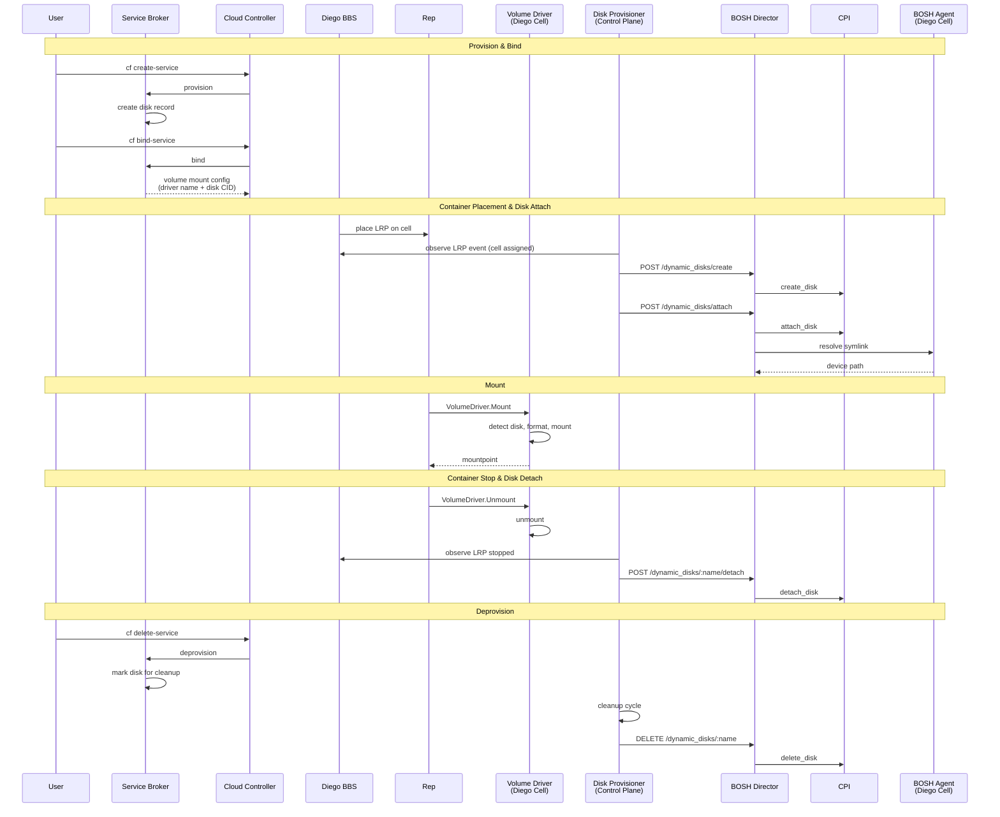

# Meta
[meta]: #meta
- Name: Dynamic Disks Support in BOSH
- Start Date: 2026-01-07
- Author(s): @mariash, @Alphasite, @rkoster
- Status: Draft <!-- Acceptable values: Draft, Approved, On Hold, Superseded -->
- RFC Pull Request: https://github.com/cloudfoundry/community/pull/1401


## Summary

This RFC proposes adding support for dynamic disk management in BOSH Director. The feature introduces a Director API that allows BOSH-deployed workloads running on BOSH-managed VMs to request persistent disks during their lifecycle, and to have the Director orchestrate the creation, attachment, detachment, and deletion of those disks using existing CPIs.

The intent is to make BOSH Director the central control plane for disk management across orchestrators such as Cloud Foundry, Kubernetes, CI systems, and other platforms deployed by BOSH.

## Problem

### Current limitations

The current BOSH disk model is almost entirely manifest-driven and static:

* Disks are defined with fixed sizes in deployment manifests.
* The Director creates and attaches disks only at deploy time.
* Runtime workflows on the VM have no supported way to request additional persistent storage.
* Any external orchestrator (e.g., Kubernetes CSI) must rely on its own IAAS-specific disk management, bypassing the Director.

This leads to several concrete problems:

### A. Fragmented Control Planes

When BOSH deploys another orchestrator (for example Kubernetes), that orchestrator typically brings its own storage subsystem. This means a deployment ends up with two independent systems managing IAAS disks.

### B. Coordinated Lifecycle Safety on Individual VMs

External disk managers have no awareness of BOSH Director’s per-VM lifecycle operations. When IAAS-specific automation performs disk workflows independently, it can unintentionally conflict with operations the Director is executing on the same VM like stop, start, restart, etc

### C. Increased Operational Complexity

Operators deploying platforms like Kubernetes clusters via BOSH must:
* Configure IAAS storage access in addition to BOSH access.
* Maintain separate attach/detach automation.

### D. High-Speed Storage Requirements for Stateful Workloads

Local disks attached directly to VMs are essential for workloads that depend on predictable, low-latency, high-throughput persistent storage. In particular, distributed systems built on consensus algorithms such as RAFT require fast durable writes to ensure correct and performant operation. Today, workloads are limited to external storage services like Databases or remote file systems like NFS and SMB. These storage options do not provide low-latency, high-throughput performance required by such stateful workloads.

### E. Lack of Flexibility for Stateful Workloads

Platforms and orchestrators deployed by BOSH, including Cloud Foundry, CI systems, and Kubernetes clusters, regularly move long-running processes between VMs as part of normal operations such as rolling updates and failure recovery. Workloads that depend on local persistent disks for high-speed durable storage require that storage to follow as the workload moves between VMs.

## Proposal

### Goals

* Preserve backwards compatibility.
* Provide a Director API that can be used by authorized clients to manage disks as first-class resources.
* Ensure that dynamic disk management is opt-in and does not conflict with standard BOSH workflows such as deployments, upgrades, and VM lifecycle operations.
* Ensure that disk device discovery is handled consistently across IAAS providers.
* Ensure correct dynamic disks detachment and cleanup as part of VM and deployment lifecycle operations.
* Keep all IAAS interaction inside existing CPIs.

### BOSH Director API

Extend BOSH Director to expose an authorized API for disk operations to provide, detach and delete disks for VM:

* `POST /dynamic_disks/provide`
* `POST /dynamic_disks/:disk_name/detach`
* `DELETE /dynamic_disks/:disk_name`

#### POST /dynamic_disks/provide

Accepts:

* `disk_name` - a unique disk identifier
* `disk_size` - size of the disk in MB (standard unit used in BOSH for disk size)
* `disk_pool_name` - name of the disk pool provided in BOSH cloud config
* `instance_id` - ID of the BOSH VM instance requesting the disk
* `metadata` - disk metadata that will be set in IAAS on a disk resource

Returns: `disk_cid`

As part of this API call, the Director should schedule a ProvideDynamicDisk job.

If the disk already exists and is attached to a different VM the job should fail.

If the disk already exists and is attached to the requested VM the job should succeed as the call is idempotent.

If the disk exists and is not attached to any VM, then it will be attached to the requested VM using CPI `attach_disk` call.

If the disk does not exist, it will be created using CPI `create_disk` call and then attached to the requested VM using `attach_disk` call.

When the disk is attached the Director should tell BOSH Agent to resolve the symlink based on the device path resolver it is configured with and create a symlink to that resolved path in `/var/vcap/data/dynamic_disks`.

If metadata is provided or is different from existing metadata the job should call `set_disk_metadata` CPI method.

#### POST /dynamic_disks/:disk_name/detach

Accepts:

* `disk_name` - a unique disk identifier

Returns: success or failure

As part of this API call, the Director should schedule a DetachDynamicDisk job. Detach is treated as a desired-state operation. No validation is required for the VM to which the disk is attached. If the disk is already detached the operation should succeed. This ensures that operation is idempotent.

If the disk with the specified name doesn’t exist this job should fail.

If the disk is attached this operation should call detach_disk CPI method.

When the disk is detached the Director should notify BOSH Agent to remove the resolved device symlink in `/var/vcap/data/dynamic_disks`.

#### DELETE /dynamic_disks/:disk_name

Accepts:

* `disk_name` - a unique disk identifier

Returns: success or failure

As part of this API call, the Director should schedule a DeleteDynamicDisk job.

This job should succeed if disk does not exist since this call is idempotent.

If the disk exists it should delete the disk using `delete_disk` CPI method.

### VM lock

All VM operations should be protected by VM lock including starting, stopping, restarting, recreating and deleting VM, attaching and detaching disks to VM. This provides coordination between VM lifecycle and disk management operations, ensuring that the VM and its attached storage remain in a consistent and safe state.

### Dedicated worker queue

Disk management operations are executed in a dedicated worker queue to ensure that runtime storage workflows do not block or degrade standard BOSH operations such as deployments, upgrades, and VM lifecycle operations.

### Dynamic disk lifecycle integration

* When a VM is recreated, all dynamically attached disks MUST be safely detached before VM deletion and may be reattached to the replacement VM if requested by the orchestrator.
* When a VM is deleted, all dynamically attached disks MUST be detached prior to VM deletion.
* When a deployment is deleted, all dynamic disks associated with that deployment MUST be deleted.

### Authorization model

Dynamic disk API endpoints are authorized using the existing BOSH Director authorization model via UAA. Two dedicated scopes control access to disk management operations:

* `bosh.dynamic-disks.create` - grants permission to create disk `POST /dynamic_disks`
* `bosh.dynamic-disks.attach` - grants permission to attach disk `POST /dynamic_disks/:disk_name/attach`
* `bosh.dynamic-disks.detach` - grants permission to detach disk `POST /dynamic_disks/:disk_name/detach`
* `bosh.dynamic-disks.list` - grants permission to list disks `GET /dynamic_disks/`
* `bosh.dynamic-disks.delete` - grants permission to delete disk `DELETE /dynamic_disks/:disk_name`

`POST /dynamic_disks/provide` will require both `bosh.dynamic-disk.create` and `bosh.dynamic-disk.attach`

Clients that need to manage dynamic disks (e.g., a Cloud Foundry Disk Provisioner or a BOSH CSI controller) are issued authorization tokens scoped to only the operations they require, following the principle of least privilege.

#### Potential future improvement: mTLS agent-identity authentication

In a future iteration, the Director can support a second authentication path based on agent instance identity using mTLS. The BOSH Agent's NATS client certificate already provides an implicit form of identity that can be leveraged for this purpose.

Under this model, the Director would accept two forms of authentication:

1. **UAA OAuth client credentials** — used by centralized control-plane components (e.g., a Cloud Foundry Disk Provisioner or a BOSH CSI controller) that manage disks on behalf of multiple VMs.
2. **mTLS using agent instance identity** — used by jobs running directly on BOSH-managed VMs, where the agent's certificate identifies the instance group and deployment.

When a request is authenticated via agent identity, the Director would authorize it against the scoped permissions defined for that agent's instance group. This eliminates the need to distribute UAA client credentials to every VM while still enforcing least-privilege access.

Instance groups in the deployment manifest gain an optional `permissions` list controlling which disk operations they may request:

| Permission | Scope |
|---|---|
| `bosh.dynamic-disks.create` | Create disks in own deployment |
| `bosh.dynamic-disks.attach` | Attach disks in own deployment |
| `bosh.dynamic-disks.detach` | Detach disks in own deployment |
| `bosh.dynamic-disks.delete` | Delete disks in own deployment |
| `bosh.dynamic-disks.list` | List disks in own deployment (by CID prefix) |
| `bosh.dynamic-disks.self.attach` | Attach disks to the requesting VM only |
| `bosh.dynamic-disks.self.detach` | Detach disks from the requesting VM only |
| `bosh.dynamic-disks.attach` | Attach disks to any VM in own deployment (implies `self.attach`) |
| `bosh.dynamic-disks.detach` | Detach disks from any VM in own deployment (implies `self.detach`) |
| `bosh.dynamic-disks.<deployment>.create` | Create disks in a named deployment (cross-deployment) |
| `bosh.dynamic-disks.*.create` | Create disks in any deployment |

No deployment qualifier = scoped to own deployment. Broader permissions imply narrower ones (disk.attach implies disk.self.attach).

**Deployment manifest**

```yaml
name: cf

instance_groups:
  # Diego cells: attach/detach to self only (tightest scope)
  - name: diego-cell
    permissions:
      - disk.self.attach   # attach disks to THIS cell only
      - disk.self.detach   # detach disks from THIS cell only
    jobs:
      - name: bosh-volume-driver   # Docker Volume Plugin v1.12
        release: bosh-volume-services
      - name: rep
        release: diego
      # ...

  # Broker: create/delete only
  - name: volume-services-broker
    permissions:
      - disk.create       # provision IaaS disks
      - disk.delete       # deprovision IaaS disks
    jobs:
      - name: bosh-volume-broker   # Open Service Broker API
        release: bosh-volume-services
      # ...
```

The details of declarative Authorization might deserve it's own RFC, or an addendum to this one, which fleshes out specifics of the Authorization declaration syntax.

### Use Cases

#### Cloud Foundry Integration

This section describes how the Director dynamic disk API can be consumed by Cloud Foundry to provision disks for CF applications. Disk provisioning can be implemented using existing CF Volume Service model (similar to NFS/SMB).

##### Components

1. **Service Broker** -- Handles `cf create-service` / `cf bind-service`. Existing pattern from NFS/SMB volume services. Creates disk records, returns volume mount config (driver name + disk CID) in bind response.
2. **Volume Driver** -- Docker Volume Plugin v1.12, collocated on Diego cells. Discovered by volman via spec file in `/var/vcap/data/voldrivers`. Reusable pattern from existing NFS/SMB volume services.
3. **Disk Provisioner** -- Centralized control-plane component. Runs on control VMs. Holds Director API credentials. Watches Diego BBS for LRP placement state. Calls the Director dynamic disk API to create, attach, detach, and delete disks.
    * Subscribes to BBS events. For the application with the bound service, on LRP changed event from UNCLAIMED to CLAIMED it attaches disk to the desired VM. When LRP is moved from RUNNING state it detaches disk from cell.
    * If an LRP moves to a different cell, the Disk Provisioner detaches from the old cell and attaches to the new cell. If an LRP is rescheduled on the same cell, the Disk Provisioner skips the detach/attach cycle.

#### Security Model

* Disk Provisioner would use credentials limited to the **disk-management scope** only. This restricts the driver to disk lifecycle operations and prevents it from performing any other BOSH Director actions.
* Disk Provisioner is deployed in a secure and isolated environment, separate from application workloads.




#### Kubernetes CSI Integration (BOSH CSI)

This proposal enables a future BOSH CSI implementation for Kubernetes clusters deployed by BOSH. In this model, Kubernetes interacts with storage through a CSI driver that uses the BOSH Director disk management API rather than calling IAAS-specific APIs directly.

##### Architecture Overview

**CSI Controller** (provisioner/attacher) issues `CreateVolume`, `DeleteVolume`, `ControllerPublish` (attach), and `ControllerUnpublish` (detach). These CSI calls are translated to corresponding BOSH Director disk API calls.

**CSI Node plugin** runs on each Kubernetes node (DaemonSet) and performs node-local operations such as formatting and mounting, using the device path resolved by the BOSH agent.

##### Why This Is Valuable

* Keeps Kubernetes storage management IAAS-agnostic by relying on BOSH CPIs.
* Ensures disk operations participate in VM lifecycle coordination (VM lock semantics).
* Enables Kubernetes volume portability (detach/attach across nodes) without requiring VM redeploys or IAAS credentials inside the cluster.

#### Availability and Consistency

BOSH CSI would follow Kubernetes CSI’s reconcile-and-retry behavior: if the Director API is temporarily unavailable, provisioning or attach/detach operations may be delayed, but the system converges once the Director is available again.