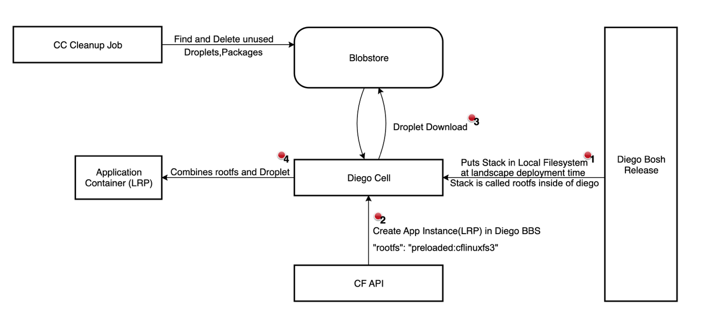

# Meta

- Name: Enhance Stack Handling in Cloud Foundry
- Start Date: 2025-06-24
- Author(s): @FloThinksPi
- Status: Draft
- RFC Pull Request: [community#1220](https://github.com/cloudfoundry/community/pull/1220)

## Summary

With the deprecation of the CFLinuxfs3 stack it became obvious that
removing unsupported stacks from an existing and heavily used CF
Foundation comes with massive problems. Ultimately a stack cannot be
removed without all depending apps being migrated to a new stack,
otherwise downtimes of applications that rely on the removed stack will
occur. This RFC proposes improvements in CF to shift this unavailability
towards lifecycle operations early and not actual app downtime - making it a
more pleasant experience for CF users and operators alike.
To mitigate the downsides of this approach, RFC-0041 proposes to provide custom stacks functionality.

## Table of Contents

- [Meta](#meta)
- [Summary](#summary)
- [Problem](#problem)
- [Motivation](#motivation)
- [Proposal](#proposal)
  - [Improve logical stack management in CF API (cloud_controller_ng)](#improve-logical-stack-management-in-cf-api-cloud_controller_ng)
- [Future Improvements](#future-improvements)
  - [Enable org scoped stack management in CF (cloud_controller_ng)](#enable-org-scoped-stack-management-in-cf-cloud_controller_ng)

## Problem

In the current CF implementation, apps run on so-called Stacks which
provide the base operating system.

Stacks are based on ubuntu and thus bound to ubuntu's [LTS release
cadence and Support](https://ubuntu.com/about/release-cycle). With
Canonical\'s stop of standard security maintenance for ubuntu
18.04(Bionic Beaver) as a consequence also the CFLinuxFS3 stack could
not be maintained anymore and was deprecated. A successor CFLinuxFS4 was
offered based on ubuntu 22.04(Jammy Jellyfish).

Stacks are used for the staging of an application meaning buildpacks run
on the stack to produce the droplet. This in return means that:

- The buildpack is stack specific meaning it can/will break on an
  incompatible stack change like a major version bump

- The droplet the buildpack produces is also stack specific meaning it
  CAN just be instantiated to become an app instance when combining the droplet
  with the same stack it was built with at execution time

Pictured in above diagram is how the stack is brought into a CF
Foundation and used in a CF Foundation. The following problems occur
when trying to remove/deprecate a stack towards users of a CF
Foundation.

Due to [RFC-39](https://github.com/cloudfoundry/community/blob/main/toc/rfc/rfc-0039-noble-based-cflinuxfs5.md), these struggles with the stack become a more pressing issue for CF Foundation operators and users since many still use CFLinuxFS3 and the migration to CFLinuxFS4 is not yet complete for many users. The current stack handling in CF does not allow for a smooth transition and leads to potential downtimes for applications when a stack is removed from the CF Foundation.

### Usage

The management entry of the stack in the stacks table of the CF API
cannot be removed as long as apps exist which use it as the stack delete has a check in place that looks up usage and prevents the deletion of a stack that is still in use.
still visible and still usable to all users of a CF Foundation even if
being insecure, deprecated and SHOULD not be adopted anymore.\
It is a cumbersome process for the users to migrate their workload to a
new stack. Оne has to acknowledge that and give users of Cloud Foundry
time to adapt their workload accordingly without a hard deadline when
their apps will stop working.

### Delivery

By regulations one MAY be forced to stop shipping insecure parts of
CloudFoundry for formal/regulatory reasons. That means removing it/not
deploying it with CF-Deployment at all. In this case, the stack is not
put onto the local filesystem of the Diego cell and every app instance
(Long Running Process(LRP)/Task) start will fail because the runtime did not find the
preloaded stack in its local filesystem. One thus is not able to stop
shipping/delivering the outdated, insecure stack anymore without causing
downtimes to all apps still using it.

### Adoption Timelines

Currently a stack is only shipped ever 4 years skipping one LTS version
of ubuntu entirely. This creates a situation where the old stack e.g.
CFLinuxFS3 is flagged as unsecure at roughly the same time the new stack
CFLinuxFS4 is available. This forces users to adopt it in a very small
timeframe if they still want to receive security updates for their
existing workload. In the last migration from CFLinuxFS3 to CFLinuxFS4
it turned out also the buildpacks need time to adopt -- then the
customers to the new buildpacks for which the time there was far too
short.

## Motivation

1. Enable operators to remove/disable a stack to prevent/limit new
    adoption

2. Better communicate and make a stack deprecation visible to
    users of a CF Foundation

## Proposal

### Improve logical stack management in CF API (cloud_controller_ng)

In the CF API currently only a global stack table exists, that either
makes the stack usable(present) or not(missing). Using a stack means
that a call to diego bbs includes that stack as e.g. rootfs
`precached:<stackname>`. No check is in place if the diego cells have
that stack available, so this table is just used to check what a user
requests as stack when doing cf capi calls or pushing a cf manifest.
Also against available system buildpacks if the stack+buildpack
combination is supported. It's not used to check what's actually
available on diego though.

In this proposal we extend the global stack management and table by
following workflows inside the CF API.

- Mark a stack as deprecated -> staging and start process logs a
  prominent warning. This brings better awareness than release notes.

- Mark a stack as locked -> prevent using the stack for new apps
  (existing apps CAN still use the stack and CAN deploy updates). This already prevents
  blue-green deploy scenarios where a rolling update is
  programmed client side by creating new CF Applications.
  However all existing apps using a locked stack SHOULD continue to run.

- Mark a stack as disabled -> prevent using the stack for any app
  staging. Existing apps continue to run but you can't update them
  anymore. Restarting and scaling of existing apps using the disabled stack is still possible.

This requires the stack table to be extended by additional information
regarding a stacks state as well as the endpoints to manage/list stacks
as well. Additionally, the CLI and client libraries would need adoption
to be able to present the newly added information to a CF user when
calling "cf stacks".

Following Datetimes MAY be saved per stack so this information CAN be
used in consequent log lines, errors and deprecation notices and for the
logic to influence stack usage:

- deprecate_at -> Timestamp after which the deprecation notice will be
  printed

- lock_at -> Timestamp after which staging new apps with a that stack
  fail

- disable_at -> Timestamp after which restaging existing apps with a that
  stack fail

Stack lifecycle management is controlled exclusively by a set of timestamps, not by an explicit "state" field. The system determines the current state of a stack (active, deprecated, locked, or disabled) by comparing the current server time to these timestamps. This approach ensures that stack usability is automatically and unambiguously defined by time-based transitions. Additional information can already be added via the `description` field.

- State transitions (deprecated_at → locked_at → disabled_at) are derived from the configured timestamps.
- A validation check SHOULD be performed when setting the timestamps to ensure that they are in chronological order( deprecated_at → locked_at → disabled_at).
- There is no explicit `state` field; the state is always computed at runtime from the timestamps.
- For additional information the operator MAY reuse the existing `description` field in the stacks table to provide additional information about the stack.
- In case a timestamp is not set, the stack is considered to be in the previous state indefinitely. This SHOULD also be considered in Error and Log messages.

This model guarantees that stack usage is consistently enforced based on time, and all state transitions are predictable and transparent.
It also provides a interface for an operator in which no externally timed api call for a stack state change is required.

The CF API SHOULD use the provided timestamps to influence the logging and error messages in the following way:

- It MAY add a log line into the Staging/Restaging logs of apps with a locked stack. It SHOULD produce the deprecation warning, optionally with color support, to underline the importance of a deprecated stack.
- It MAY add the time since when a stack is deprecated/locked/disabled to the Staging/Restaging logs.
- It MAY add the time when future state transitions will happen to the Staging/Restaging logs, so when is going to be locked/disabled.
- The `description` field MAY be used in addition in Staging/Restaging logs to enable CF Admins to include a custom message in the apps staging logs

#### Positive

- It allows cf admins to phase out a stack via multiple small steps and
  gives both customer and admins a paved road forward to move from one
  stack to another.

- Better awareness of the deprecation and removal of a stack by
  printing a deprecation notices and timelines in the app logs

- It deliberately shifts the unavailability of a stack towards
  lifecycle operations and not actual app downtime - making it a more
  pleasant experience for CF users and operators alike.
  More pleasant for a CF User because an operator that removes a stack does not cause immediate downtime for their apps.
  More pleasant for a CF Operator because they can follow a staged process to remove a stack without causing immediate downtime for all apps using it.

- Likely a manageable change as just in the app creation/staging
  workflows a check is required and the stack table and endpoints CAN be
  extended in a compatible way since all fields are only additions.

#### Negative

- It introduces additional complexity to the stack management process

- Blocks workflows of CF users who want to use a stack that is
  deprecated, locked or disabled. This may lead to support tickets and
  complaints from CF users. It only affects lifecycle operations and not creates actual app downtime, but it may still be perceived as a negative operation by some users.
  To mitigate this and allow users to regain control over lifecycle operations RFC-0041 proposes
  to provide custom stacks functionality. This allows CF Foundation operators to respond
  to user requests that need the deprecated stack for a longer time.
  Users CAN be enabled by RFC-0041 to unblock themselves by taking over ownership
  of the stack in the case they cannot/don't want to follow the lifecycle of Stacks
  provided by the CF Community.

## Future Improvements

In this section we describe future work that is not part of this RFC but CAN extend the current proposals in the future with a new RFC. Its just here for completeness and to give an idea of what future improvements are possible.

### Enable org scoped stack management in CF (cloud_controller_ng)

In the CF API currently, only a global stack management exists as
described above.
In addition to that we'd like to create the ability for CF Admins to
decide per organization to set or remove the statuses "deprecate",
"locked", "disabled" on an organization individual basis.

Introducing two new endpoints:

`GET /v3/organizations/[GUID]/stacks`

`UPDATE /v3/organizations/[GUID]/stacks`

This allows CF admins to react on CF user request/complains/tickets on
an individual level rather than re-enabling a deprecated, locked or
disabled stack for a whole CF Foundation and all users.\
It supplies the tool required by CF admins to support individual users
properly without making commitments to all CF users regarding
support/enablement of a certain stack.

It also creates the opportunity to offer certain system stacks to just a
subset of CF Users as a side motivation. With this mechanism extended
support for a certain stack CAN be provides to individual users.

#### Positive

- Enables admins to react on CF user complains/issues/incidents when
  locking or disabling a certain stack globally

- Enable CF foundation admins to offer certain stacks for certain CF
  users exclusively and not globally for all.

#### Negative

- Likely higher implementation effort since every check against the
  stacks table would need to join a "stacks-visibility-table" in various
  places.

- Needs additional endpoint on org level to list/manage the
  "stacks-visibility-table" to control which stacks are available to
  certain orgs
