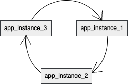
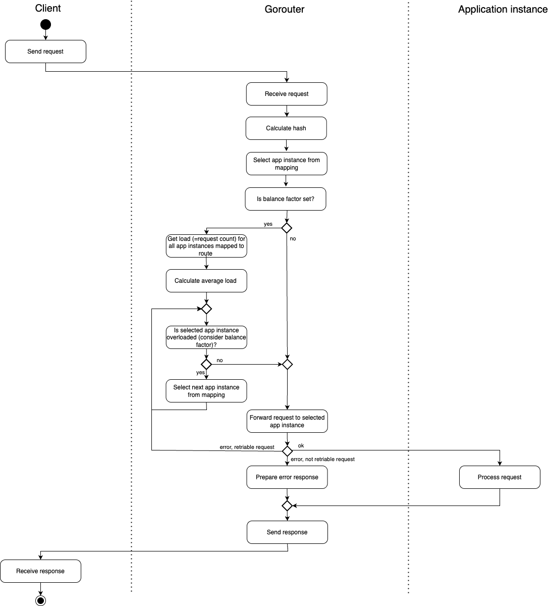
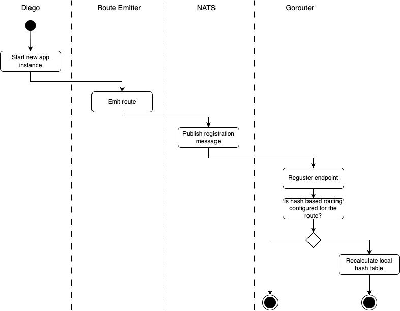

# Meta

[meta]: #meta

- Name: Implementing a Hash-Based Load Balancing Algorithm for CF Routing
- Start Date: 2025-04-07
- Author(s): b1tamara, Soha-Albaghdady
- Status: Draft <!-- Acceptable values: Draft, Approved, On Hold, Superseded -->
- RFC Pull Request: https://github.com/cloudfoundry/community/pull/1222

## Summary

Cloud Foundry uses round-robin and least-connection algorithms for load balancing between Gorouters and backends. While
effective in many scenarios, these algorithms may not be ideal for certain use cases. Therefore, this RFC proposes to
introduce a hash-based routing on a per-route basis.
The hash-based load balancing algorithm uses the hash of a request header to make routing decisions, focusing on
distributing users across instances rather than individual requests, thereby improving load balancing in specific
scenarios.

## Motivation

Cloud Foundry offers two load balancing algorithms to manage request distribution between Gorouters and backends. The
round-robin algorithm ensures the number of requests is distributed equally across all available backends, and the
least-connection algorithm tries to keep the number of active requests equal across all backends. A recent enhancement
allows these load balancing algorithms to be configured on the application route level.

However, these existing algorithms are not ideal for scenarios that require routing based on specific identifiers.

An example scenario: users from different tenants send requests to application instances that establish connections to
tenant-specific databases. 


With the current load balancing algorithms, each tenant eventually creates a connection to
each application instance, which then creates connection pools to every customer database. As a result, all tenants
might span up a full mesh, leading to too many open connections to the customer databases, impacting performance. This
limitation highlights a gap in achieving efficient load distribution, particularly when dealing with limited or
memory-intensive resources in backend services, and can be addressed through hash-based routing. In short, hash-based
routing is an algorithm that facilitates the distribution of requests to application instances by using a stable hash
derived from request identifiers, such as headers.

## Proposal

We propose introducing hash-based routing as a load balancing algorithm for use on a per-route basis to address the
issues described in the earlier scenario.

The approach leverages an HTTP header, which is associated with each incoming request and contains the specific
identifier. This one is used to compute a hash value, which will serve as the basis for routing decisions.

In the previously mentioned scenario, the tenant ID acts as the identifier included in the header and serves as the
basis for hash calculation. This hash value determines the appropriate application instance for each request, ensuring
that all requests with this identifier are consistently routed to the same instance or might be routed to another
instance when the instance is saturated. Consequently, the load balancing algorithm effectively directs requests for a
single tenant to a particular application instance, so that instance can minimize database connection overhead and
optimize connection pooling, enhancing efficiency and system performance.

### Requirements

#### Only Application Per-Route Load Balancing

Hash-based load balancing solves a particular load pattern, rather than serving as a general-purpose load balancing
algorithm. Consequently, it will be configured exclusively as a per-route option for applications and will not be
offered as a global setting.

#### Minimal rehashing over all Gorouter VMs

Rehashing should be minimized, especially when the number of application instances changes over time.

For the scenario when a new application instance (e.g. app_instance3) is added, Gorouter updates the mapping so that it
maps part of the hashes to the new instance.

| Hash  | Application instance(s) before | Application instance(s) after a new instance added |
|-------|--------------------------------|----------------------------------------------------|
| Hash1 | app_instance1                  | app_instance1                                      |
| Hash2 | app_instance1                  | app_instance3                                      |
| Hash3 | app_instance2                  | app_instance2                                      |
| ...   | ...                            | ...                                                |
| HashN | app_instance2                  | app_instance3                                      |

For the scenario when the application is scaled down, Gorouter updates the mapping immediately after routes update, so
that it remaps hashes associated with the app_instance3:

| Hash  | Application instance(s) before | Application instance(s) after the app_instance_3 removed |
|-------|--------------------------------|----------------------------------------------------------|
| Hash1 | app_instance1                  | app_instance1                                            |
| Hash2 | app_instance3                  | app_instance1                                            |
| Hash3 | app_instance2                  | app_instance2                                            |
| ...   | ...                            | ...                                                      |
| HashN | app_instance3                  | app_instance2                                            |


#### Considering a balance factor

Before routing a request, the current load on each application instance must be evaluated using a balance factor. This
load is measured by the number of in-flight requests. For example, with a balance factor of 150, no application instance
should exceed 150% of the average number of in-flight requests across all application instances. Consequently, requests
must be distributed to different application instances that are not overloaded.

Example:

| Application instance | Current request count | Current request count / Average number of in-flight requests |
|----------------------|-----------------------|--------------------------------------------------------------|
| app_instance1        | 10                    | 20%                                                          |
| app_instance2        | 50                    | 100%                                                         |
| app_instance3        | 90                    | 180%                                                         |

Based on the average number of 50 requests, the current request count to app_instance3 exceeds the balance factor. As a
result, new requests to app_instance3 must be distributed to different application instances.

#### Deterministic handling of overflow traffic to the next application instance

The application instance is considered overloaded when the current request load of this application exceeds the balance
factor. Overflow traffic should always be directed to the same next instance rather than to a random one.

A possible presentation of deterministic handling can be a ring like:



### Required Changes

#### Gorouter

- Gorouter MUST be extended to take a specific identifier via the request header
- Gorouter MUST implement hash calculation, based on the provided header
- Gorouter SHOULD store the mapping between computed hash values and application instances locally to avoid
  expensive recalculations for each incoming request
- Gorouters SHOULD NOT implement a distributed shared cache
- Gorouter MUST assess the current number of in-flight requests across all application instances mapped to a
  particular route to consider overload situations
- Gorouter MUST update its local hash table following the registration or deregistration of an endpoint, ensuring
  minimal rehashing
- Gorouter SHOULD NOT not incur any performance hit when 0 apps use hash routing.

For a detailed understanding of the workflows on Gorouter's side, please refer to the [activity diagrams](#diagrams).

#### Cloud Controller

- The `loadbalancing` property of
  the [route object](https://v3-apidocs.cloudfoundry.org/version/3.190.0/index.html#the-route-options-object) MUST be
  updated to include `hash` as an acceptable value
- The [route options object](https://v3-apidocs.cloudfoundry.org/version/3.190.0/index.html#the-route-options-object)
  MUST include two new properties, `hash_header` and `hash_balance`, to configure a request header as the hashing key
  and the balance factor
- It MUST implement the validation of the following requirements:
    - The `hash_header` property is mandatory when load balancing is set to hash
    - The `hash_balance` property is optional when load balancing is set to hash. Leaving out `hash_balance` means the
      load situation will not be considered
    - To account for overload situations, `hash_balance` values should be greater than 110. During the implementation
      phase, the values will be evaluated to identify the best fit for the recommended range
    - For load balancing algorithms other than hash, the `hash_balance` and `hash_header` properties MUST not be set

An example for manifest with these properties:

```yaml
version: 1
applications:
  - name: test
    routes:
      - route: test.example.com
        options:
          loadbalancing: hash
          hash_header: tenant-id
          hash_balance: 125
      - route: anothertest.example.com
        options:
          loadbalancing: least-connection
```

The decision to introduce plain keys was influenced by the following points:

- Simple to use
- It allows for easy addition of more load-balancing-related properties if new requirements arise in the future
- It complies with
  the [RFC #0027 that introduced per-route options](https://github.com/cloudfoundry/community/blob/main/toc/rfc/rfc-0027-generic-per-route-features.md#proposal),
  which states that the map must use strings as keys and can use numbers, strings, and the literals true and false as
  values

### Components Where No Changes Are Required

#### CF CLI

The [current implementation of route option in the CF CLI](https://github.com/cloudfoundry/cli/blob/main/resources/options_resource.go)
supports the use of `--option KEY=VALUE`, where the key and value are sent directly to CC for validation. Consequently,
the `create-route`, `update-route`, and `map-route` commands require no modifications, as they already accept the
proposed properties.
Example:

```bash
cf create-route MY-APP example.com -n test -o loadbalancing=hash -o hash_header=tenant-id -o hash_balance=125
cf update-route MY-APP example.com -n test -o loadbalancing=hash -o hash_header=tenant-id -o hash_balance=125
cf update-route MY-APP example.com -n test -o loadbalancing=hash -o hash_header=tenant-id
cf update-route MY-APP example.com -n test -o loadbalancing=hash -o hash_balance=125
cf map-route MY-APP example.com -n test -o loadbalancing=hash -o hash_header=tenant-id -o hash_balance=125
```

#### Route-Emitter

The options are raw JSON and will be passed directly to the Gorouter without any modifications.

#### Route-Registrar

In the scope of this RFC, it is not planned to implement hash-based routing in route-registrar for platform-routes.

### Diagrams

#### An activity diagram for routing decision for an incoming request



#### A simplified activity diagram for Gorouter's endpoint registration process


