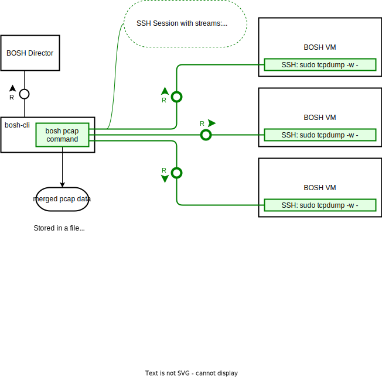

# Meta
[meta]: #meta
- Name: Integrate pcap feature into BOSH
- Start Date: 2023-07-06
- Author(s): @domdom82 @maxmoehl @peanball
- Status: Draft
- RFC Pull Request: https://github.com/cloudfoundry/community/pull/640

## Summary

Add a feature to BOSH that provides a convenient network capturing mechanism for instances deployed via BOSH and easy streaming of network traffic to the user issuing the capture request.

Capture targets are identified automatically based on metadata in the BOSH Director, i.e. their deployment, instance groups and/or specific instance IDs.

## Problem

Distributed, and particularly networked systems are hard to debug. Software developers and operators are not necessarily the same people, in some cases not even the same companies.

Network traffic can be reasonably easily captured via tools such as `tcpdump` on local machines. In order to get a unified view of the network traffic of relevant nodes, those captures need to be retrieved, merged and analysed.

BOSH does not have a user or operator friendly way for resolving targets, or capturing, filtering and merging network traffic.

## Proposal

The feature proposed in this RFC has two possible solutions, each of which have their benefits and drawbacks. The solution with the most community support will ultimately be implemented. Motivations, constraints and considerations are highlighted in those respective sections.

The following solutions are discussed in subsequent sections (linked below):
1. [Integrate pcap-release with BOSH](#integrate-pcap-release-with-bosh-cli-director-agent)  
   This solution focuses on integrating components that are reusable for other scenarios and ensure long-term availability, use and improvements.
2. [Add "pcap-lite", a thin front-end and merge functionality of tcpdump streams](#add-pcap-lite-a-thin-front-end-and-merge-functionality-of-tcpdump-streams)  
   This solution focuses on a convenient minimal solution for the problem statement, but presents a separate code base.

> **Warning**
> While this RFC is in review, both options are presented and discussed. A final version of the RFC will highlight the chosen solution and summarise the discarded approach briefly.

### Use Case Overview

The following use cases are considered:
1. Capture data from a target deployment, filtering for:
   - instance groups, and/or
   - instance IDs
2. Providing detailed [Berkeley Packet Filter (BPF) filters in `libpcap` notation](https://www.tcpdump.org/manpages/pcap-filter.7.html), as used e.g. in [`tcpdump`](https://www.tcpdump.org/manpages/tcpdump.1.html) in a safe manner.
3. Concurrent capturing requests from different users or IP addresses  
   This includes support for concurrent captures, but also imposing limits on the desired number of concurrent captures
4. Filter out traffic between the capturing agent and the target to avoid feedback loops
5. Output of the resulting capture data to a local file or `stdout` for further processing
6. Clean Shutdown and error handling
7. Authorized Access

These use cases are addressed in the respective solutions, highlighting how each use case is addressed.

### Integrate pcap-release with BOSH (CLI, Director, Agent)

The first option is to integrate the existing [pcap-release](https://github.com/cloudfoundry/pcap-release) components or functionality. These are either integrated in existing BOSH components or deployed side by side with them. The following sections provide more detail on the components and their integration.

#### Architecture Overview

Based on the [BOSH Component Overview](https://bosh.io/docs/bosh-components/), the diagram below shows, where the respective pcap-release components or functionalities will be integrated. A  description with more details follows below the diagram.

Extensions to the existing diagram are added in green, with callouts highlighting the purpose for each connection.

*Figure 1 - Bosh Architecture with Integrated pcap-release*

The pcap-release is a general-purpose network traffic capturing component with well-defined APIs.

Noteworthy constraints of the reused implementation:
* **All communication between PCAP CLI, PCAP API and PCAP AGENT(s) is carried out via gRPC over HTTP/2.**
* **Authentication and Authorization are done via the BOSH client token issued via BOSH UAA.** Only RSA signed tokens are currently supported. BOSH UAA is mandatory.

For the purpose of this RFC, integrating the existing components into BOSH focuses on integrating code or entire components from pcap-release with their BOSH counterparts:

1. `pcap-agent` go code can be integrated directly in the BOSH Agent. The `pcap-agent` was specifically designed as reusable component that can run standalone or integrated into other components. 
   For communication with gRPC/HTTP2, a separate port may need to be opened.
2. `pcap-api` can be deployed as is as part of the BOSH Director deployment and started with appropriate configuration. Configuration for the `pcap-api` includes the connection to the BOSH Director API for target lookup.  
   As the BOSH Director is a singleton, there can only be one VM with `pcap-api`, which limits the amount of network traffic that can be captured to the network link of this VM. Considering the primary use for debugging and troubleshooting, this is not a major constraint. 
3. `pcap-client` is integrated in `bosh-cli` for constructing the capture request based on metadata from bosh director and handling the merged capture response retrieved from `pcap-api`.
   `pcap-client` was designed as reusable component for integration into other tools, e.g. CLIs and encapsulates the messaging protocol for the pcap-release into streams of capture data and message information.

By reusing the components from pcap-release, any improvements stemming from the BOSH integration or the pcap-release itself will be available respectively to both types of deployment.

#### Use Cases

The cases from the [Use Case Overview](#use-case-overview) are addressed below:

| # | Use Case                                                           | Comment                                                                                                                                                                                                                                   |
|---|--------------------------------------------------------------------|-------------------------------------------------------------------------------------------------------------------------------------------------------------------------------------------------------------------------------------------|
| 1 | Capturing Data from specific instances                             | Instance groups and their instances can be determined by querying the BOSH Director with an appropriate token. When integrated into the bosh-cli, the pcap-client can access the managed token information directly.                      |
| 2 | Providing BPF Filters                                              | BPF Filters are checked for length to avoid accidental overload or attacks. Other checks can be added centrally.                                                                                                                          |                                                                                                                                         |
| 3 | Concurrent capturing requests from different users or IP addresses | The `pcap-api` and `pcap-agent` respectively keep track of the number of concurrent captures overall. `pcap-api` keeps track of concurrent captures per client IP. All numbers have configurable limits.                                  |
| 4 | Filter out traffic between capturing agent and target              | Traffic is filtered out by excluding the IP address(es) of the pcap-api, before forwarding the request to the pcap-agent code.                                                                                                            |
| 5 | Output of captured data to a local file or stdout                  | `pcap-client` writes the pcap file header and received capture data to a file or configurable stream (e.g. stdout). Additionally, control and status messages are received and can be processed for a better user experience.             |
| 6 | Clean shutdown and error handling                                  | The messaging protocol of pcap-release foresees clean capture stops, draining of agent with clear indication of what is going on and flushing buffers with captured data after the stop was requested and before the capture is finished. |
| 7 | Authorized Access                                                  | Access is controlled via BOSH token scope. The BOSH token is validated and checked for a configurable scope, e.g. `bosh_admin`. A limitation is that only token based authentication is currently supported                               |

A detailed look at the overall pcap-release messaging protocol can be seen in the [PCAP Release API Specification](https://github.com/cloudfoundry/pcap-release/blob/c9d514d19bd1c54a469e875a58b94fd362391065/docs/api-communication-spec.md)

#### pcap-release Integration Summary

The first proposed solution focuses on implementing the functionality by integrating the already existing [pcap-release](https://github.com/cloudfoundry/pcap-release) with the overall BOSH components.
 
`pcap-release` is a bosh-release in development by the [App Runtime Platform WG](https://github.com/cloudfoundry/community/blob/main/toc/working-groups/app-runtime-platform.md). 

The main features and noteworthy design choices are as follows:
* Communication between the components is done via gRCP bidirectional streams. This allows sending capture requests and control messages (e.g. graceful stop), as well as sending status information about the capture in addition to the captured packet data.
* Overloads of individual components can be mitigated or avoided automatically and via configuration:
  * Components have **configurable limits for concurrent captures** (per source IP and overall)
  * A **congestion control mechanism**, based on buffer fill states, notifies downstream components about the fact that not all the captured traffic can be forwarded. This is an indication for the user to e.g. adjust their capturing filter. At the same time this avoids flooding memory or network links accidentally.
* Comprehensive logging of requests, connection issues, congestion and successful completion.
* mTLS encrypted communication between all components, using gRPC over HTTP/2
* Authentication and authorization are handled via the existing BOSH UAA and respective BOSH CLI tokens. Accordingly, the current solution is limited to using UAA and token based authentication with RSA tokens. Other authentication mechanisms can be implemented but require additional work.

While the pcap-release is complex, it is also very flexible and versatile, with many advanced use cases that go beyond simply capturing network traffic to a client machine. While these benefits are not realized with the current state of the implementation, they are on the horizon. 

The largest short-term benefit of integrating pcap-release with BOSH is the increased user base and feedback channel that will help improve pcap-release for the mid- and long-term use and future developments.

### Add "pcap-lite", a thin front-end and merge functionality of tcpdump streams

The alternative solution is based on the orchestration of existing tools with a small amount of new code.

Akin to the BOSH SSH feature, a BOSH pcap feature is proposed with similar but slightly different workflow. The well-known `tcpdump` tool is launched on each VM via SSH and transmits its data via the SSH channel. In order to handle multiple VMs and merge their captures, multiple SSH sessions to the respective targets are opened in parallel, multiplexed in the bosh-cli and available for writing to disk or an output stream.

#### Architecture Overview

The architecture of the pcap-lite solution looks as follows:

**Figure 2 - Architecture Overview for the pcap-lite Solution**

The main benefit of operator convenience over raw use of command line tools requires the following:
* Automatic determination of VM target addresses via the BOSH Director.
* A single SSH session can contain multiple streams, one for data, one for process control. The Go SSH library always opens such a "Master Mode" connection.
* Multiplexing can be done in the BOSH CLI, using a similar mechanism to pcap-release, i.e. by using the `gopacket/gopacket` libraries (and `libpcap` under the hood).

The largest constraint is that the capturing is done used by tools that must already be available on the target VMs, e.g. `tcpdump` that is available as part of the stemcell.

Support for capturing from [Windows stemcells](https://bosh.io/docs/windows-sample-release/) must be considered further, e.g. by invoking [Npcap](https://npcap.com) instead of `tcpdump`, as suitable replacement for Windows. Please also note that [WinPcap is essentially unsupported](https://npcap.com/vs-winpcap.html). 

#### Use Cases

The cases from the [Use Case Overview](#use-case-overview) are addressed below:

| # | Use Case                                                           | Comment                                                                                                                                                                                                             |
|---|--------------------------------------------------------------------|---------------------------------------------------------------------------------------------------------------------------------------------------------------------------------------------------------------------|
| 1 | Capturing Data from specific instances                             | Instance groups and their instances can be determined by querying the BOSH Director with an appropriate token. The invocation of `tcpdump` can be constructed with appropriate command line arguments.              |
| 2 | Providing BPF Filters                                              | BPF Filters are checked for length to avoid accidental overload or attacks, and provided to the invocation of `tcpdump` on the respective target VMs.                                                               |                                                                                                                                         |
| 3 | Concurrent capturing requests from different users or IP addresses | There is no enforced limit for concurrent captures. An accidental overload is possible more easily.                                                                                                                 |
| 4 | Filter out traffic between capturing agent and target              | Traffic is filtered out by excluding the IP address(es) of the requester. The ports of the SSH connections can be included in the exclusion for more fine-grained control.                                          |
| 5 | Output of captured data to a local file or stdout                  | The merged pcap data can be redirected to a file or configurable stream (e.g. stdout).                                                                                                                              |
| 6 | Clean shutdown and error handling                                  | `tcpdump` [accepts signals to control ongoing captures](https://www.tcpdump.org/manpages/tcpdump.1.html). This includes clean shutdown with `SIGINT`/`SIGTERM` and flushing already captured buffers via `SIGUSR2`. |
| 7 | Authorized Access                                                  | Access authorization can be enforced similar to BOSH SSH. The same SSH keys can be re-used as well.                                                                                                                 |

All of those use cases would need to be re-assessed for Windows based stemcells.

#### Summary

The "pcap-lite" solution of more advanced orchestration of streamed `tcpdump` based captures via SSH provides a lean alternative to the pcap-release.

Some features are missing or not a extensive as with the pcap-release integration. Most notably, congestion control is missing.

For the initial problem described in this RFC, this is a "Minimal Viable Product" that provides the functionality for the support and debugging case and offers great functionality that covers a majority of use cases. 

Further developments or more advanced use cases may be hindered by its simplicity however and will need to be re-assessed as they become relevant.

### Comparison of Solutions

This section provides a comparison of both presented solutions, highlighting their benefits and drawbacks. This comparion is particularly relevant for the community's decision for either or none of the presented solutions.

#### 1. pcap-release integration into BOSH

Main benefits of the pcap-release integration approach are:
* Extended functionality through bidirectional signalling, including congestion control.
* Clear signalling of state, errors during communication and status informaiton for the user.
* Central component with enforceable limits, e.g. in terms of concurrent captures.
* Portable Go code should support any stemcell (including Windows), for which libpcap is available.

Drawbacks are the following:
* More complex solution
* A separate port is required on the BOSH director to support the pcap API endpoint (with gRPC/HTTP2). As this is not functionality that logically belongs to BOSH Director, a new port is needed either way. 
* Minor overhead for HTTP2 and gRPC wrapping of network data (ca. 1-10%, depending on the captured traffic)
* Dependency on an externally provided component outside the control of the BOSH team

#### 2. pcap-lite

Main benefits of the pcap-lite approach based on tcpdump and SSH are:
* Based on standard tools, e.g. `tcpdump`.
* Other tools for more flexibility on capturing side could be integrated, e.g. `tshark`, which provides deeper inspection into network streams and more powerful filters.
* The BOSH SSH ports and certificates can be reused.
* Self-contained solution within BOSH, which can be maintained by the BOSH team

Drawbacks are the following:
* No congestion control
* Requires other tools for Windows, as `tcpdump` is not available.
* More complex scenarios that would benefit from a central component will require more work or a different solution.

### Background and Context

Background information and context are provided as supplemental information to the RFC.

Members of the [App Runtime Platform WG](https://github.com/cloudfoundry/community/blob/main/toc/working-groups/app-runtime-platform.md) are developing a BOSH release called [pcap-release](https://github.com/cloudfoundry/pcap-release). [pcap-release](https://github.com/cloudfoundry/pcap-release) is intended as full-fledged solution for the use case of large-scale network capturing.
The release was created after an initial discussion was started on the [cf-deployment](https://github.com/cloudfoundry/cf-deployment/issues/980) repository.

BOSH deployments and CF applications alike are targeted conceptually with the same software components, but different configuration. The main benefit of reusing the same implementation in all cases is that improvements from one case will benefit the other.

The use case for CF applications is more complex, technically and organizationally. In order to gain further operational experience and "battle test" the code, support for capturing BOSH deployments was added. This "BOSH Scenario" will now be deployed initially and used by our developers and operators to identify issues with the implementation.

Later, the CF specific target resolution, authentication mechanisms and configuration options can be enabled. The base code for the various components (i.e. pcap-client, pcap-api, pcap-agent) remains the same for either case. Consequently, the CF capturing will significantly benefit from the BOSH Scenario initially. Later on, improvements to the shared code will benefit both use cases equally.

A detailed look at the pcap-release can be found in its repository. For this RFC, the most relevant items are:
1. [BOSH VM Capture Overview](https://github.com/cloudfoundry/pcap-release#bosh-vm-capture)
2. [API Communication Specification](https://github.com/cloudfoundry/pcap-release/blob/c9d514d19bd1c54a469e875a58b94fd362391065/docs/api-communication-spec.md)
