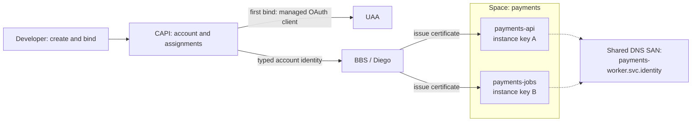
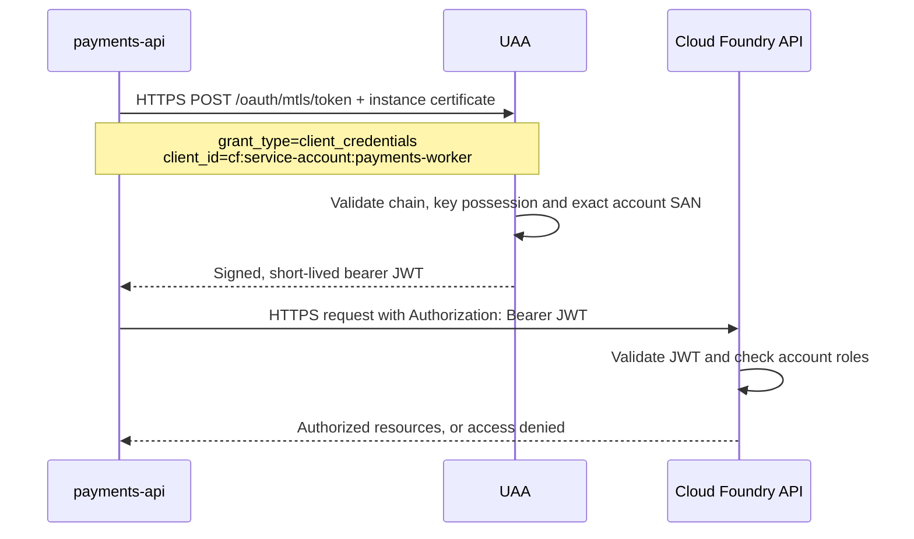

# Meta
[meta]: #meta
- Name: Service Accounts for Cloud Foundry Workload Identity
- Start Date: 2026-10-06
- Author(s): @rkoster
- Status: Draft
- RFC Pull Request: [community#1645](https://github.com/cloudfoundry/community/pull/1645)
- Related RFCs: [RFC 0055: Identity-Aware Routing for GoRouter](rfc-0055-identity-aware-routing-for-gorouter.md)
- Affected Component(s): Cloud Controller, BBS, Diego, UAA, CF CLI; later GoRouter and service brokers

## Summary

Give applications a stable identity they can share, without distributing a shared
secret. Developers assign a **service account**; Cloud Foundry manages its
credentials. Apps exchange their instance certificates for short-lived tokens and
use those tokens to access resources such as the Cloud Foundry API.

**One account, multiple apps, independent keys, explicit permissions.**

## Problem

A payments team runs an API and a background worker. Both need the same access to
Cloud Foundry resources. Today, the team can distribute an OAuth client secret to
both apps—but then it must store, protect and rotate that secret. Scaling and
blue/green deployments add more places where the credential lives.

Cloud Foundry already gives every instance its own certificate. However, instance
identities change on replacement, and app identities do not describe an intentional
group of apps. The team needs a durable **payments identity**, independent of which
instances or blue/green apps currently implement it.

Service accounts connect existing instance credentials to that shared identity.
The platform handles keys; the team decides which apps use the identity and what
it may access.

## Proposal

### 1. Create once, assign to apps

The account belongs to the targeted space. Each app can use one account, and
multiple apps in that space can share it. Cross-space assignment is excluded.

```sh
cf target -o acme -s payments
cf push payments-api --no-start
cf push payments-jobs --no-start

cf create-service-account payments-worker
cf bind-service-account payments-api payments-worker
cf bind-service-account payments-jobs payments-worker

cf start payments-api
cf start payments-jobs
cf service-account payments-worker
```



First bind provisions one secretless UAA client and a roleless CAPI principal;
subsequent binds reuse them. The CLI waits for provisioning jobs, including retries.
No account certificate is issued before authorized provisioning is ready.

### 2. Grant permissions explicitly

Binding answers **“Who am I?”**, not **“What may I do?”** An authorized role manager
can grant the shared account access using existing role commands:

```sh
cf set-space-role cf:service-account:payments-worker acme payments SpaceAuditor --client
```

The CLI establishes required org membership before granting the space role. Both
apps can now read those resources. Without roles, their tokens grant no resource
access. Anyone who can deploy code to either app can exercise the shared grants.

Creating accounts follows service-instance creation permissions: **Space Developer
or platform admin**, with readable/writable-space checks and operator controls.
Other lifecycle management initially requires space manager/admin; assignment
requires app-write permission. Ownership alone grants no account resource roles.

### 3. From app certificate to API access

The app discovers its client ID and token endpoint through non-secret
`VCAP_SERVICE_ACCOUNT` metadata. Its library reads `CF_INSTANCE_CERT` and
`CF_INSTANCE_KEY`, reloading them when acquiring tokens after credential rotation.



Illustrative **decoded access-token payload** for the proposed CAPI profile:

```json
{
  "iss": "https://uaa.example.org/oauth/token",
  "sub": "cf:service-account:payments-worker",
  "client_id": "cf:service-account:payments-worker",
  "aud": ["cloud_controller"],
  "scope": ["cloud_controller.read"],
  "iat": 1791288000,
  "exp": 1791288300
}
```

Both apps have the same subject, but authenticate with different keys. The token
is limited to authorized audiences/scopes and expires within five minutes **and
no later than the certificate used to obtain it**. Scope permits API use; CAPI
roles determine which resources are accessible. Caller app/instance attribution
should also be retained in platform-controlled claims; claim names remain to be
agreed.

There is deliberately **no `cnf`**: [RFC 8705][mtls] separates mTLS client
authentication from certificate-bound tokens. UAA must honor the client policy
`tls_client_certificate_bound_access_tokens: false`. The certificate is needed
to obtain the token, not to present it to CAPI. Token issuance needs no live CAPI
assignment lookup; consumers validate issuer, signature, audience, expiry and
permissions independently.

### 4. Manage the account's lifecycle

| Intent | Command | Effect |
| --- | --- | --- |
| Inspect | `cf service-accounts` | List accounts in the targeted space |
| Remove assignment | `cf unbind-service-account payments-api` | Changes desired identity; restart the app to apply |
| Stop new tokens | `cf disable-service-account payments-worker` | Disables issuance for all apps sharing it |
| Resume | `cf enable-service-account payments-worker` | Re-enables issuance, retaining roles |
| Delete | `cf delete-service-account payments-worker` | Requires workload references removed; retains a name tombstone |
| Recover a deleted name | `cf create-service-account payments-worker --reuse-name` | Explicit, audited platform-admin override |

Running instances retain their launch identity—including renewal—until restart;
new tasks use the desired assignment. Staging never receives the account identity.
Unbind before assigning a different account. Zero-app accounts retain their client
and roles until explicitly disabled/deleted.

**Unbind, restart and disable do not revoke existing tokens or certificates.**
Copied credentials can remain usable until expiry while the client is enabled;
without restart, a running old assignment can keep renewing.

Names are immutable, foundation-unique lowercase DNS labels (3–63 characters).
The SAN suffix creates no DNS record or route; external identity is the trusted
`(issuer, subject)` pair. Admin `--reuse-name` creates a new UUID without restoring
bindings/roles, preserves audit history and cannot bypass live-name conflicts or
quotas. Its warning explains that external grants and valid old certificates may
still apply to the reused identity.

### 5. Extend space quotas

Add a maximum account count to space quotas, with this proposed V3 fragment:

```json
{
  "service_accounts": {
    "total_service_accounts": 10
  }
}
```

Count existing accounts, including disabled/unprovisioned ones, not bindings or
tombstones. Creation checks the limit atomically; deletion frees capacity. Lowering
the limit blocks further creation rather than deleting accounts. Default/unlimited
behavior follows existing space-quota conventions.

### Delivery

Start with CAPI account APIs/roles, native CLI, typed BBS/Diego identity and UAA
bearer issuance. Preserve existing instance fields, C2C route SANs and independent
keys. Protect the SAN namespace and managed client prefix from injection/takeover;
provision clients only in UAA's default zone. Unsupported identity features must
fail closed, with operator enablement only after compatible rollout.

Later stages add curated external token targets/federation, account sources for
RFC 0055 route policies, and negotiated broker/driver integration. Route grants
must preserve verified-certificate checks, caller org/space restrictions and
default deny. Existing OSB bindings are unchanged.

**Progress:** [CAPI][capi], [release wiring][release], [BBS][bbs], [Diego][diego] and
[CLI][cli] drafts demonstrate the two-app flow, explicit roles, disable/enable and
unbind/restart. Remaining work includes creation permissions, quotas/name reuse,
[UAA][uaa] bearer policy (the POC still emits `cnf`), leaf-expiry caps, namespace
protection, caller claims, module publication and rollout capability signaling.
Further renewal/staging/Windows/negative coverage is needed; lab CAPI HTTP access
must become HTTPS. Implementation details and test evidence live in those PRs.

[mtls]: https://www.rfc-editor.org/rfc/rfc8705.html#section-3.4
[capi]: https://github.com/cloudfoundry/cloud_controller_ng/pull/5520
[release]: https://github.com/cloudfoundry/capi-release/pull/702
[bbs]: https://github.com/cloudfoundry/bbs/pull/168
[diego]: https://github.com/cloudfoundry/diego-release/pull/1216
[cli]: https://github.com/cloudfoundry/cli/pull/3875
[uaa]: https://github.com/cloudfoundry/uaa/pull/4076
