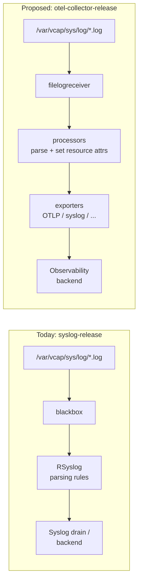

# Meta
[meta]: #meta
- Name: Support Platform Logs Collection and Processing with OpenTelemetry
- Start Date: 2026-08-19
- Author(s): @chombium, @jorbaum, @Katharin4, @beyhan, @silvestre
- Status: Draft
- Related RFCs: [rfc-0018-aggregate-metric-egress-with-opentelemetry-collector](https://github.com/cloudfoundry/community/blob/main/toc/rfc/rfc-0018-aggregate-metric-egress-with-opentelemetry-collector.md)
- RFC Pull Request:
- Affected Component(s): otel-collector-release, cf-deployment

## Summary

Members of the [App Runtime Platform WG](https://github.com/cloudfoundry/community/blob/main/toc/working-groups/app-runtime-platform.md) propose adding support for collection and processing of platform component logs with OpenTelemetry. The goal is to modernize the consumption of platform component logs in Cloud Foundry and add another more modern alternative to the Syslog Protocol. Operators would be able to choose how they want the platform component logs to be processed and forwarded.

We believe that adding OpenTelemetry support for platform component logs will enable more reliable delivery and open possibilities for better processing of the telemetry data downstream inside and outside of Cloud Foundry.

## Problem

In Cloud Foundry the platform component logs are collected and processed with the [syslog-release](https://github.com/cloudfoundry/syslog-release) which provides a tool to tail log files from `/var/vcap/sys/log` called [blackbox](https://github.com/cloudfoundry/blackbox) and forwarding and processing rules for [RSyslog](https://www.rsyslog.com/). Rsyslog is provided with the stemcell. Rsyslog is highly specialized for parsing and processing text strings and JSON, but is hard to extend (depends on plugins delivered with the stemcell), its configuration is done with ReinerScript and some legacy formats. Rsyslog still has some use cases, but it doesn't fit in the modern observability pipelines.

On the other hand, OpenTelemetry has become the defacto standard in the Observability World and it has a vibrant community.
The OpenTelemetry Collector offers huge advantages over Syslog:
- Can be easily extended with many community managed components like receivers, processors, extensions and exporters from the [opentelemetry-collector-contrib](https://github.com/open-telemetry/opentelemetry-collector-contrib) repository.
- The configuration is standardized yaml.
- The information from all telemetry signals (logs, metrics, traces and baggage) can be easily correlated on the fly while it is still moving through the pipelines which enables faster problem discovery, root cause analysis and problem solving.

## Proposal

We propose adding support to the [otel-collector-release](https://github.com/cloudfoundry/otel-collector-release) for collection and processing of platform component logs in a way that is compatible with what the `syslog-release` currently offers and the use cases it covers. Having the platform component logs and metrics in the same place would enable usage for all of the goodies mentioned above. The `syslog-release` has to be analyzed to get to know all its functionalities and find their proper replacements with OpenTelemetry.

The `syslog-release` remains the default and stays in place; OpenTelemetry is offered as an opt-in alternative. Deprecating or removing the `syslog-release` is out of scope for this RFC and would be handled by a future RFC.

### Affected Working Groups
- Foundational Infrastructure
- Application Runtime Platform

### Implementation

Cloud Foundry supports platform log collection on two major types of operating systems: Linux with the `syslog-release` and Windows with the [windows-syslog-release](https://github.com/cloudfoundry/windows-syslog-release). It has to be ensured that the OpenTelemetry replacement works equally good for both of them. Both releases have to be analyzed to find the details how they function, so that proper replacement can be built.

#### Focus

This implementation will focus on collection and processing of the platform component logs (BOSH job logs) stored in `/var/vcap/sys/log` directory. Supporting other paths where logs are stored is nice to have capability.

The two basic functions of the `syslog-release` will be replaced as follows:
- blackbox -> [filelogreceiver](https://github.com/open-telemetry/opentelemetry-collector-contrib/tree/main/receiver/filelogreceiver)
- RSyslog parsing rules -> Otel Collector Pipeline with the same functionality. Additional processors and receivers might be needed

The following diagram contrasts today's syslog-based flow with the proposed OpenTelemetry Collector pipeline:

#### Phases

##### Phase 1 - Discovery and Stakeholder Alignment (prerequisite)

Before we start with the technical implementation we have to:
-  Analyze the internals of both `syslog-release` and `windows-syslog-release` release, how they work and what functionality do they provide:
    - BOSH jobs
    - Configuration parameters
    - Access permissions for log files. On Ubuntu Noble and higher the AppArmor rules are enforced.
    - Setting of proper context data with attributes like deployment, az, id, instance etc.. All the data from [syslog-release-forwarding-setup.conf.erb](https://github.com/cloudfoundry/syslog-release/blob/main/jobs/syslog_forwarder/templates/syslog-release-forwarding-setup.conf.erb) has to be covered.
- **Prerequisite — agree on a resource-attribute naming convention.** The data in OpenTelemetry format will follow the [OpenTelemetry Semantic Conventions for Cloud Foundry](https://opentelemetry.io/docs/specs/semconv/resource/cloudfoundry/). Those conventions cover `cloudfoundry.*` (app/org/space/process) attributes but do **not** define BOSH-level context (deployment, az, instance-group, instance-id, job). This RFC therefore has to *establish* a convention for those BOSH attributes rather than merely follow an existing one. SAP has internal conventions for BOSH which we propose to contribute and publish as the basis for this. Because attribute names are the public contract with every downstream backend, they must be settled before Phase 2 produces stable output. See [Open Questions](#open-questions).

##### Phase 2 - Implementation

The implementation will be based on the findings from the `Discovery Phase` and will follow the new and modern trends for processing logs with Open Telemetry.

The three main topics in the implementation phase will be:
- `otel-collector-release` adjustments to support collection and delivery of platform logs:
  - BOSH release:
     - adjust the BOSH jobs, so that they support the same functionality that is provided with the `syslog-release`
  - OpenTelemetry Collector:
    - introduce new receivers, processors and extension
    - introduce some standard pipeline(s) which process the data in the same way that the current `syslog-release` does
    - add examples on how to do further processing of the data inside the OpenTelemetry Collector

- Ops-file for activating collection and processing of platform component logs with OpenTelemetry
    - The default platform logs forwarding mechanism will remain Syslog up until further notice

#### Deliverables

- Adjusted `otel-collector-release` which supports consumption and processing of platform component logs
- Ops file in [cf-deployment](https://github.com/cloudfoundry/cf-deployment) with which the operators can select the mechanism for forwarding platform logs

## Impact and Consequences

### Positive

- Platform operators will be able to use modern technologies to process Cloud Foundry platform logs 
- Easier integration with other Observability backends
- Ability to correlate platform component logs with platform component metrics and get better insights much faster

### Negative

- When opting in to use OpenTelemetry instead of syslog, operators have to adjust their alerts and dashboards in their observability backends, because the OpenTelemetry Semantic Conventions change the names of the log metadata. This is a one-time cost of adopting the new opt-in path, not a change forced on operators who stay on syslog.
- On the Diego Cells the application logs might affect the throughput and delivery of the platform logs. The operators should set an [application log rate limit](https://docs.cloudfoundry.org/loggregator/app-log-rate-limits.html) in order to limit the produced application logs which are accepted in Loggregator.

## FAQ

### Why extend the `otel-collector-release` instead of creating a new release?

The `otel-collector-release` already deploys an OpenTelemetry Collector to CF VMs for metric egress (see [RFC-0018](https://github.com/cloudfoundry/community/blob/main/toc/rfc/rfc-0018-aggregate-metric-egress-with-opentelemetry-collector.md)). Reusing it keeps platform logs and metrics in the same Collector, which is what enables the cross-signal correlation described above, and avoids operators having to deploy and maintain a second release with an overlapping component set.

### Why not keep RSyslog and just add an OpenTelemetry exporter to it?

That would preserve the parts of the current pipeline we most want to move away from: RSyslog is hard to extend, its configuration relies on RainerScript and legacy formats, and its plugins are tied to the stemcell. Bolting an exporter onto RSyslog carries that maintenance burden forward instead of moving processing into the standardized, community-supported OpenTelemetry Collector configuration.

### Why OpenTelemetry over other log shippers (Fluent Bit, Vector, etc.)?

OpenTelemetry has become the de facto standard in the observability space, has a large and active community, and is already established in Cloud Foundry via the `otel-collector-release` for metrics. Standardizing on a single collector for logs and metrics reduces the agent footprint and the number of distinct configuration formats operators have to learn.

## Open Questions

- **BOSH resource-attribute naming convention.** The OpenTelemetry Semantic Conventions for Cloud Foundry do not define BOSH-level attributes (deployment, az, instance-group, instance-id, job). This RFC proposes to establish one, seeded from SAP's internal BOSH conventions. Open: is this owned as a Cloud Foundry standard, who maintains it, and should it be pursued for upstream OpenTelemetry adoption? This must be settled before Phase 2.
- **Windows parity.** Can the OpenTelemetry Collector / `filelogreceiver` cover everything `windows-syslog-release` does, and with acceptable resource usage on Windows cells? To be answered in Phase 1.
- **Log-file access permissions.** On Ubuntu Noble and higher, AppArmor rules are enforced. What changes are needed for the Collector to read `/var/vcap/sys/log` under those rules?
- **Non-standard log paths.** Handling logs stored outside `/var/vcap/sys/log` is currently listed as nice-to-have — do any in-scope components require it?

